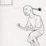

# 「兩大類」網站

網址： https://marco79423.net

[修改歷史](./CHANGELOG.md)

專案目標
============

為什麼我會想要有個人網站？

理由有三：

1. 整合所學並促進自我學習
    * 由於東西要給別人看，所以就會有動力盡量做到好。 這是為了克服人類的墮性的一個機制，一個自我學習的動力。
2. 學習如何管理網站
    * 其實也是同 1 點，是學習的一部分。
3. 備份自己的技術文章和作品
    * 多一點地方備份總也不是壞處。
4. 展示自己
    * 三個理由有第四個也是很合理的，因為我爽！
