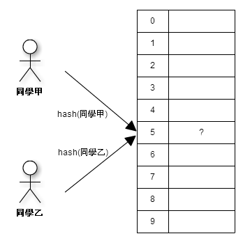

Bloomier Filter
####################################

:date: 2013-05-14
:categories: 程式設計

說到 Bloomier Filter，看倌一定會覺得看起來和 Bloom Filter 很像(詳情請看 `Bloom Filter </articles/bloom-filter/>`_ )。
是的，而且兩者演算法本身確實也有相似之處，不過用途並不相同。

Bloom Filter 可以紀錄「某一個元素是否存在」這種型態的資料，
我們可以利用這種資料結構來查詢某元素是否存在的資訊，如查詢「某小雞是不是在這一間雞舍？」這種訊息。
雖然 Bloom Filter 的結果不準確，可能發生「明明不存在，卻回報存在」的狀況，但因為所佔空間小，
而且搜尋速度快的特性，所以常用來做前期的篩選。

但 Bloomier Filter 不同，它不會放棄資料的正確性，而且不像 Bloom Filter 只能存「某一個元素是否存在」的資訊，
因此可以當作實際存放資料的地方，是故 Bloomier Filter 雖然稱作 Filter，但並不只能做 Filter 的事。

.. image:: images/1.png
    :alt: weight-table.png

這類型的演算法使用的情境約略來說，就是會有很多個 Key，每個 Key 都會對應一筆資料，
而我們的目標是希望能有一種方法能夠快速的根據 Key 找到其對應的資料。
比如說「班上同學體重紀錄表」紀錄著全班同學的體重資料，Key 就是班上同學的名字，
對應的資料就是該同學的體重，而我的目標就是希望能找到一個方法，
能夠很簡單快速的用同學的名字(Key) 取得他的體重資訊(資料)。

.. image:: images/2.png
    :alt: hash.png

最簡單的做法，就是用 Hash 函式(如：CRC) 對 Key 做編碼，
然後再利用編碼後的結果當成 Hash Table(存放資料的資料結構)的索引值，而索引值的對應的位置就可以放置資料內容。
從此以後，只要我知道 Hash 函式是什麼，就可以利用 Key 輕鬆取得我要的資料。

由於 Hash 函式的好處在於計算速度很快，而且不受資料個數的影響(如果是用串列之類的方式找，
資料個數越多找得越慢)，所以這種找資料的方式在碰到這種情境時相當常用。

不過這種做法最大的麻煩在於必須考慮「碰撞」的問題，
「碰撞」是指不同的 Key 卻編碼出相同的結果，造成搶位置的情況。
舉例來說，假設「同學甲」和「同學乙」這兩位同學編碼出相同的結果，那麼兩個人的體重資料就會對應在 Hash Table 一樣的位置，
但問題是資料只能放一份，所以就會發生不知道要放「同學甲」的體重還是「同學乙」的體重進去的情形。

最常見也是最簡單的解決辦法就是不在 Hash Table 裡面存放實際的資料(體重)，
而是放一個指標來指向要存放的資料，以串列的方式來紀錄資料，
這樣我們就不用擔心放不下或是浪費空間的問題了。不過這樣一來，搜尋時就變得還要再多找串列裡的內容，
讓原本這類方法搜尋速度很快的優勢少了很多。

.. image:: images/4.png
    :alt: hash-with-linked-list.png

為了解決這個問題 Bloomier Filter 提供了一個很有趣的解決方法，它使用了和 Bloom Filter 相同的概念，
也就是運用多個 Hash 函式來減少發生「碰撞」的可能性。

具體來說，「碰撞」的問題在於不同的 Key 計算出來的 Hash 值是一樣的，所以無法利用 Hash 函式區別不同的 Key。
那為什麼利用多個 Hash 函式就可以減少「碰撞」的機會呢？道理很簡單，假設現在我用三個 Hash 函式來建置 Hash Table，
那麼理論上一個 Key 就會對應到 Hash Table 上的三個位置，當我發現我第一個位置有人用了，我只要放第二個位置即可，
如果第二個位置一樣很倒楣，也被其他的 Key 使用了，那就放第三個位置，這樣發生「碰撞」的機會就會變小很多。

不過這種方式會產生新的問題，因為三個位置都有可能是 Key 存放資料的地方，
所以搜尋的時候就必須一個個檢查才能判斷資料真正存放的位置，一樣會增加搜尋的時間。
而且也因為我要確認某個位置是那一個 Key 所存放的資料，
所以我還必須多加一個欄位來紀錄 Key 的資訊，多佔許多空間。

所以 Bloomier Filter 並不是這麼使用多個 Hash 函式的。

我們先仔細觀察一下現在的情況，雖然 Key 對應的三個位置，但只需要用到一個位置來存放資料，
其他位置裡頭的內容是什麼其實無關緊要。現在的問題是我不知道那個 Hash 函式對應的位置才有我要的資料......
所以如果我能找到一個方法「可以在不知道資料實際存放資料的情況下取得資料」，
那我是不是就可以不用煩惱資料到底放在那個 Hash 函式對應的位置，
也不用煩惱如何建置「能夠判斷某一位置的資料對應那一個 Key」的資料結構了？

這種猶如魔法般的想法有沒有可能實現呢？Bloomier Filter 告訴你，確實是有的－－使用 XOR(Exclusive OR)。

XOR 的特性很有趣，假設 A xor B 會得到 C，那 B xor A 也會得到相同的值 C，而 C xor A 會得到 B，
C xor B 會得到 A。

看不明白的話，參看下表：

::

    A xor B => C
    C xor A => B
    C xor B => A

因為這個特性，所以 XOR 在密碼學中很常用，比如說：

::

    資料 xor Key => 密文
    密文 xor key => 資料

如果沒有 Key ，就算拿到密文也不知道真正的資料。
但如果有 Key 的話，就可以對密文做 XOR 運算取得所要的資料。

那麼 XOR 究竟要怎麼應用在 Bloomier Filter 上呢？
仔細看看下表，這是用三個變數的情況：

::
   
    A xor B xor C => D
    D xor A xor B => C

也許你已經看出來了，若還是看不出來的話，我就再改一下：

::

    資料 xor B xor C => D
    D xor B xor C => 資料

套用到 Bloomier Filter 上，那就是現在有三個 Hash 函式，而 B、C 和 D 都是某一個 Key 在 Hash Table 上對應位置的內容。
接下來搜尋的時候，只要把三個位置的內容全部 xor 起來，就可以直接得到資料了。也就是說，
現在我再也不用在意到底那個位置才是實際放資料的位置，只要做 XOR 運算就好了。

.. code-block:: python
    :linenos:

    #假設使用三個 Hash 函式的情形下
    data = hash_table[hash1(key)] ^ hash_table[hash2(key)] ^ hash_table[hash3(key)]

至於建置 Hash Table 的時候也很簡單，只要把除了實際放資料的位置外，其餘所有位置對應的內容和資料做 XOR 運算後，
再存進實際放資料的位置即可。

.. image:: images/5.png
    :alt: bloomier-filter.png

.. code-block:: python
    :linenos:

    #實際要放資料的位置 = 資料 xor (其餘位置的內容1 xor 其餘位置的內容2....)
    for hash in [hash1, hash2, hash3]:
        if actual_position != hash(key):
            value = value ^ hash_table[hash(key)]
    hash_table[actual_position] = value

這麼一來，Bloomier Filter 大致的概念就清楚了。不過實際上要怎麼建置這個 Hash Table 呢？這就是一件麻煩事了。

建置的要點就是為每一個 Key 對應的資料找到在 Hash Table 實際存放的位置，
而這個位置不可以和其他 Key 共用，也就是說一個位置只能放一個 Key 的資料。不過另一方面，
只要不放入實際的資料，其他 Key 還是可以參照這個位置的內容，因為除了實際要存放資料的位置外，
其餘位置裡的內容只是會用到，並不會有任何改變。

實際在建置 Hash Table 時，大致只會有三個步驟：

1. 
    找出 Key 在 Hash Table 對應的所有位置，然後紀錄 Hash Table 中的每一個位置有那些 Key 對應對到。
2. 
    檢查 Hash Table 每一個位置，把只有一個 Key 使用的位置抓出來，當成該 Key 實際存放資料的位置。
    紀錄完這個資訊後，再把第一步有關該 Key 的紀錄清除。這樣一來，可能有些位置就會變成只有一個 Key 使用。
    不斷重覆這個步驟，直到找出每一個 Key 實際存放資料的位置為止。
3.
    最後再依照找出 Key 的順序反向放進 Hash Table。放入的方式就是前述的方法，
    將所有不是實際放資料的位置裡的內容和資料全部 XOR 起來，存進實際放資料的位置裡。

第三步之所以要反向放進 Hash Table 是因為很可能別的 Key 要參照的位置，是某些 Key 實際存放資料的位置，
如果不照順序的話，就會影響到其他的 Key。
    
嚴格說起來，這個演算法就是利用暴力解的方式找到每一個 Key 實際要放資料的位置，所以建置的效率並不太好，
而且更新也非常麻煩。

事實上，這個演算法還有一個問題，那就是在很罕見的情況下，可能會發生每一個位置都不只有一個 Key 使用的情況，
這樣我在第二步的時候，就會發生不知道該把那一個 Key 抓出來的情況。
這時一個簡單的解決辦法就是隨便把一個 Key 抓出來丟掉，一直丟到問題解決為止。

聽起來，這個方法很弱，因為這樣一來，有些 Key 就放不進 Hash Table 了。
但事實上，這種情況發生的機率極低，而且我也可以增加 Hash Table 的大小之類的手法解決。
若還是有放不進 Hash Table 的情況的話，我也可以用其他資料結構補助，反正沒多少，所以影響不會很大。

雖然有這些缺點，但 Bloomier Filter 做到能一致而且快速的搜尋 Key，
而且保持了 Hash 系列方法中，佔的空間很小的好處，因此還是有很高的討論價值。
