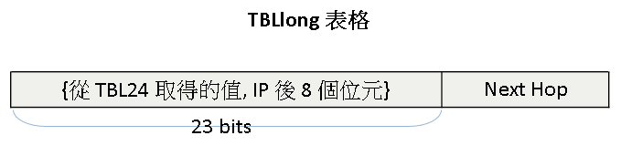

##################################################
IP Lookup 演算法 - DIR-24-8-BASIC
##################################################

:date: 2013-05-06
:categories: 程式設計

這個演算法是「Routing Lookups in Hardware at Memory Access Speeds」這篇論文提出的，
除了最基本的「DIR-24-8-BASIC」，還有其兩種變化，分別是「DIR-24-8-INT」和「DIR-n-m」

「DIR-24-8-BASIC」演算法設計有兩個表格，分別稱作「TBL24」和「TBLlong」。
「TBL24」表格裡頭有 2 ^ 24 個項目，其索引對應著 IP 前 24 位元 0.0.0 到 255.255.255 共 2 ^ 24 種可能。
而索引對應的值和 IP 後 8 個位元經過計算後，可以當成「TBLlong」的索引，
「TBLlong」存放的內容便是 Nexthop 資訊了。

而「TBLlong」的存放的 Nexthop 資訊都來自於長度超過 24 的 prefix，
若是少於 24 的 prefix ，為了減少搜尋的時間，其對應的 Nexthop 會直接存在「TBL24」這個表格中，
而不是放在「TBLlong」。所以說「TBL24」可能會有兩種資訊，
一種是「TBLlong」的索引」，另一種則是 Nexthop 的資訊。

.. image:: images/1.png
    :alt: tbl24.png

由「TBL24」的存放的內容第一個位元可以得知後面十五個位元實際存放的資訊是什麼。

而搜尋的過程是把要做搜尋的 IP 的前 24 個位元當成「TBL24」的索引，找到對應的值後，
若發現值的第一個位元是 0，搜尋就直接停止並回傳 Nexthop 資訊，若發現不是，
再根據得到的值和 IP 後 8 個位元「接在一起」算出「TBLlong」的索引值，
然後在「TBLlong」找到對應的 Nexthop 資訊，完成這次的搜尋。

在實作時要注意，對於所有長度小於 24 的 prefix，都必須展開成許多長度為 24 的 prefix，
因為我們是用 IP 的前 24 個位元當成索引，自然不能少於 24 才行。

至於 TBLlong 的索引的計算方式是當碰到 prefix 長度大於 24 的時候，利用從「TBL24」取得的值，乘上　256(等於往左平移 8 位元) 再加上 IP 後面八個位元，便是 TBLlong 的索引。
我們可以利用該索引取得 Nexthop 資訊。

TBLlong 包含了所有長度大於 24 的 prefix。而因為剩於 8 個位元，
每個 prefix 都要考慮 256 種狀況，
所以 TBLlong 實際上會有「長度大於 24 的 prefix 的個數」乘上 256 個項目來紀錄 Nexthop 資訊。

.. image:: images/3.png
    :alt: dir-24-8-basic.png

至於實作的部分.....我懶了，改天再說吧。
