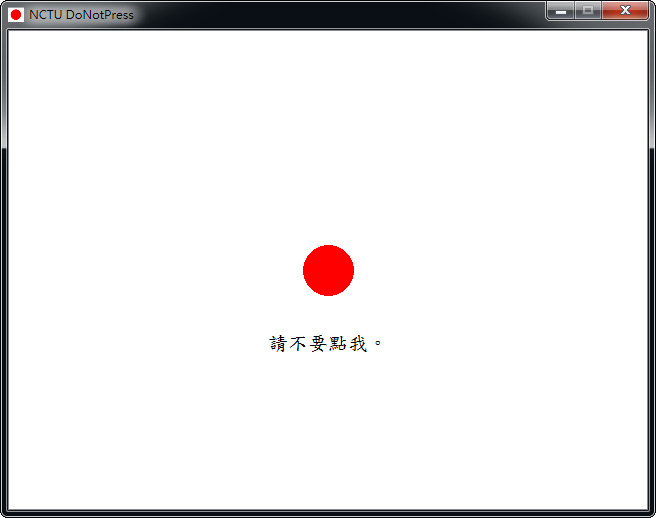

不要點我
##################

:date: 2013-02-23
:categories: 專案作品

     
============= ===========================================================
 名稱          不要點我
 使用語言      Qt
 使用平台      Windows
 版本資訊      0.9.4
 作者          大類
 下載連結      `載點 <files/donotpress.exe>`_
============= ===========================================================

這是一個小遊戲，規則很簡單，就是點就對了。

.. note::

    這個小遊戲靈感來自 Chrome 的一個擴充功能，名字叫作 DoNotPress。
    當然啦，這應該不是最原始的版本，最原始的版本是什麼我也不清楚。

    開發這個遊戲基本上沒有什麼技術難度，最難的地方在於要如何想一堆傲嬌的句子，
    這對如此正經的我似乎有點強人所難......無奈。
