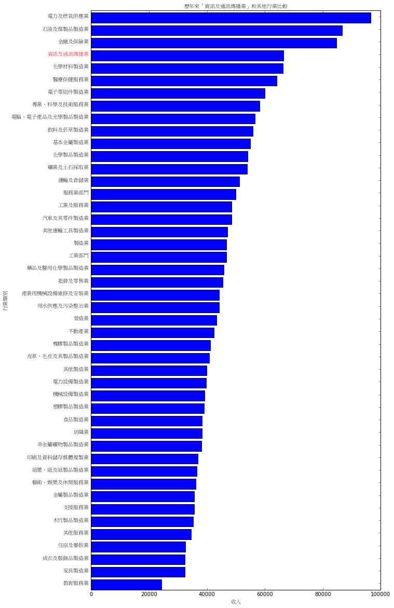
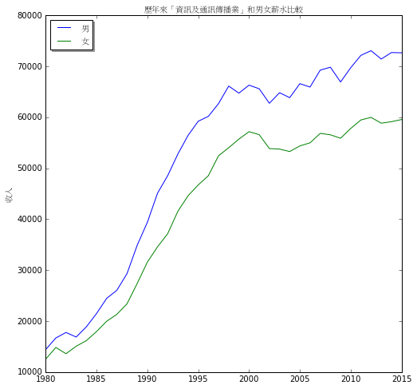

使用 Python 的生活日常系列 [2] - 超簡易資料分析
####################################################

:date: 2016-9-30
:categories: Python;程式設計
:series: 使用 Python 的生活日常系列
:cover: images/2.png

最近閒閒沒事做，想起前陣子看到的新聞評論－－ `如何看貧富差距？官員與學者的爭論 <http://www.thinkingtaiwan.com//content/5381>`_ 。

該文章認為許多爭論根本沒有意義，因為調查從一開始就充滿著統計問題：首先，台灣納稅人也不過一千三百萬人，要取得完整的母體資料並非不可能，為何只取一萬六千戶的人抽樣？如果能提供客觀的完整資料，就不需要爭執到底該用十等分還是二十等分的簡化。而且用收入的平均數表示結果就像男生和女生平均有一個睪丸一樣可笑……然後就是一推分析和討論。

不過文章的內容不是重點，畢竟我並非專業，雖然聽起來好像有道理，但問題是其所用的數據難道就一定沒有問題嗎？他是否會像他自己說的那般操弄數據呢？這我可不曉得，所以我實在無法給予正確的評判，但這事確實勾起了我小小的好奇心……。

說這麼多，讀者應該會以為小弟我接下來的文章就是分析這件事……可惜你猜錯了。

因為當我興奮地開始查資料，才無奈的發現即使找遍了主計處、財政處等機關，我也無法找到所得的母體資料，只有已經處理過的統計資料，這種已經整理過的資料沒什麼意思，雖說中研院的「學術調查研究資料庫」好像有完整的版本，但似乎不是註冊網路會員就能拿得到……。

不過這無關緊要，反正我既不是研究員，也不是趕畢業的研究生，我只是一個喜愛 Python、有點好奇心的無聊份子，我只為了好玩。

而在這個過程中，我在「中華民國統計資訊網的統計資料庫」看到「 `每人每月薪資 <http://statdb.dgbas.gov.tw/PXweb/XMLFile/LaborForce/LM6201A1A.xml>`_ 」的統計，比較這些年來各行業男女的平均薪資變化。我突然有些好奇我所處的行業薪水和其他行業比起來到底如何？男女薪資比又是如何？於是就決定下載來玩玩看。

要分析資料之前，自然要先能處理對應的資料格式，通常這些格式不外乎就是 csv、xml、xls、json 等，常見的格式幾乎都有官方的標準庫可以直接使用，上述的四種格式中，也只有 xls 需要依靠第三方函式庫才能處理。但透過 pip 我們也可以很輕易地找到如 xlrd 之類的函式庫搞定這種格式。

============= ============
  csv          csv
  xml          xml
  xls, xlsx    xlrd
  json         json
============= ============

一般而言，第三方的工具都會比標準庫好用(如果沒有比較好用，好意思拿出來嗎？)，尤其資料分析這一塊，我們有許多超強大的工具，像是 numpy、pandas、scipy 之類的工具來處理非常複雜的問題，不過為了讓本文更單純，我會盡可能的使用標準庫來解決，反正我也不是想分析什麼複雜的問題。 

而本文例子中「每人每月薪資」的資料格式是 xml，所以我就直接使用 xml 函式庫來處理。

.. code-block:: python

    import xml.etree.ElementTree as ET

    tree = ET.parse('每人每月薪資.xml')
    root = tree.getroot()

以上的程式碼會將 xml 的內容轉為「樹」的結構。最外層的 tag 就是根節點。我們可以透過搜尋這個樹的節點取得 XML 對應位置的資料。要抓取指定節點的資訊，有一個很常見的方式即是 XPath (XML Path Langauge)，這是一種專門用來查詢 XML 資料的語言。完整的語法有些複雜，但了解基本語法後，幾乎足以滿足大部分的需求了。

先舉一個簡單的例子：

.. code-block:: XML

    <list>
        <chicken name="小白雞">
            <weight>30</weight>
            <height>7</height>
        </chicken>
        <chicken name="小黃雞">
            <weight>30</weight>
            <height>7</height>
        </chicken>
    </list>

這個例子中，<list> 就代表根節點，裡頭的 <chicken> 都代表它的子節點，如果我們想抓取所有雞的體重，就可以透過 XPath 的語法「/list/chicken/weight」抓取，這句話的意思是說：「找出 list 節點下的 chicken 節點的 weight 節點」，類似檔案系統路徑的概念，應該不難理解。

.. code-block:: XML

    <list>
        <chicken name="小白雞">
            <weight>30</weight>   <!-- 這個節點符合 -->
            <height>7</height>
        </chicken>
        <chicken name="小黃雞">
            <weight>30</weight>   <!-- 這個節點也符合 -->
            <height>7</height>
        </chicken>
    </list>

換言之，「/list/chicken/weight」就代表著條件，丟進對應的 XPath 處理器後，它就會把所有符合條件的節點找給你，很簡單吧？

我們還可以用「中括號」加上別的限制條件，好比說想限制第二個 chicken 節點，就可以用「/list/chicken[2]/weight」表達。

.. note:: 注意是由 1 開始算起。

.. code-block:: XML

    <list>
        <chicken name="小白雞">
            <weight>30</weight>   
            <height>7</height>
        </chicken>
        <chicken name="小黃雞">
            <weight>30</weight>   <!-- 符合！ -->
            <height>7</height>
        </chicken>
    </list>

除此之外，若想指定節點的屬性，則可以用「@」，如「/list/chicken[@name="小黃雞"]/weight」代表只接受屬性 name 為「小黃雞」的 chicken 節點。

.. code-block:: XML

    <list>
        <chicken name="小白雞">
            <weight>30</weight>   
            <height>7</height>
        </chicken>
        <chicken name="小黃雞">
            <weight>30</weight>   <!-- 符合！ -->
            <height>7</height>
        </chicken>
    </list>

接著觀察「每人每月薪資」檔案格式，內容大概長這樣：

.. code-block:: XML

    <GenericData>
        <Header> <!-- ...不管他... --> </Header>
        <DataSet>
            <Series ITEM="工業及服務業-合計(新台幣元)">...</Series>
            <Series ITEM="工業及服務業-男(新台幣元)">...</Series>
            <Series ITEM="工業及服務業-女(新台幣元)">...</Series>
            <Series ITEM="工業部門-合計(新台幣元)">...</Series>
            <Series ITEM="工業部門-男(新台幣元)">...</Series>
            <Series ITEM="工業部門-女(新台幣元)">...</Series>
            <!-- ...後面都差不多... -->

包含各行業的總計、男、女的薪資資料，其中每一個項目又可以分成「原始值」和「年增率」兩種資料，如：

.. code-block:: XML

    <Series ITEM="工業及服務業">
        <SeriesProperty TableName="每人每月薪資" FREQ="" DECIMALS="0" SERIESTYPE="原始值" SOURCE="行政院主計總處" UNIT="新台幣元"><!-- ... --></SeriesProperty>
        <SeriesProperty TableName="每人每月薪資" FREQ="" DECIMALS="2" SERIESTYPE="年增率(%)" SOURCE="行政院主計總處" UNIT="新台幣元"><!-- ... --></SeriesProperty>
    </Series>

隨便抓一個的原始值內容長這樣：

.. code-block:: XML

    <SeriesProperty TableName="每人每月薪資" FREQ="" DECIMALS="0" SERIESTYPE="原始值" SOURCE="行政院主計總處" UNIT="新台幣元">
        <!-- ...很多年的資料... -->
        <Obs TIME_PERIOD="2012" OBS_VALUE="45589.0000000001"/>
        <Obs TIME_PERIOD="2013" OBS_VALUE="45664.0000000001"/>
        <Obs TIME_PERIOD="2014" OBS_VALUE="47300.0000000001"/>
        <Obs TIME_PERIOD="2015" OBS_VALUE="48490.0000000001"/>
    </SeriesProperty>

我手動整理一下裡頭的內容，共有下列這幾種行業：

::

    工業及服務業
        工業部門
            礦業及土石採取業
            製造業
            食品製造業
            飲料及菸草製造業
            紡織業
            成衣及服飾品製造業
            皮革、毛皮及其製品製造業
            木竹製品製造業
            紙漿、紙及紙製品製造業
            印刷及資料儲存媒體複製業
            石油及煤製品製造業
            化學材料製造業
            化學製品製造業
            藥品及醫用化學製品製造業
            橡膠製品製造業
            塑膠製品製造業
            非金屬礦物製品製造業
            基本金屬製造業
            金屬製品製造業
            電子零組件製造業
            電腦、電子產品及光學製品製造業
            電力設備製造業
            機械設備製造業
            汽車及其零件製造業
            其他運輸工具製造業
            家具製造業
            其他製造業
            產業用機械設備維修及安裝業
            電力及燃氣供應業
            用水供應及污染整治業
            營造業
        服務業部門
            批發及零售業
            運輸及倉儲業
            住宿及餐飲業
            資訊及通訊傳播業
            金融及保險業
            不動產業
            專業、科學及技術服務業
            支援服務業
            教育服務業
            醫療保健服務業
            藝術、娛樂及休閒服務業
            其他服務業

估計我大概是屬於「資訊及通訊傳播業」吧？看完這些資料，我有點好奇「資訊及通訊傳播業」和其他行業比起來到底如何呢？為了省麻煩，直接比較 2015 年的薪水好了。

終於到了使用 Python 的時間了！

先來抓取資料：

.. code-block:: python

    import xml.etree.ElementTree as ET

    tree = ET.parse('每人每月薪資.xml')
    root = tree.getroot()

    data_set = dict()

    # findall 可以接受 XPath 語法，然後回傳所有符合條件的節點
    for series_node in root.findall('./DataSet/Series'):
        item_name = series_node.get('ITEM')

        # 先只計算合計，不管男女
        if '合計' not in item_name:
            continue

        industry = item_name.replace("-合計(新台幣元)", "")

        # data_set[行業] = 薪水
        data_set[industry] = float(series_node.find( './SeriesProperty[@SERIESTYPE="原始值"]/Obs[@TIME_PERIOD="2015"]').get('OBS_VALUE'))

現在各行業的薪水資訊都有了，再來根據「薪水」排序即可。不過這樣看起來就太遜了，不方便炫耀，所以果然還是要圖形化才行。

至於要怎麼畫圖表呢？那自然就得用著名的 Matplotlib 函式庫了。

Matplotlib 是一個專門畫圖表的工具，用法據說和 MATLAB 相當接近，對其使用者來說非常好學，可惜我沒用過 MATLAB，所以對我沒差。

由於 matplotlib 功能超強大，幾乎什麼都可以畫，畫「點」、畫「線」、畫「面」都難不倒它，畫一張圖也可，畫多張圖也可，甚至多張圖重覆畫在同一張圖也可，因為什麼都可以，所以操作上稍微有點複雜。

這裡直接用例子介紹：

.. code-block:: python

    # 設定中文字體
    font = font_manager.FontProperties(fname='./mingliu.ttc')

    # 建立一個可以實際放圖表的地方 (figsize 可以指定大小)
    fig = plt.figure(figsize=(20,20))

    # 在上面建一個可以畫圖的區域 Ax (裡頭可以有自己的座標系什麼的)
    ax = fig.add_subplot(1, 1, 1) # 1 分別代表第幾行、第幾列和第幾個

    # matplotlib 提供多種函式可以畫不同的圖，此例為水平條形圖
    # 第一個參數代表垂直方向的值，後者代表對應水平方向的值
    # 兩者皆為 array-like 的型態。
    ax.barh(range(len(industries)), salaries)

    # 設定標題
    ax.set_title("歷年來「資訊及通訊傳播業」和其他行業比較", fontsize=25, fontproperties=font)

    # 設定 x 軸的文字
    ax.set_xlabel("收入", fontproperties=font, fontsize=20)

    # 設定 y 軸的大小限制
    ax.set_ylim([0, len(industries)])

    # 設定 x 軸的文字
    ax.set_ylabel("行業類別", fontproperties=font, fontsize=20)
    
    # 設定 y 軸那些值需要顯示(之所以加 0.5 是因為我想要讓文字顯示在中間)
    ax.set_yticks([a+0.5 for a in range(len(industries))])
    
    # 決定實際顯示的文字
    yticklabels = ax.set_yticklabels(industries, fontproperties=font, fontsize=16)

    # 回傳的物件還可以做更細的設定
    target_label = yticklabels[industries.index("資訊及通訊傳播業")]
    target_label.set_color('red')

    # 顯示
    plt.show()

雖然看起來很多行，但多數都是為了美觀而做的相關設定。概念上，首先就是要用建立一個 Figure，你可以指定大小、解析度等。

然後在 Figure 上建立 Axe 或 Subplot，如果要直接指定具體的位置大小就用 Axe，而 Subplot 則可以讓你用「上下幾分之幾、左右幾分之幾的位置」方式指定。前者比較有彈性，後者很多時候用起來比較方便。

接下來就可以在 Axe 上畫各種圖表，像是長條圖、折線圖、直方圖等。

剛剛所提幾乎所有元素都可以再微調，這就很廢功夫了，可能需要查看官方文件才能了解。

總之，最後畫出來的圖形長成這樣子：

可以看得得出來「資訊及通訊傳播業」排第四，第一名是「電力及燃氣供應業」而且還多出第二名不少；最後一名則是教育服務業。

實話說我現在才知道原來「電力及燃氣供應業」這麼賺錢，不過仔細想想「基礎設施」賺錢好像也沒什麼不對，但我有一點一直搞不清楚，為什麼「教育服務業」這麼不賺錢，還有那麼多人想當、或是「被想當」老師呢？只能說這個世界充滿著各種神秘的現象。

這份資料也有包含男生和女生的薪水，我也來試試歷年的「資訊及通訊傳播業」的男女薪資比為何，看看什麼時候咱們辛苦的程式工作者在未來有沒有女性數量大爆發的可能性？

稍為改一下剛才的程式碼：

.. code-block:: python

    data_set = dict()
    for series_node in root.findall('./DataSet/Series'):
        item_name = series_node.get('ITEM')

        # 偷懶做法，反正我只要資訊通訊傳播業
        if "資訊及通訊傳播業" not in item_name:
            continue

        race = item_name[9]  # 男 or 女

        def parse_salary(node):
            if node.get('OBS_VALUE') != '':
                return float(node.get('OBS_VALUE'))
            else:
                return None

        expression = './SeriesProperty[@SERIESTYPE="原始值"]/*'
        data_set[race] = [parse_salary(node) for node in series_node.findall(expression)]

資料結構改一下，然後畫成折線圖：

.. code-block:: python

    fig = plt.figure(figsize=(8, 8))
    ax = fig.add_subplot(1, 1, 1)

    for race in data_set:
        data = data_set[race]
        ax.plot(list(range(1973, 2016)), data, '-', label=race)

    ax.set_title("歷年來「資訊及通訊傳播業」和男女薪水比較", fontsize=25, fontproperties=font)
    ax.set_ylabel("收入", fontproperties=font, fontsize=20)

    legend = ax.legend(loc='upper left', shadow=True) 
    for label in legend.get_texts():
        label.set_fontsize(25)
        label.set_font_properties(font)

    plt.show()

最後畫出來的圖形大概長成這樣子：

可以看出來，女生薪水增長的速度明顯比不上男生，男女薪水確實有落差，看來女性大爆發的未來還要再等等了。

不過我個人還是很有信心！現在台灣女多男少，男生已經在不知不覺中變成少數族群了，再加上現在又出一位女性總統，女生還有什麼不可以做的？更何況這個行業並不是體力活(加班不知道算不算？)，男性並沒有特別的優勢，沒道理這個行業就該全是男性……所謂風水輪流轉，也許是時候該換男生被壓迫了喔喔喔！

以上。

.. note:: 不過說起來，這個行業薪水真的有這麼高嗎？

相關檔案：

* `第一個例子 <files/1.py>`_ 
* `第二個例子 <files/2.py>`_ 
