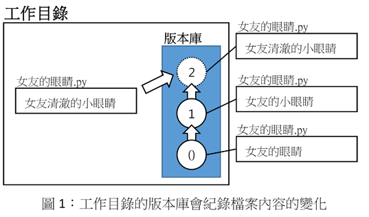
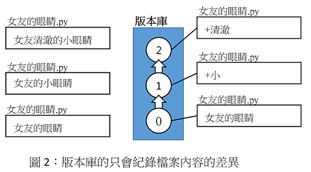
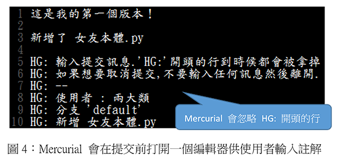
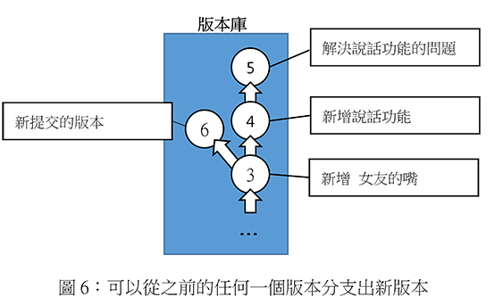
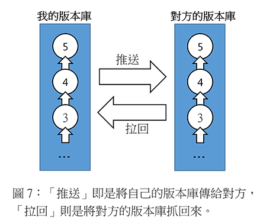
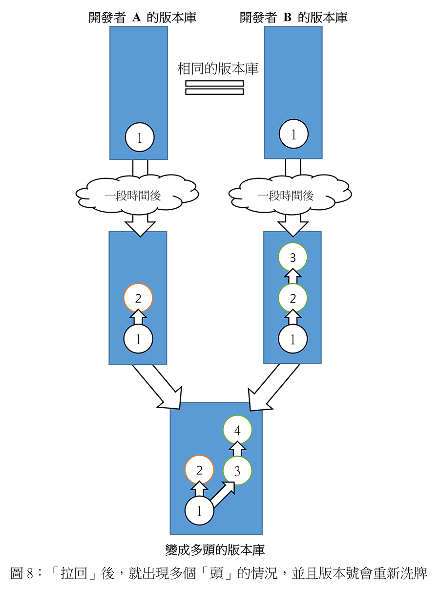

初探 Mercurial 之女友開發日誌
################################

:date: 2013-09-28
:modified_date: 2015-12-04
:categories: UNIX & 工具;程式設計
:cover: images/1.png

*「身為一個仁義正直、年輕有為的宅男而言，想要一個開源免費的『女友』，當然是一件很正常的事情！」*

*「當全世界的女人都發現不了你的優點時，能夠自行創造現想中的美好，一個純真、可愛、又對你百依百順的女朋友，是多麼美妙的事情呢？」*

所以說怎麼辦？開工啊！

我現在就來開發一個程式專案－－「女友」吧！

(並不代表小弟我就是宅男)

這顯然是一個大工程，畢竟女友這種生物，沒有最完美，只有更完美！

為了達成我們遠大的夢想，一個稱手的好工具，自然是不可或缺的。

我們想像一個情境－－開發的過程中，免不了需要新增、修改一些原始碼。我們可能會為了安全起見，先將檔案複製一份，然後命名成「xxxx.orig」或「xxxx.old」之類的名稱，以免未來出狀況時找不到補救的機會。

這種做法雖然可用，但缺點是會產生很多備份檔，若真要回復時，時常反而找不到所需要的檔案。而且通常備份檔之間的內容差異很小，大部分都是重覆的內容。換言之，有很多硬碟空間就這樣白白浪費在這些重覆的內容裡了。

因此，有些人會特意限制備份檔的數量，超過就刪除。但問題是雖然刪除的備份檔都是當下認為不重要的，但未來會不會這麼想可就不好說，萬一未來什麼時候改變主意，檔案也已經救不回來了。

幸好有一個很好用的系統可以幫我們解決這個問題－－那就是 Mercurial。這是一種版本控制系統，這個系統可以有效地幫助我們解決備份檔案的問題。

Mercurial 能夠紀錄檔案的變更，省去手動備份的麻煩。而且好處是目錄裡再也看不到一堆名稱奇怪的備份檔了！因為 Mercurial 會偷偷將這些備份存在我們看不見的地方。

只要指定好 Mercurial 的「工作目錄(working directory)」，它就能幫我們檢查該目錄裡檔案的變更，並在需要的時候幫我們備份裡頭的內容。這個工作目錄沒什麼特別，就只是普通的目錄而已，隨便你指定都行。

至於 Mercurial 究竟會將備份存到那裡了呢？其實只要仔細觀察，就能發現 Mercurial 會在工作目錄裡偷偷新增「.hg」的隱藏目錄，此目錄正是專案的「版本庫(其實英文是 repository，不過我覺得翻成版本庫比較直覺)」，Mercurial 會把所有備份通通存放在這裡。

不過我們其實可以不用理會，只需要知道 Mercurial 的工作目錄裡面一定會有這個目錄即可。

假設我正在開發「女友的眼睛.py」，並且不斷修改裡面的內容。而我為了避免出問題，所以每修改到一點便要求 Mercurial 備份。當裡頭內容為「女友的眼睛」時備份一次，改成「女友的小眼睛」時又備份一次，然後又改成「女友清澈的小眼睛」時又再備份一次。

這三種版本的「女友的眼睛.py」都會存在工作目錄裡的版本庫中，只要我有這個需要，我可以在工作目錄中輕鬆切換三種版本的「女友的眼睛.py」。

Mercurial 其實並不會真的備份三種版本的「女友的眼睛.py」，這樣一來就和傳統的做法沒什麼分別了，我前面何必廢話這麼多？事實上，Mercurial 只會儲存三個版本的「差異」而已，並不會備份重覆的內容。

Mercurial 的基本操作
=====================

Mercurial 的所有指令都是由「hg」開頭，這是參考自素週期表的水銀而取的名字。後面會將一些常用的功能一一介紹，若想知道更詳細的資訊，可以透過下列指令查詢：

>>> hg help 關鍵字 # 關鍵字如：init, add, remove,...

hg version
---------------------

若是第一次在主機使用的話，可以先用下列指令查看主機裡 Mercurial 的版本，順便檢查 Mercurial 有沒有正確地安裝。

>>> hg version

hg init
---------------------

等到確定 Mercurial 有正確安裝後，就可以建立新專案了，假設我決定將這個專案取名為 「girlfriend」，我會這麼做：

>>> hg init girlfriend

init 後面接的是專案名稱，下完指令後，當前目錄就會多了一個名為「girlfriend」的新目錄，這即是先前提過的「工作目錄」。之後的工作都要在此進行，我們可以在裡頭建立檔案、修改檔案內容、建立子目錄等。

.. note::

    Mercurial 會根據專案名稱建立一個新的目錄，即為「工作目錄」；若不加上專案名稱，就不會建立新目錄，而是把當前目錄當成「工作目錄」。

    專案都是個自獨立的，每個專案都會有屬於自己的「.hg」，原則上不要去修改此目錄的內容。

hg add
---------------------

不是每一次變動檔案都要做紀錄，也不是每一個檔案都有紀錄的價值，所以 Mercurial 的可以讓讓使用者自行決定那些檔案需要追蹤。就算是要追蹤的檔案，
也不是每一次變動值得紀錄，若每修改一個字就備份一次，只會產生一堆無意義的版本。所以 Mercurial 交由使用者自己決定何時「提交」最新的版本給 Mercurial 紀錄。

每提交一次，版本庫就會多一個版本，Mercurial 會將整個工作目錄中有追蹤的內容紀錄下來。回復時，其實就是將工作目錄的內容變回其中一次提交時工作目錄的狀態。

因此在專案開發時，我必須決定那些檔案需要追蹤，那些不需要。假設我決定要追蹤「女友本體.py」，那麼我可以這麼做：

>>> hg add 女友本體.py

這樣在下次提交時，Mercurial 除了會把「女友本體.py」存進版本庫外，還會追蹤這個檔案在不同次提交時的內容變動。此後每一次提交時，只要檔案的內容和上一次提交時的內容不同，就會將新的修改儲存進版本庫裡。

並不是下完 hg add 後就會馬上將該檔案存進版本庫裡，而是等到提交時才會這麼做。此後也不用再使用 hg add 這個檔案，因為 Mercurial 會自動追蹤檔案後續的變化。

如果我想新增工作目錄所有未追蹤的檔案，我可以選擇不加上檔案名稱，那麼 Mercurial 就會直接追蹤工作目錄所有未追蹤的檔案。

>>> hg add

hg remove
---------------------

有新增自然就有刪除，我們當然也可以要求 Mercurial 取消對某一個檔案的追蹤，舉例來說，我打算刪除「女友的腳.py」，我可以這麼做：

>>> hg remove 女友的腳.py  # remove 可以用 rm 取代

這樣就會刪除工作目錄中的「女友的腳.py」，並且取消這個檔案的追蹤。若不透過這個方法刪除的話，Mercurial 還是會繼續追蹤這個暫時「丟失」的檔案。

要知道 Mercurial 只會紀錄變動，所以當你沒有明確告訴它：「這個檔案被刪掉了喔！」，那麼 Mercurial 就仍會當這個檔案存在，並且一直保持在最後一次變動的版本。也就是說對 Mercurial 而言，「丟失」不算變動，就只是丟失了而已。

但若真的忘記用 hg remove 刪除檔案了，也可以在事後補上：

>>> hg rm --after 欲刪除的檔案 #--after 可以用 -A 代替

.. note:: 不過就算不加上 --after 其實也關係。

.. image:: images/3.png

hg remove 並不會刪除歷史，所以這個檔案還會存在於先前的版本中。所以雖然「女友的腳.py」被我刪掉了，但這個檔案仍然會存在於之前的版本中。

hg status
---------------------

在每次提交之前，最好都要先用 hg status 檢查一下在上次提交後究竟做了那些變動，順便檢查是不是有什麼檔案忘記用 hg add 新增：

>>> hg status  #status 可以用 st 代替

然後螢幕就會顯示類似下方的列表：

::

    M 女友本體.py
    A 女友的眼睛.py
    R 女友的腳.py
    ? 女友的嘴.py
    ...

簡單解釋一下其中的意思，每行開頭字元表示變動的類型，「M」代表上次提交後，檔案有被修改過，「A」則代表新增追蹤的檔案，「R」則代表取消追蹤的檔案。

換言之，如果我們用 hg add 追蹤檔案，就會出現「A」，用 hg remove 刪除檔案就會出現「R」。

至於「!」是檔案丟失了，表示該檔案並沒有用 hg remove 刪除，而「?」則是這檔案案並沒有被追蹤。

=== ================
 M   檔案已被修改過 
 A   新增追蹤的檔案
 R   取消追蹤的檔案
 !   丟失的檔案
 ?   未被追蹤的檔案
=== ================

hg move
---------------------

有時檔案並不是被刪除，只是改名或是移動位置而已，像是將「吃飯功能.py」改名為「不重要的功能.py」，那麼對 Mercurial 來說，就會覺得是丟失了「吃飯功能.py」，並且多了一個未追蹤的檔案「不重要的功能.py」。所以說，無論是改名還是移動位置，我們都必須透過 Mercurial 提供的指令操作才行。

>>> hg move 來源檔案 目的檔案  # move 可以用 mv 或 rename 代替

不過由於用法和 Unix 的指令 mv 基本相同，所以我就不多說了。

hg commit
---------------------

在經過一連串的開發後，如果覺得已經到一個段落了，就可以將當前工作目錄的狀態提交給版本庫。對使用者而言，「提交」就像是將整個工作目錄的內容複製一份到版本庫裡。理論上，因為不會只提交一次，所以提交時必須留下可供辨識的註解，比如說「這是我的第一個版本」、「這是我女友長出眼睛的版本」、「這是我女友腳刪掉的版本」之類的訊息以協助自己了解不同版本之間的區別，這樣之後回復時才知道要選那一個版本。

.. note::

    養成一個習慣－－每次提交前最好先用 hg status 查看有沒有問題後，才進行提交的動作。

提交的指令如下：

>>> hg commit -u 兩大類 #commit 可用 ci 取代

「-u」後面接提交者的名字，這是必不可少的，因為專案不見得只會有一個開發者，即使現在確實如此，也難保未來不會有新人加入(說不定就是有很多人想一起開發寶貝女友也不一定)。

由於 Mercurial 可以支援多人開發，所以一定要列出提交的人是誰，這樣出事的時候，才可以找到「正確」的人「修理並處理掉」。

下完這個指令後，Mercurial 會打開一個編輯器要求為這次的變更提供註解。

註解的第一行很重要，因為在一般情況下，Mercurial 只會顯示第一行。因此第一行的訊息最好要能完整的表達出該版本的概況。輸入完成後，即可存檔關閉。若想放棄這次提交的話，關閉時不要存檔就行了。

另外，如果不想要每次提交都打開編輯器一次，可以選擇使用參數「-m」，然後直接接註解。

>>> hg ci -u 兩大類 -m "新增 女友本體.py"

不過每次提交時都要加上參數「-u」也是挺麻煩的！對我來說，開發者自然永遠都是「兩大類」。因此若我想省略這個過程，我可以在家目錄中建立一個名為「.hgrc」的檔案，並輸入下面內容。

::

    [ui]
    username=兩大類
    
這樣從此提交時，我就不用再自報名號了。

.. note::

    .hgrc 可以用來設定 Mercurial 很多的相關功能，除了可以指定一些預設值外，還可以指定外掛等的功能。

    這個檔案可以直接建立在家目錄中，表示該使用者的所有專案都可以延用這個設定；也可以建立在專案的工作目錄裡的 .hg 目錄內，這樣就代表這個設定檔只應用在該專案中。

Mercurial 只會追蹤檔案，不能追蹤目錄。在建立一個檔案前，它會先建立檔案路徑缺少的目錄，而在刪除檔案的時候，如果路徑中的目錄變成空目錄， Mercurial 也會一併刪除這個目錄，也就是說不可能單純管理一個完全為空的目錄。

另外，並不是工作目錄裡的每一個檔案都想要追蹤(不然還要 hg add 幹麻？)，比如說「\*.pyc」、「tmp」這類型的檔案，就沒有紀錄的必要。雖然 Mercurial 不會主動紀錄沒用 hg add 追蹤的檔案，但使用 hg status 時，還是會顯示出來。而且還可能隨著時間還變得越來越多，當一堆「?」佔滿了螢幕時，使用者想砸螢幕的可能性就會上升許多。

為了解決這個問題，可以在工作目錄上建立一個名為「.hgignore」的文字檔，並在這個檔案中條列出那些類型的檔案需要忽略，比如說：

::

    syntax: glob
    *.pyc
    .*.swp
    output

第一行需要指定檔名比對的方式，比如可以選擇「glob」採用 Shell 風格或是用「regexp」代表用正規表達式比對。

.. note::

    最好把 .hgignore 列入追蹤的項目，這樣一來更動不但能保存下來，若是和別人一同開發專案時，也能直接共享這個檔案的設定。

hg revert
---------------------

人總免不了失手，當發現改錯而且改不回來的時候，果斷放棄也是也不錯的選擇。這時我們可以用 hg revert 這個指令將檔案恢復到最近一次提交前的狀態。

換言之，也就是說當我們投入了 Mercurial 溫暖的懷抱之後，想開發一個新的功能，就可以盡情開發！

想為女友新增「說話功能」？我可以直接修改「女友的嘴.py」。反正當修改失敗，而且改不回來的時候，直接利用下列指令就可以回復成最後一次提交前的狀態了：

>>> hg revert 女友的嘴.py

你可能會發現 Mercurial 除了會把「女友的嘴.py」回復成之前的狀態外，還會額外將新修改的版本(修改失敗的版本)也複製一份，並命名為「女友的嘴.py.orig」。

之所以這麼做是因為 hg revert 的功能是檔案回復到提交前的版本，也就是說新修改的內容並沒有紀錄在版本庫之中。因為沒有任何備份，所以萬一回復後的版本不如預設的話，仍有補救的機會。

當然了，雖然這是貼心之舉，但如果每次回復都還要刪除一次備份的話也很麻煩，所以其實可以加上參數「--no-backup」要求 Mercurial 不要做出備份的動作。

>>> hg revert --no-backup 女友的嘴.py #--no-backup 可以用 -C 取代。

具體而言這個指令大概有四種用途：

* 回復修改的檔案至上次提交時的狀態
* 取消用 hg add 檔案
* 回復用 hg remove 刪除的檔案
* 不是用 hg remove 刪除的檔案，也可以用這個指令回復

簡單來說，這個指令就是可以取消在提交後下的所有指令，並回復到提交時的狀態。

hg log
---------------------

不過也有可能在努力了一陣子後，才終於發現也許讓女友擁有「說話功能」正是一件「重大的錯誤」時……已經幾個版本過去了。所以現在的問題是－－我究竟該回到那一個版本呢？

幸好！我們只要透過查看版本庫的歷史，就可以判斷究竟要回到那一個版本了。至於怎麼查詢呢？可以這麼做：

>>> hg log

.. image:: images/5.png

這裡恐怕還是要解釋一下顯示的內容是什麼意思，簡單來說每一個版本都有幾個欄位：

**常見的欄位**

=========== ======================
 changeset   版本號：十六進制字串
 標記        此版本的別名
 使用者      提交的開發者
 日期        提交的日期
 提交摘要    此版本的註解
=========== ======================

changeset 後面無論是「版本號」還是「十六進制字串」其實都一樣代表這個版本。一般而言我們都可以用「版本號」來表示版本，如上例版本 1 即代表有「女友的腳.py」的版本。

不過後面會提到，事實上在團隊合作時，可能會發生不同開發者之間同樣版本號卻分別代表不同版本的情形，有可能會發生有別人的版本 3 和自己的版本 3 的內容是不相同的情形。所以說溝通的時候最好以版本號後面的「十六進制字串」來表示版本，因為這種表示法是絕對的、唯一的，同樣的字串表示的一定是同一個版本。

另外有些版本會有「標記」這個欄位，可以當作是這個版本的「暱稱」，可以自己定義，至於此例的「tip」則是一個特殊的名稱，是 Mercurial 自動給予的，不會固定指向同一個版本，只單純代表最新的版本，也就是可以直接用 tip 來表示最新的版本。

最後註解的部分，如果你有實驗過的話，就會發現 Mercurial 只會顯示註解的第一行，這也是之前為什麼說第一行最好就要能完整表達這個版本的概況的原因。但若想查看註解的完整內容，就可以加上參數「-v」來顯示：

>>> hg log -v

如果覺得每次都要加上「-v」來顯示完整的內容頗麻煩的話，可以在 .hgrc 設定的 [ui] 欄位多加了一行「verbose=True」：

::
    
    [ui]
    username=兩大類
    verbose=True

這樣就會預設顯示完整的註解了。

話說回來，版本會越來越多，如果全部一次都顯示在螢幕上的話，就會被一大堆訊息淹沒，所以我們可以只顯示個別版本的訊息或顯示少數幾個版本的訊息就好了。

>>> hg log -r 1 #只顯示版本 1 的資訊

>>> hg log -r 1 -r 3 #只顯示版本 1 和版本 3 的資訊

>>> hg log -r 1:3 #只顯示版本 1 到版本 3 的資訊

參數「-r」後面接代表要顯示的版本，其中版本可以用範圍來表示。

hg diff
---------------------

等等！雖然 hg log 確實可以幫助我們約略了解有那些版本和不同版本之間的變化，得知有的女友有長腳、有的沒有。但是註解寫得清不清楚卻是很重要的關鍵！人都是會偷懶的動物，就算出現：

::

    修正了幾個 bug

這種註解也不會覺得奇怪，這樣使用 hg log 就看不出來了。

這時 hg diff 就可以派上用場了！這個指令可以查看不同版本之間檔案內容變化的細節。至於顯示的格式因為就和 Unix 指令中的 diff(Unified format) 一樣，所以我不多解釋。

>>> hg diff -r 0 -r 2 #比較版本 1 和版本 2 內容的差別。

::

    diff -r 2ef6d7097cc8 -r dbe19235ea1e 女友本體.py
    --- a/女友本體.py       Tue Aug 19 20:58:05 2013 +0800
    +++ b/女友本體.py      Tue Aug 19 21:05:43 2013 +0800
    @@ -1,1 +1,1 @@
    -本體
    +修改後的本體
    
這樣我就可以很清楚的看出來原來是「女友本體.py」被修改過了。檔案裡面的第一行「本體」被改成了「修改後的本體」。

hg cat
---------------------

除了看檔案在不同版本之間的變化外，其實我們也可以直接查看某一個檔案在某一個版本的內容為何？我們可以利用 hg cat 直接顯示一個檔案在某一個版本的完整內容，如：

>>> hg cat -r 1 女友本體.py

參數「-r」後面接的欲查看的版本。這個指令的意思是查看「女友本體.py」在版本 1 時的內容。

hg update
---------------------

在確認要回到那一個版本後，便可以利用 hg update 幫助我們完成這個任務了。這個指令的功能是將工作目錄的內容回復成指定的版本，實際的操作如下：

>>> hg update -r 版本 #update 可以用 up 取代

基本上參數「-r」都是代表版本，這裡也不例外。在這個指令中，如果不加上這個參數的話，默認會回到最新的版本(tip)。透過這個功能，我們就可以回到之前某一個時間點後再重新開始，而且同樣可以提交，只是多出一個分支，變成有多個「頭(head)」的狀態，之前分支並不會刪除，一樣可以透過 hg update 回到該版本。

使用的時候，如果工作目錄中還有尚未提交的修改，Mercurial 就會主動嘗試解決這個問題，將兩個版本盡量完美的結合，假設新的版本中多了一個檔案「女友的內褲.py」，回到舊版本時這個檔案就會保留在工作目錄中。但整體而言，這應該不是我們所希望看到的情況，所以若還想保留當前工作目錄的版本，就先提交吧！反之若覺得不需要保留新修改的版本時，就可以加上參數「--clean」放棄修改的內容：

>>> hg update --clean -r 版本 #--clean 可以用 -C 取代

這裡再提一個小功能，對於常穿梭在各個版本之間的人，有時可能會發生搞不清楚現在自己在那一個版本的情況，碰到這種情況，便可以使用下列指令查詢：

>>> hg parent

這樣便會回傳使用者當前的版本資訊。

小結
---------------------

對單獨的開發者來說，上面提到的功能就已經相當夠用了，這裡我整理出一個簡易的開發流程，這只是個參考，工作流程因為而異，愉快就好。

1. 使用 hg init 開新專案，並且用 hg add 追蹤想追蹤的檔案。
2. 盡情修改已追蹤的檔案, 直到完成一個段落。
3. 測試效果，如果覺得效果不錯，那就提交內容給版本庫，反之效果不好的話，就使用 hg revert 回復到最後提交的版本或用 hg update 回到別的版本。
4. 重覆上一個步驟，直到完成為止。

團隊合作開發
======================

對於個人開發者來說，之前提到的功能就已經非常實用了，但 Mercurial 的功能並不僅於此，多人團隊開發才是它發揮真正實力的場合。

多人開發的困難點有很多。舉例而言，若是多人開發，那麼每個人都必須人手一份原始碼，這樣才能得到最大的效益，但由於每個人都有權限修改，所以當我在修改一份原始碼時，我很難保證是不是別人也正在處理同一份原始碼。我也不能保證我現在正在處理的問題，是不是別人早就處理好了，只是我手上的原始碼的版本不夠新罷了。另一方面，如果後來出事了，也很難找出到底是誰幹的好事。

不過話說回來，其實我們通常不是害怕兩個人同時開發了同一個功能，畢竟只要事先分配好了，這些都不是個問題，真正的問題在於「當甲開發了 A 功能，而乙開發了 B 功能，我要怎麼把這兩份原始碼輕鬆地合而為一而不會出事呢？」，這才是大問題！

使用 Mercurial 的好處就在這裡，雖然它沒有神奇到可以自動完全解決合併時發生的所有問題，但它的好處是能夠提供足夠的資訊協助我們處理問題。這版本是誰寫？用 hg log 即可，與要合併的版本內容差在那裡？用 hg diff 查看。甚至在大部分的情況下，Mercurial 可以直接幫我們合併兩個版本的內容(當然使用者還是得檢查一下有沒有問題)。

詳細的內容，後面會介紹。

hg clone
---------------------

隨著時間過去，自然也有不少「有識人士」能認同小弟我的「理想」，認同開發出一個女友能讓世界變得更加美好……那麼接下來的問題就是－－要怎麼讓新來的開發者能夠輕鬆取得我開發的成果並且能在開發時與我共同享受 Mecurial 所帶來的美好呢？首先，自然要先取得我的程式碼和版本庫資訊，該怎麼做呢？這麼做即可：

>>> hg clone 來源位置(我工作目錄的位置) [目標位置]

這樣一來，目標位置就會產生一個工作目錄，如果不填「目標位置」的話，就會在當前目錄。這個新的目錄除了程式碼外，也會有一份內容完整的版本庫(.hg)，直觀來說 hg clone 做的事其實就像是直接把來源的工作目錄複製到目標位置而已。

事實上，不管使用什麼方法，對方只要能的取得一份完整工作目錄就行了。我們甚至可以選擇用手動的方式複製一份工作目錄傳給對方，反正都可以達成一樣的目的。

話說回來，這個方法自然還是和手動複製有一點差別，首先是這個方法可以支援不同的傳遞媒介，比如說我們可以使用下列幾種來源：

::

    /home/marco79423/girlfriend                 #檔案路徑
    http://marco79423.twbbs.org/girlfriend      #網址
    ssh://hg@bucket.org/marco79423/girlfriend   #SSL

又比如說，假設來源位置和目標位置是同一檔案系統的話，hg clone 複雜的速度還會快一點，而且所佔的空間也會少一點，理由是因為其採用一種稱為「寫時複製」的方式，如果沒有改變內容的話，會使用類似「捷徑」的方式共用同一份資料，直到修改時才會真的複製出一份。

不過大體而言，我們可以想像就是單純把工作目錄複製過去，所以對方也擁有了一份完整的版本庫，換言之，就算複製過去的那一霎那，自己的電腦馬上爆炸，而且衝上了青天，方圓百里立刻被轟成了飛灰……也沒什麼關係。因為還有一份完整的「女友」在對方那兒。也就是說，使用 Mercurial 開發時，每一位開發者都代表一份完整的備份，這樣可以讓寶貝「女友」更加安全。

hg pull
---------------------

既然每位開發者都會有一份屬於自己的版本庫，那麼版本庫之間自然也必須有方法可以互相交流，才能保證每一個版本庫的內容都是一致的。因此 Mercurial 提供了「推送」和「拉回」兩種動作給我們使用。

「推送」指的是將自己的版本庫推送給別人，而「拉回」則是將別人的版本庫推回給自己。

至於實際上要怎麼運作呢？雖然確實可以開發者兩兩互相交流版本庫，但這樣不太能保證交流的版本確實是最新的，所以通常我們會選擇其中一個版本庫當作標準，比如說眾人共同覺得小弟我最仁義正直，所以決定以我的版本庫為標準。那麼對於其餘的開發者而言，只要每次在開工前都先從我的版本庫「拉回」新的版本，就可以保證自己擁有的版本是目前最新的，然後才開始工作。等到終於開發完一個段落並且提交了新的版本後，再將新版本「推送」給我。這樣別人就可以透過我的版本庫取得當前最新的版本(有點繞口，對吧？)。

那麼要如何拉回別人新的版本庫呢？可以這樣做：

>>> hg pull [目標位置]

「目標位置」指的是對方的版本庫，也就是從對方的版本庫拉回最新的版本給自己的版本庫。其實 pull 後面的「目標位置」可以省略，因為 Mercurial 會自動採用預設的位置，若專案是由 hg clone 取得的話，預設的位置就會是 hg clone 的來源位置。

當然我們也可以自行指定預設的位置，只要在工作目錄的「.hg」裡建立一個名為「.hgrc」的文字檔，並在裡面加上：

::

    [path]
    default = 來源位置

就行了。Mercurial 會自動推送到這裡填的「來源位置」。

看到「.hgrc」這個檔名，想必聰明的你就能猜到這和之前提到在家目錄建的「.hgrc」的其實是一樣的，先前提到的設定也可以寫進這個檔案中，差別是放在這裡的「.hgrc」的設定只限於這個專案使用。

要注意的是「拉回」的只是版本庫的資訊，工作目錄的內容並沒有變化，因此「拉回」後記得使用 hg update 更新至最新的版本。

hg push
---------------------

至於推送的方法也是大致相同，可以這麼做：

>>> hg push [目標位置]

也就是我要將我的版本庫裡最新的版本推送給對方。

這裡要提一下，實際上我們實行「推送」和「拉回」動作時，對象通常不會是一個開發者的工作目錄，雖然不是不行，但卻不是個好方法，畢竟隨便更動別人家目錄的內容不是有點怪怪的嗎？

所以說最常見的情況是會為專案建立一個伺服器使用，以伺服器的版本庫當作標準，實行「拉回」和「推送」。不過這對一般人而言，似乎有點壓力，所以不是本文的範疇。有一個更簡單的做法就是請別人來託管，這樣就不會有任何技術上的壓力了。有很多網站都有提供類似的服務，比如說好用的 Bitbucket 就是不錯的例子，不但專案個數和大小都沒有限制，而且還是完全免費的。詳細的做法可以參見官網，並不難使用。設定完後，就可以使用類似下面的語法「推送」和「拉回」版本庫了。

>>> hg pull http://bitbucket.org/使用者帳號/專案名稱

>>> hg push http://bitbucket.org/使用者帳號/專案名稱

hg merge
---------------------

雖然剛開始開發的時候大家的版本庫都是一樣的，但隨著時間過去，開發者們會不斷地提交各自的修改給版本庫，開發者 A 提交了自己的版本，開發者 B 也提交了自己的版本，假設開發者 A 和開發者 B 在版本 1 的時候都是相同的，但隨著各自修改和提交，就會出現不同內容的版本 2、版本 3 同時並行。

碰到了這種情況，我們就不能隨便使用「推送」的動作了，因為現在已經出現問題了，如果要「推送」的話，就必須先把問題解決。

雖然不能「推送」，但我們還是可以做「拉回」的動作。不過「拉回」後就會發生上圖 8 的情況。出現了多個頭(head)的情況，由於 Mercurial 不知道那一個才是真正的頭(head)，所以我們必須處理這個問題。

.. note:: 想知道現在是不是多個頭(head)的情況？可以使用 hg heads 來查看現在有那些頭(head)。

但其實無論選擇那一個當真正的頭都不對，因為我們想要的應該是同時擁有兩個人的開發成果才對，也就是說我們必須將這兩個頭版本的成果「合併」起來，怎麼做呢？我們可以為兩個頭版本各自準備兩個資料夾，然後再分別比對每一個檔案，找我們要的片斷，修正成正確的版本，再檢查......停！打住！顯然我們不用這麼麻煩，因為我們有使用 Mercurail(得意)！

這時，我們就可以使用 Mercurial 的合併功能了，語法如下：

>>> hg merge [目標版本] #此例其實不需要填寫「目標版本」，因為已經出現多個頭的問題了，Mercurial 自然知道要優先合併那一個版本。

這樣一來 Mercurial 就會先幫助我們完成初步合併的動作，畢竟 Mercurial 紀錄的是每一個變動，所以版本之間的合併，只要不發生衝突，並不是沒辦法推算出來。比如說你新增了「女友的肚子.py」，而我修改了「女友的鼻子.py」這合併起來自然不會有問題。

雖然大部分的情況下，Mercurial 都會自動幫助我們解決，但也不是每次都能這麼輕鬆，還是有一些情況必須我們自己解決。Mercurial 這時會很聰明的試著呼叫所有可以處理的工具幫助我們完成合併。

合併後的成果會放在工作目錄裡，我們可以仔細檢查工作目錄的內容有沒有問題，也許某些細節還需要再調整，等確定沒有問題後，我們還要再將成果提交才算真正完成合併的工作。

.. image:: images/9.png

你可能有注意到每一次提交後，版本號都會加一，由於每個開發者都會提交自己的版本，所以當出現分支時，就會發生雖然是同一個版本號但是實際上代表不同版本的情況。這也是為什麼之前說不要使用版本號和別的開發者溝通的原因。

hg branch
---------------------

看到這裡，想必應該有人會有一個疑問－－為什麼要讓所有人都有自己的版本庫呢？只有一個的話不就不需要考慮版本庫分支或合併的問題了嗎？

這是自然是有原因的，除了之前提到可以有更好的備份效果外，效能也會有所提升，因為如果每個人都要直接和同一個版本庫溝通的話，這個版本庫的運行就會很吃力，但若使用分散式的方式，多少可以就可以幫忙分擔一些流量了。反正每一個人的版本庫都是完整的，所以我們不見得一定要從誰的版本庫取得最新的版本。

另一個很重要的原因是假設我現在要開發一個功能，而這個功能有點複雜，一次我只能寫完一個部分，那麼當我寫完成一段落時，到底該不該提交給版本庫呢？若一旦提交了，別人可能就會受到那份不完善的程式碼影響(結下仇恨的因子)。

但如果我真的寫完後才提交，那就失去了使用版本控制的意義了，只要中途出現了差錯，就會沒辦法回復，只能砍掉重寫。

如果每一個人都有自己的版本庫的話，就不會有這樣的問題了。我一樣可以寫完一個片段就提交，反正只會提交到自己的版本庫，並不會影響到別人。等到程式碼穩定以後再和別人的版本庫交流就行了，相對比較不會出問題。

話說回來，這樣似乎還是有一個問題－－只要程式碼還沒穩定，我就永遠不能別人的版本庫同步了。不然一樣還是會影響到別人，強迫別人「享受」你未完成的程式碼的結果就是累積了新的仇恨值。但如果一直都不同步的話，又有誰知道你有沒有在工作呢？

其實有一個更好的方法，那就是使用「分支(branch)」的功能，每寫一個功能，就多開一個分支，要開發「女友的肚臍.py」就開一個肚臍分支，要開發「女友的性別.py」就新開一個性別分支。每個人各自開一個新分支，等到新功能開發完成後，再和主幹合併即可。感覺就像是之前提到的多個頭的情況，差別是這次是我們主動做分支而已，要合併時一樣可以用 hg merge 合併。

這樣一來，就算別人沒有開發完成，同步的時候也只會看到一個未完成的分支而已，主幹(預設的分支)還是開發完成而且穩定的程式碼。而且就算開發失敗了也無關緊要，只要放棄這個分支即可。另一方面，我們還可以透過這些分支掌握別人的開發進度。

至於開新分支的方式如下：

>>> hg branch 分支名稱

下完這個指令後，之後所有的提交都會改在這個分支上進行，並不會影響主幹的內容，除了主幹可以開分支外，分支也可以繼續開分支，無限分支下去。如果想切換不同的分支時，可以使用：

>>> hg update 目標分支名稱 #update 一樣可以用 up 取代

切換不同的分支，其中「default」代表主幹，也就是預設的分支，如果沒有開啟別的分支的話，預設的提交都是在這個分支上進行。
如果 hg branch 後面不加上目標分支的話，就會回傳目前所在的分支為何。

當分支的內容開發完成，我們可以要求 Mercurial 將分支的內容合併回主幹。由於 hg merge 做的事是將目標版本的內容合併入當前所在的版本中，因此我們必須先回到主幹後才能進行合併：

>>> hg up default

>>> hg merge 分支名稱

合併的過程與之前提到的做法相同，碰到衝突必須解決，然後提交後才算完成合併。

如果分支的工作完全搞定後，我們可以提交最後一次，並透過參數「--close-branch」關閉這個分支。

>>> hg commit -m "分支開發完成" --close-branch  #commit 可以用 ci 取代

.. note:: 如果有使用分支的話，建議每次提交時註解都要加上所在的分支名稱，以方便查看。

此外，我們可以使用：

>>> hg branches

查看目前有那些分支正在進行，已經關閉的分支不會列在上面。但要注意的是就算已經關閉了，也不能再開一個同名的分支(不用擔心不小心犯錯，因為用了同樣的名稱 Mercurial 會慘叫給你看)。

分支的應用相當廣泛，舉例來說，我們可以區分「default」和「dev」兩個主要分支，「default」代表發行版，「dev」則代表開發版。「dev」分支代表軟體的最新進展，永遠不會關閉，會不斷地開發新的功能(可以從這個分支再分支出去)，等到覺得可以了以後，再合併至「default」，然後「dev」則繼續開發新功能。

之所以這麼做的原因是假設發行的版本出現 bug 了，但我還想要繼續開發新功能，而團隊這麼多人，自然會需要有人開發新功能，有人處理 bug，總不能把 bug 全部處理完以後才開發新功能，這是耗費人力的做法。

而採用這種模式的話，某些人可以在「default」分支負責努力解決 1.0 的 bug，而負責「dev」分支的人，則繼續開發 2.0 的新功能，等到 1.0 的 bug 處理完以後，便可直接發佈 1.1。

可是開發中的 2.0 一樣可能會隱含 1.0 的 bug 呀？難道也要重新修改一遍嗎？不需要！
因為我們可以反過來將「default」合併至「dev」分支，這樣「dev」隱含的 bug 也就一併被處理了。

戲法人人會變，巧妙各有不同，其實怎麼使用都可以，舉例來說「女友」的開發者們可能不都像本作者一樣正直仁義善良，所以「個別的」開發者也可以另外開一個只共用部分程式碼的特殊分支，像是「十八禁」分支之類的。這樣用當然也行，要知道工具就是拿來用的，使用愉快就好了，不要反而被工具束縛。

.. note:: 實際使用的時候，你可能會發現 Mercurial 會推薦使用 hg bookmark，這是新版本推薦使用的功能，不過這裡有一些爭議，有些人不喜歡這個功能，還是比較推薦使用 hg branch(比如說我，守舊派一隻)，你可以在網路上找到相關的討論。

總結
---------------------

最後再整理一下新版本的工作流程(一樣是因人而異，你爽就好)：

1. 使用 hg init 開新專案或使用 hg clone 複製別人的專案
2. 如果有一段時間沒工作的話，先使用 hg pull 取得最新的版本內容，再用 hg update 更新到最新版本
3. 盡情修改已追蹤的檔案, 直到完成一個段落
4. 測試效果，如果覺得效果不錯，那就提交內容給版本庫，反之效果不好的話，就使用 hg revert 回復到最後提交的版本或用 hg update 回到別的版本。
5. 當成果穩定後，使推送至伺服器。如果發現自己不是最新的版本，便用 hg pull 取得最新的版本，再用 hg merge 合併，直到確定沒問題後，提交合併的版本，再進行推送。
6. 重覆上一個步驟，直到完成為止。

至於只是想惡搞，想實驗新功能，可以直接使用 hg clone 複製一份，然後再上面修改。反正只要沒有推送，就不會影響到別人，而反過來說，萬一寫得太好了，也可以選擇推送，一切取決於自己。

最後做個總結，雖然沒有把所有的功能講完，有很多好用的功能還沒有提到，不過了解目前的這些功能，應該就可以很好的工作了，至於比較進階的功能等以後有機會寫「再探 Mercurial」的時候再說吧。
