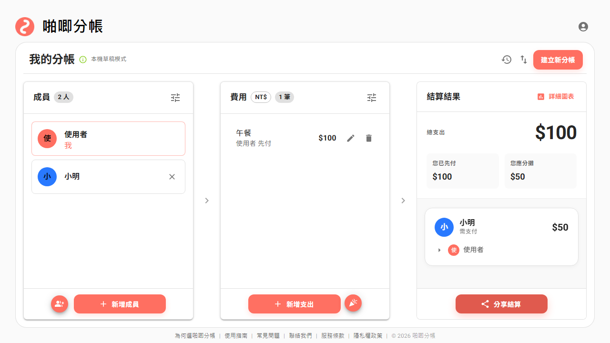
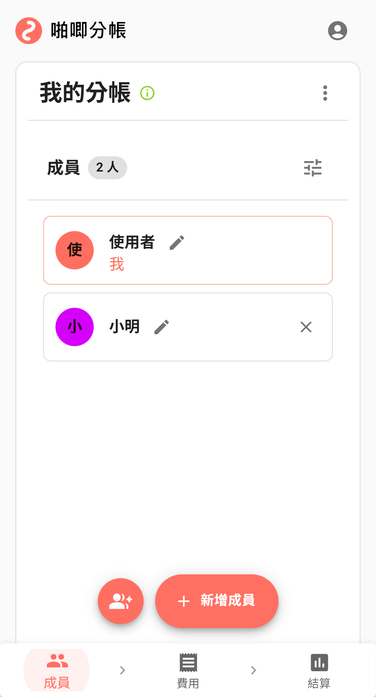
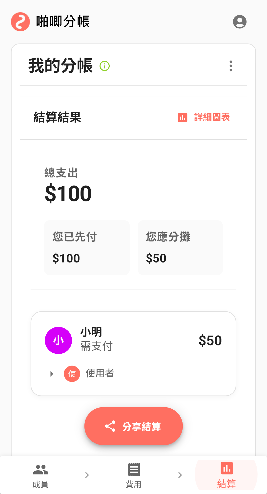

啪唧分帳
########################

:date: 2026-03-31
:categories: 專案作品
:cover: images/1.png

網站： https://splitly.pajitool.com/

來分享一下我閉關三個月做的新作品－－啪唧分帳。

顧名思義，這就是一個分帳工具。不過如果只是「大家吃完飯後平分一下錢」那種程度，其實市面上早就有很多產品了，所以我這次想做的方向不是只有把金額除一除而已，而是希望它在多人協作、即時同步、結算體驗和手機操作上都能再往前推一點。

花了大量的時間在使用 AI，目前的心得是目前 AI 離「一句話就能生出一個完整產品」這件事還有一段距離，做出能動的玩意兒確實很容易，但真要磨到能用、好用還是需要時間。

何況深究其中產生的程式碼還是會覺得問題不少，雖說乍看生出的程式碼品質確實不錯（這邊尤其要稱讚一下 Claude），但只能看局部而已。

如果往大的方面看就會發現不太行，好比說你要它修改畫作的某一處，它會把那一處修改得還不賴，但如果你站遠一點看整幅畫，就會覺得那邊怎麼看怎麼怪，結果還是得自己下去一個口令一個動作的修。

但不管怎麼說 AI 確實幫助很大，這個規模的作品之前的我絕對是想都不敢想，但現在卻真的做出來了，這件事本身－－就很爽！

科科。

因為我 OpenAI 的 Codex、Anthropic 的 Claude 和 Google 的 Gemini 都有在用，而且都算是大量使用，所以剛好也能分享一下我小小的使用心得。

首先自然是大家都在大推的 Claude Code，不用說，確實是目前我最滿意的，至少在寫程式這一塊我覺得是我用過最好的。

另外還有一項可能沒多少人會在意的事情－－那就是我覺得和它語音對話的時候，那個英文的口說和 Gemini 和 ChatGPT 相比聽起來最自然（單指口說本身，不是指內容）……呃，這是題外話，不是很重要 XD。

但 Claude Code 的問題是 token 量太少了，用幾次就沒了。所以必須使用 Max 方案才行，所以成本明顯比其他兩個貴，而且是貴非常非常多。

至於 Gemini 的部分我個人最有意見，不是說完全不能用，但它卻很容易做出一些讓人血壓上升的事情。

比如說我明明叫它－－「改完後先不要 commit，等我確認完沒問題再 commit。」

它改完後還是可能會直接給你 commit 加上 push。質問它為何要這麼做，他會說：「對不起，你明明有要求不要 commit，但我還是 commit 加 push 了。」

然後呢？然後它還會繼續這麼幹，然後繼續道歉，然後再繼續這麼幹……這種事情反覆發生過好幾次了，其他家都沒發生過這種情況，但 Gemini 就是很愛這樣做。

.. note::
    
    聽說最近有更新解決這個問題，但我還沒試過效果，因為我現在主力變成 Claude 了。

不過特別要說一下，如果是用線上的 Jules，量倒是真的很敢給，幾乎可以說是用不完，這點非常兇猛。所以我在散步發想的時候，很喜歡用它來亂做一些東西，而且通常效果也不差，反而程式碼本身之後再找 Claude 修就好。但它執行真的很慢、非常慢，要等很久，如果急用就不適合。

Codex 的感覺大概就在中間，沒有讓我覺得像 Claude 那樣全面壓制，但整體表現通常比 Gemini 更穩定，量也給得不錯。所以如果 Claude 的額度用完了，我大多會優先切去用 Codex。順帶一提，如果我想要做「美美的東西」，通常 Codex 的表現還不錯。

講完 AI，再講回產品本身。

啪唧分帳的核心目標，是想把「多人一起花錢」這件事處理得更順。比方說聚餐、旅遊、同居、水電瓦斯、社團活動，這些場景其實都很煩，煩的點不是算不出來，而是過程很碎，還會一直變。

有人先代墊、有人晚點才補記、有人只參與其中幾筆、有人是固定金額、有人是按比例分攤，而且大家通常還不是坐在同一台電腦前慢慢輸入，多半是各自拿手機邊走邊記。

啪唧分帳目前比較重要的功能大概有下面這些：

============= ==========================================================================
 功能          說明
 免註開帳      免註冊直接開始分帳。
 多人協作      可以快速邀請其他人加入同一個帳本。
 即時同步      多人同時編輯時會即時同步。
 派對功能      可以抽籤決定誰付錢。
 分攤方式      支援平均分、百分比、固定金額、權重份數。
 圖表結算      會自動整理債務關係並畫成圖表。
 結算分享      可以直接分享結算頁，讓大家看懂欠款關係。
 結清管理      可以管理每個人各自結清的帳目。
 紀錄追蹤      每筆帳目的建立、修改和刪除都有修改紀錄。
 離線使用      網路不穩時也能先記，之後再補同步。
============= ==========================================================================

其中我自己比較在意的是這個產品要給人很好的體驗，而不只是有那些功能，所以花了不少時間在調整細節。因為我覺得如果一個產品的功能表很長，但用起來很麻煩，那也不算是一個好產品。

當然了，我一個人也不能保證能注意到所有問題，所以有發現問題的話也歡迎回報給我，讓我有機會修掉它。

以上。
