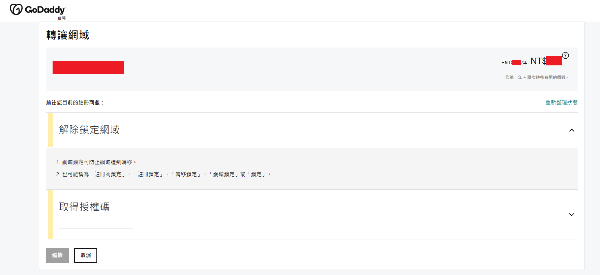
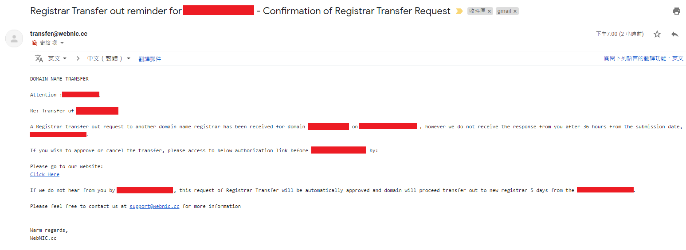

如何從 PCHome 轉移域名至 Godaddy？
####################################

:date: 2022-06-14
:categories: UNIX & 工具
:cover: images/9.png

前言
=====

多年來，一直覺得 PCHome 的網域很貴，所以時常在考慮換別的域名註冊商。

最近我有了一個小發現，所以終於決定下定決心換到 GoDaddy。而我也注意到網路上好像沒有什麼關於從 PCHome 轉網域到 GoDaddy 的教學文章，所以來分享一下，順便做個紀錄。

至於那個「小發現」是啥？其實是因為很早以前，我嘗試要轉移網域時，在 PCHome 的 `常見問題 <http://extra.pchome.com.tw/adm/faq_content02.htm?channel_no=Is2WXMu..ANNAv3-d1BLNcX__&exh_no=P000007&pexh_no=P000183&cexh_no=H000228&faq_id=1461&qnum=8#0>`_ 中看見：

::

    都符合上述條件，請填妥「網域名稱轉出申請書」及附上申請書上所列之相關文件，再傳真給本公司。

沒錯！填本身申請書不是什麼過份的要求，但竟然需要用「傳真」！？

不是吧？這年頭還有人在用傳真的嗎？難道這其實是令人打退堂鼓的手段？

我不知道是否真有這個目的，但這確實是多年我想換結果沒換的原因。

直到某天，我隨手下載網頁的「網域名稱轉出申請書」查看，才發現原來申請書裡頭有說明其實可以直接用檔案上傳的方式，並非一定要用傳真，這才讓我下定決心來轉移。

（順帶一提，「檔案上傳」的連結其實就是連絡客服頁面，具體等會兒會提到）

流程說明
==========

這邊簡單介紹一下轉移所需的條件，由於大部分的網域名稱都有支援網域名稱移轉鎖定，意思是域名上會有一個鎖定的狀態。鎖定後域名就無法移轉至其他註冊商 （經銷商）。

所以要轉移之前就必須先在原註冊商網站申請轉出，請舊註冊商解除鎖定，具體而言就是請他們將移轉密碼（EPP Code）寄給你。

「移轉密碼」各家似乎都有不同的說法，如 EPP 碼、EPP 移轉碼、移轉金鑰、授權碼等等，簡單來說就是要轉到別的註冊商時必須要有的密碼。有了這個密碼，新的註冊商才能取得你原網域的使用權。

因此在轉網域前，必須要先申請取得這個密碼，然後才到新註冊商去申請轉入，大致流程就是這樣。

接下來我就來詳細分享轉移的過程，正式開始我們的轉移之旅！

＊＊＊

首先，因為要取得移轉密碼，所以要去 PCHome 填申請表，剛才有說過可以去的 `常見問題 <http://extra.pchome.com.tw/adm/faq_content02.htm?channel_no=Is2WXMu..ANNAv3-d1BLNcX__&exh_no=P000007&pexh_no=P000183&cexh_no=H000228&faq_id=1461&qnum=8#0>`_ 的頁面下載。

（順帶一提，申請表是古早的 .doc 檔，因為我沒有 Word，所以我是扔到 Google Doc 打開的）

內容大致就是填一些基本聲明而已，不會太困難。

搞定之後，可以去 `聯絡客服 <http://extra.pchome.com.tw/adm/customer_service.htm>`_ 填寫申請，並上傳申請表和身份證正反面影本。

（記得要提供註冊人的身份證正反面影本，不然會被打槍，不要問我為啥知道）

填完之後約一天，就會收到客服中心的回覆說收到了，並表示之後會再寄一封信告訴我亂數移轉密碼（也就是剛才說的移轉密碼）。

也就是下面這封信，那個 Authorization Information 後面的即是移轉密碼，可以在之後去新註冊商轉入域名的時候使用。

接著就是到  GoDaddy 申請移轉。

老實說我覺得 GoDaddy 的操作比 PCHome 還不直覺， PCHome 的介面醜歸醜，至少我使用沒啥大問題，也不會有一堆莫名其妙的廣告，但在 GoDaddy 就複雜許多，所以這裡簡單指引一下要怎麼點進去。

.. image:: images/7.png
   :width: 100%
   :alt: 7.png

接著選轉移網域名稱。

輸入要轉的網域。

最後就會來到這一頁，它會告訴你轉移所需要的金額並且要求你填入的授權碼（也就是移轉密碼）

接著就可以在這裡填入授權碼，搞定！

順帶一提，其實當下沒填入授權碼也可以過，但如果原網域有鎖定的話，之後還是會收到 GoDaddy 的來信要求補填（像下面這張這樣）。

總之，填完移轉碼後，幾天後就會收到確認信。上面會簡單說明說收到這個確認信後可以決定要不要繼續或取消，但如果一段時間都沒回覆就會自動確認。

如果你很叛逆，決定不理它的話，它還會再寄一次。

總之確認一下就好。

後記
=====

用了一陣子，再次認真覺得好像 PCHome 也沒多差，至少對我來說很好懂，雖然陽春了一點，但還是挺堪用的。

反之 GoDaddy 每次要操作什麼都要點好多次，還要避過一堆廣告才能點到我想要的東西。我覺得使用體驗實在不怎麼樣。
