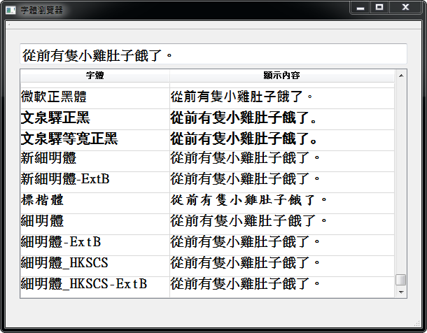

字型檢視器
##################

:date: 2013-02-21
:categories: 專案作品
:cover: images/2.png

.. image:: images/1.png
    :alt: fontviewer.png
     
============= ===========================================================
 名稱          字型檢視器
 使用語言      Qt
 使用平台      Windows
 版本資訊      0.9
 作者          大類
 下載連結      `載點 <files/fontviewer.exe>`_
============= ===========================================================

**簡介**

當寫文章或設計網站的時候，有些時候會覺得字型這麼多，不知道要用那一個才好，
可能是因為不知道到底系統有那些字型？或是不知道寫的這些字配上那些字型比較好看？

雖然很多軟體都有提供選擇字型的功能，
甚至還能秀出一些測試的文字讓你了解這種字型顯示的感覺，
但問題是這畢竟不是你真的要拿來顯示的文字，所以還是會有所差別，
也許它對某個文字的處理你不喜歡，但偏偏那就是你要用的......。

所以為了確定那一種字型是自己真的想要的，可能就要實際一個個調整字型，
看看那種字型比較漂亮.....但這麼做實在太麻煩了！所以有需求就有工具。

使用這個「字型檢視器」，就可以直接顯示所有的字型，
而且還可以完全依自己的需求設定內容，這樣一來，就可以輕鬆方便的瀏覽所有字型了。

.. note::

    是不是很厲害？是不是嘛？是不是嘛？快說句話，我想聽聽看讀者的聲音，
    說不定我聽得到喔？ 快說你覺得超有用！

    介紹的很心虛，開發的時候覺得超有用，但開發完了以後，
    突然發現自己超蠢的.....嗚嗚。

    *「身為一隻沒用的廢物，寫出沒用的程式也是非常合乎邏輯的」*
     
