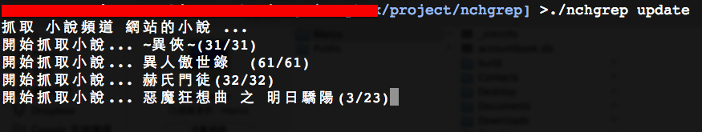
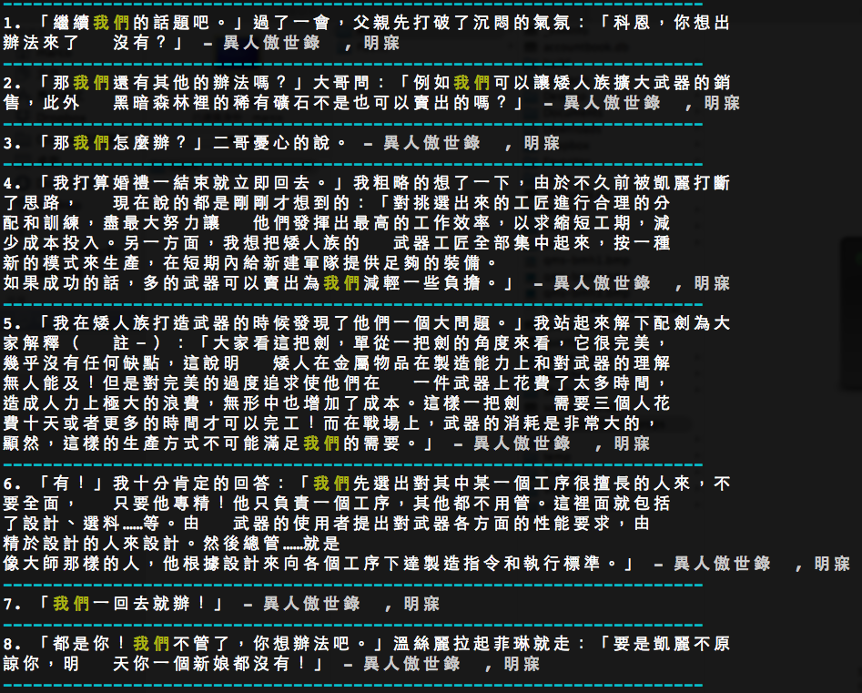
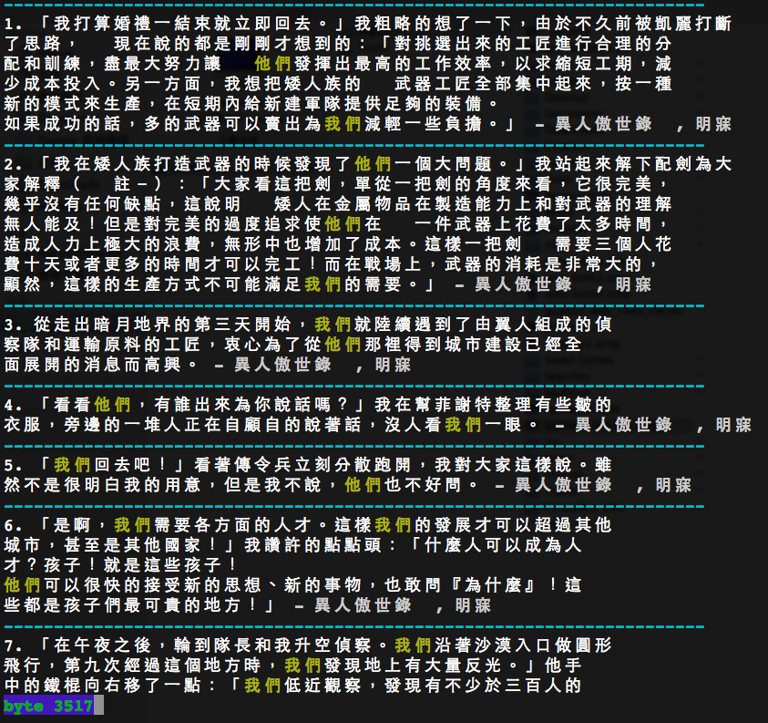

小說語句搜尋引擎
##################

:date: 2014-09-19
:categories: 專案作品
:cover: images/5.png

============= ===========================================================
 名稱           小說語句搜尋引擎
 使用語言        Python 2.7(需另裝 lxml)
 使用平台        Unix-like(e.g. Linux, FreeBSD)
 版本資訊        0.2.2
 作者           兩大類
 下載連結       `載點 <files/nchgrep>`_
============= ===========================================================

.. note:: 

    0.2.2 版更新內容

    * 重新設計架構和程式碼
    * 新增支援多字詞搜尋
    * 自動使用 PAGER 瀏覽

對於寫作新手來說，如何使用字詞是一個重要的課題。比如想描述「煩惱」，該怎麼做呢？是苦痛的煩惱？奇異的煩惱？亦或是莫名的煩惱？這些都困擾著寫作新手，形成新手們的煩惱。

參考別人的作品往往是一個好的出發點，多了解高手是怎麼使用文字，可以協助自己寫出更漂亮的文章。但參考作品的品質也必須有所限定，畢竟參考垃圾對文筆沒什麼幫助。

但要如何找出值得參考的文章呢？

這顯然無法透過 Google 搜尋字詞解決，我們雖然可以藉此找出含有相同詞彙的文章，但卻沒什麼意義。因為 Google 只在意文章是否相關，它並十分不在乎文筆的好壞，因此找出來的文章參考價值有限。

為了解決這個問題，此專案的目標即是做一個文字搜尋引擎，只要輸入關鍵字詞，便會後回傳完整的語句。

我的構想是「一個廣受大家喜愛的作品，其文筆至少不會太差」，所以我找了一個名為「小說頻道」的網站，抓取小說公開的內容當作資料來源，並以「小說排行榜」的排序做為篩選的依據，只要排行比較前面的小說，就更有可能被當成結果顯示。透過這樣的篩選，理論上我就可以找出不錯的句子。

使用方法很簡單，只要做兩件事：

* 更新語句資料庫
* 搜尋

更新即是去「小說頻道」抓取資料，所以要保證網路的暢通，抓取的過程可以隨時用 Ctrl + C 中斷，畢竟「小說頻道」一共有上千部小說，如果要等到全部抓完，將會花上許多時間和硬碟空間，因此只需要抓取足夠量的小說即可。

由於抓取的順序是以排行榜第一名的小說開始，相信搜尋出的語句都能有不錯的表現。如果發現搜尋不到句子，或是結果太少，可再重新下「更新」指令，抓取更多小說。

更新的語法如下：

等到抓完足夠多的小說後，便可以用 Ctrl + C 中斷，接下來就可以搜尋了。

.. note:: 資料庫會存放在家目錄之中，檔名為 .nch.db

比如說想搜尋「我們」，可以如下操作：

也可以同時搜尋多個字詞，如「我們」、「他們」：

除此之外還有一個功能，如果 grep 後面不接任何參數，就會進入互動模式，可以搜尋多次關鍵字。

.. image:: images/4.png

如果不想要搜尋時，只要輸入 Ctrl + C 即可跳出程式。

.. image:: images/5.png
