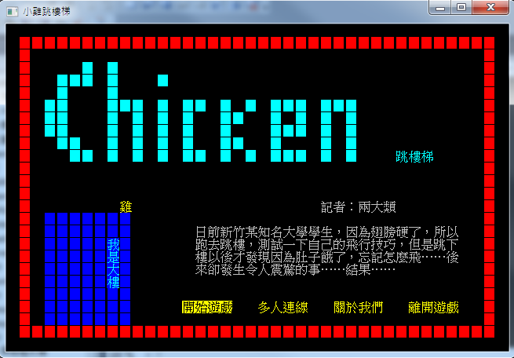
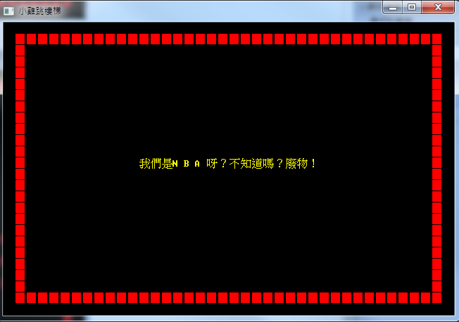

小雞跳樓梯
###########################

:date: 2013-02-18
:categories: 專案作品

 
========== ===============================================
 使用語言   C++ 和 Win API
 遊戲平台   Windows 7
 版本資訊   0.9.0.1
 下載連結   `載點 <files/chicken.exe>`_
========== ===============================================
 
**遊戲簡介**
 
「日前新竹某知名大學學生，因為翅膀硬了，所以跑去跳樓，測試一下自己的飛行技巧，
但是跳下樓以後才發現因為肚子餓了，忘記怎麼飛......後來卻發生令人震驚的事......結果......」
 
驚險的遊戲旅程，由此展開！「小雞跳樓梯」是由知名的遊戲廠商 CSsula 創意工坊所製作，
之前CSsula 創意工坊曾經製作過 「冏頭蛇」、「CSRPG」 和最令人津津樂道的 「賴聖帝君」系列。
製作團隊費時三年，將再次呈現新一代經典遊戲傳說！為了增加遊戲效果，
製作團隊更是特地請來一隻小雞來代言。而這隻小雞可不僅僅是「藝雞」，她表示她也是遊戲玩家，
參與這次「小雞跳樓梯」製作的經驗非常有趣，而製作團隊的用心更是令她印象深刻。
而「小雞跳樓梯」結合動作、冒險等各項元素，配上許多有迫力的音效加持，絕對可以給玩家前所未見的全新體驗！
 
**遊戲節圖**

.. image:: images/2.png
    :alt: chicken-game.png

(遊戲畫面)

.. image:: images/3.png
    :alt: chicken-dead.png

(小雞死亡畫面)
 
.. image:: images/4.png
    :alt: chicken-profile.png

(遊戲動畫)

 
(關於畫面)

 
| *知名藝人：「這個遊戲讓我們了解到，讓自己肚子餓，不是件好事。」*
| *知名雜誌總編：「這是一個小雞的身體力行的體悟之旅。『 肚子餓時，不要亂飛！』 」*
| *交大校長：「在交大跳樓的不一定是交大學生，請記者不要亂寫！」*
| *教育部長：「有這樣的事？我怎麼都不知道？喂！小黃！這麼大的事，你怎麼不通報一聲？你在搞什麼呀？」*
| *某總統：「我用 facebook 絕對不是為了趕時髦......咦！弄錯了？」*
 