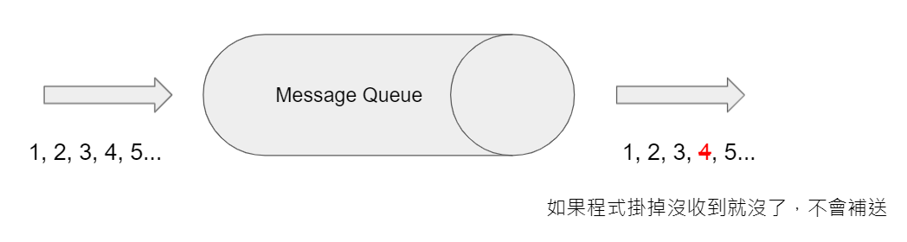

淺談 NATS、STAN 和 JetStream 兩三事
###############################################

:date: 2022-01-20
:categories: 程式設計
:cover: images/6.png

事情是這個發生的……

因為公司新專案需要用到 MQ，所以我們選用了 NATS Streaming (STAN) 當作我們專案的 MQ。

沒想到如火如荼的密集開發一年後，某天在 Github 查看 STAN 的資料時才發現原來 STAN 要被開發團隊棄用了……

（來源: `https://github.com/nats-io/nats-streaming-server <https://github.com/nats-io/nats-streaming-server>`_）

……三小？

看上面說明，開發團隊建議改用他們的新產品 JetStream，取代現有的 STAN。

所以 JetStream 是啥？聽都沒聽過？

於是決定來研究一下 JetStream 究竟是何方神聖？並藉此機會順便回顧一下先前的 Core NATS 和 NATS Streaming 兩套產品，並且比較一下新舊產品的差異。

這次分享的主題主要有三個部分：

* 一是簡單介紹 Message Queue (MQ) 的概念和其用途；
* 二是分別介紹 NATS、NATS Streaming 和這次的重點 JetStream；
* 最後再做個簡易的評測。

Message Queue (MQ)
===================

Message Queue (MQ)，時常翻譯為「訊息佇列」或「消息隊列」，常見的開源選擇有 RabbitMQ、Kafka 和今天要談的 NATS。

Message Queue 本身可以簡單想像成是一個服務級別的 Queue，同樣訊息先進先出，差別在因為這是獨立的服務，所以通常必須異步處理；另一個分別是通常 Queue 是一進一出，一則訊息被一個消費者接收，另一個就收不到，但 Message Queue 可以做到讓每個消費者都能收到全部的訊息(這通常是可選的)。

MQ 概念上大致可以分別兩個角色，分別是：

* 生產者 (Producer)
* 消費者 (Consumer)

生產者負責生產訊息 (Message)，並丟進 MQ，而消費者負責接收並處理訊息。兩者可以完全不用知道對方，只要和 MQ 溝通即可。

換句話說，只要生產者產生的訊息符合消費者能接收的格式，那麼其實不一定具體非得由哪個生產者才能生產。因為無論是單個生產者還是多個不同的生產者，對身為接收端的消費者都無所謂，只要能正常收到符合條件格式的訊息即可。

反過來也是如此，生產者只管生產，至於後端究竟有多少個消費者消費，對生產者來說無關緊要，也不會影響程式碼，可以讓生產者和消費者各自都擁有最大的彈性。

套用我流解釋，使用 MQ 可以有幾個好處：

* 更簡單
* 更可靠
* 更大更強

更簡單 - 程式簡化和解耦
------------------------

使用 MQ 可以方便讓不同服務解耦，正如前面所說，所有服務不管是生產者還是消費者 ，全部都統一都只和 MQ 溝通，生產者不用管是誰處理或是什麼時候處理，而消費者也不用管是誰生產的內容。

因此無論是生產者還是消費者都可以自由的拆分成多個服務，讓每個服務都只負責一件事，程式碼可以很單純。

也就是說只要能和 MQ 溝通，不管是用什麼程式語言、用什麼方式處理皆無所謂，就算後面其實是一隻雞在處理也可以。

::

   你永遠不會知道網路上和你聊天的是不是一隻雞，但如果他真的能用你理解的方式溝通、協作，那對方是不是只是一隻雞其實也沒差了。

更進一步說，其實連時間也解耦了，因為中間隔了一層 MQ，所以不一定需要生產者和消費者同時在線上。

生產者在生產訊息時，沒人規定消費者非得即時在線上處理；反之亦然，消費者在處理訊息時，生產者也不一定要同時在線上生產訊息。

更可靠 - 服務掛掉也沒差的能力
-----------------------------

在這個架構下，因為生產者或消費者不需要直接連結，所以即使服務掛掉，系統還能一定程度的繼續運作。

因為 MQ 通常都有一定程度的儲存訊息的能力，所以即使某一個消費者掛掉，也可以等到它復活後再繼續把之前沒推送成功的訊息再推送給它。

雖然處理時間多少會受影響，但至少訊息不會掉，在多數情境下，這樣也不會影響到系統的運作。

更大更強 - 大流量的緩衝
------------------------------

網路服務的流量並不一定是恆定的，系統有時可能會突然面臨超大量的網路請求，但是即使要開更多台服務器也需要一點時間，這時 MQ 就可以當作「漏斗」一樣的功能，充當緩充。

等到足夠數量的服務啟動完畢，可以跟上訊息生產的速度了，就可以處理之前來不及處理的訊息了。

.. note::

   另一種假設是這類超大量的網路請求不會一直持續，所以如果業務許可，也可以選擇不啟動新的服務器，讓 MQ 先接收下來就好，之後再讓消費者慢慢消化，用時間換取資源，也是一種選擇。

Core NATS
===========

這裡首先介紹 Core NATS，此處有個很容易混淆的點是 NATS 其實有三項產品：一是 Core NATS、另一是 NATS Streaming，最後還有最新的 JetStream。

因為官網的文件是直接把這三者的內容寫在一起，所以一開始沒看清楚很容易會以為是同樣的東西。但其實這是各自擁有不同概念的三項產品。

Core NATS（以下簡稱 NATS），一個開源、雲原生、用 Golang 寫的訊息傳遞系統，也是 NATS 最基礎的產品。

NATS 使用「發布」和「訂閱」的方式和程式溝通，並且不做任何持久性的處理，非常單純，所以效能也相當好。

程式操作也非常簡單，這裡介紹一下簡單的例子。

範例 - NATS 連線
--------------------

.. code-block:: go

   // 連線
   natsConn, err := nats.Connect("nats://localhost:4222")
   if err != nil {
     log.Fatal("連不上 NATS")
   }
   defer natsConn.Close()

範例 - NATS 發送訊息
----------------------

.. code-block:: go

   // 發送訊息
   err = natsConn.Publish("subject", []byte("Hello world"))
   if err != nil {
       log.Fatal("送不出去")
   }

   // 清空緩衝
   err = natsConn.Flush()
   if err != nil {
       log.Fatal("清空失敗")
   }

.. note::

   基於效能因素，函式庫會先緩充要發送的訊息，直到一定量的時候才會發送。但如果應用程式有需求要確保想處理的已經確實處理好了，可以使用 flush 函式立即處理。 

   (來源：https://docs.nats.io/developing-with-nats/sending/caches)

範例 - NATS 接收訊息
----------------------

.. code-block:: go

   // 接收訊息
   _, err = natsConn.Subscribe("subject", func(msg *nats.Msg) {
       fmt.Println("收到了", string(msg.Data))
   })
   if err != nil {
       log.Fatal("訂閱失敗")
   }

Queue Groups
----------------

NATS 內建 Load balancing 的功能，你可以在訂閱的時候隨便指定一個 Queue 的名稱，NATS 會確保訊息能自動分配訊息到同一個 Queue Group 的不同的消費者。

.. code-block:: go

   // 訂閱時直接指定 Queue 的名稱，不需要用設定檔預先設定
   _, err = natsConn.QueueSubscribe("subject", "queue", func(msg *nats.Msg) {
       fmt.Println("收到了", string(msg.Data))
   })
   if err != nil {
       log.Fatal("訂閱失敗")
   }

這樣一來，即使一個 Subject 有多個消費者一起處理，每則訊息也只會被處理一次，非常方便。

「最多一次」交付模型
-----------------------

前面說到，NATS 本身不做任何持久性處理，換句話說，如果 NATS 發送訊息的時候如果沒人接，掉了就掉了， NATS 也不會理它，訊息便有可能會丟失。

雖然 NATS 本身不管這件事，但它提供了一種稱為 Request / Reply 的解決方案。

簡單來說就兩件事：

* 消費者主動回傳「收到」的訊息給生產者知道有收到
* 讓開發者自行解決有沒有收到的問題

範例 - Request / Reply 機制
---------------------------------

.. code-block:: go

   // 自動建立一個唯一 subject
   reply := nats.NewInbox()

   // 發送訊息
   err = natsConn.PublishRequest("subject", reply, []byte("Hello world"))
   if err != nil {
       log.Fatal("送不出去")
   }

此例的 reply 其實就是一個普通的 Subject，可以正常透過 Subscribe 監聽，用來接收消費者回傳的「收到」訊息。

.. code-block:: go

   // 接收訊息
   _, err = natsConn.Subscribe("subject", func(msg *nats.Msg) {
       fmt.Println("收到了", string(msg.Data))

       msg.Respond([]byte("我收到了")) // 生產者會監聽 reply，來確認消費者有沒有收到
   })
   if err != nil {
       log.Fatal("訂閱失敗")
   }

Respond 意思就是回傳訊息給上例的 reply，只要生產者有監聽，就可以收到該訊息。藉此讓生產者自行處理「收到」或是「沒收到」的情況。

當然，這是有需要判斷有沒有收到的場景才需要這麼做，如果本身是不介意掉訊息的場景那就沒差了。

NATS 小結
------------

簡單來說，Core NATS 的好處就是速度很快，簡單易用，而且對我來說因為是用 Golang 寫的，有什麼問題比較容易自己找到原因。

但因為有可能因為以消費者掛掉而掉訊息，所以適合需要大量、低延遲的場景 (比 Kafka 低很多)，而且不擔心漏訊息的場景 (或是能自行維護也行)。

NATS Streaming (STAN)
=======================

NATS Streaming，縮寫為 STAN，與前述的 Core NATS 相比，最重要的就是新增了持久化的功能，可以說就是「有持久化功能的 NATS」。

具體的應用場景，大約有下列四種情況：

* 需要訊息的歷史紀錄 (需要 Replay data 的時候)
* Producer 和 Consumer 高度解偶，有可能不是同時在線
* Producer 和 Consumer 需要按照自己的節奏發送、或是接收資料
* 最後一條訊息對 Consumer 是必須的 (Producer 可能離線)

根據官方的說法，其實大部分用原始的 NATS 即可，如果要確保收到，可以透過前述的 Request / Reply 機制解決，官方相信自行在應用端管理，長久下來會比直接用 STAN 更加穩定。

(當然啦，身為苦逼的開發者，不一定都有機會可以能長遠的看待問題就是了……)

獨立的 STAN
----------------

雖然乍聽起來， STAN 好像只是 NATS 多了持久化的功能而已，但其實兩者幾乎是完全不同的東西， STAN 有完全屬於自己的概念，有自己獨立的函式庫，只是函式庫內部使用 NATS 連線而已。

由於 STAN 只是將 NATS 當作連線工具使用，會用自己的方式將資訊做包裝，如果你直接透過 NATS 來觀察，你發現完全看不出什麼鬼。

簡單來說， STAN 與 NATS 是不同的東西。

好比說客戶端在連上 STAN 需要指定使用的 Cluster ID，也要自行指定自己的 Client ID。

而這邊的 Client ID 是專屬於 NATS Streaming 的概念，並不是 NATS 的 Client ID (但因為是用 NATS 連線，所以同時仍然也會有 NATS 的 Client ID)。

範例 - STAN 連線
--------------------

.. code-block:: go

   // 連線
   stanConn, err := stan.Connect(
       "test-cluster", // Cluster ID
       "clientID",   // 客戶端自設的 Client ID
       stan.NatsURL("nats://localhost:4222"),
       stan.NatsOptions(
           nats.Name("NATS 連線名稱"),
       ),
   )
   if err != nil {
       log.Fatal("連不上 STAN")
   }
   defer stanConn.Close()

此外， STAN 使用的是 Channel 而非 Subject，雖然看似相同，但實際卻有差別。

NATS 原生的 Subject 可以支援 wildcard，我們可以在直接訂閱 `chicken.*` ，那麼無論是 `chicken.a` 又或是 `chicken.b` 也都能收到訊息，但 NATS Streaming 的 Channel 就不支援這麼做。

.. note::

   不知為何，雖然官網說 STAN 用的是 Channel 而非 Subject，但函式庫的命名還是使用 subject

   (來源： https://docs.nats.io/developing-with-nats-streaming/streaming)

而 STAN 使用的訊息也是不同的物件，一個是 ``nats.Msg`` 另一個是 ``stan.Msg`` 。

範例 - STAN 發送訊息
-----------------------

.. code-block:: go

   // 發送訊息
   err = stanConn.Publish("channel", []byte("Hello world"))
   if err != nil {
       log.Fatal("送不出去")
   }

範例 - STAN 接收訊息
---------------------

.. code-block:: go

   // 接收訊息
   _, err = stanConn.Subscribe("channel", func(msg *stan.Msg) {  // 使用 stan.Msg
       fmt.Println("收到了", string(msg.Data))
   })
   if err != nil {
       log.Fatal("訂閱失敗", err)
   }

Durable
------------

因為 STAN 多了持久化的功能，所以消費者端這邊就不用在生產者生產訊息的時候即時接收，只要訊息還存在 STAN 裡，就可以自行選擇任意時間和位置開始接收訊息。

但是如果消費者端每次都要隨時自己記得自己收到哪裡也很麻煩，所以 STAN 也多了 Durable 的概念。

STAN 本身會幫忙記錄消費者收到哪裡，如果消費者斷線回復，STAN 會自動從斷線的地方開始送。

消費者可以在訂閱的時候指定 Durable 名稱，STAN 會把消費者的 Client ID 和 Durable 當作 Key 記錄當前接收到的位置。假若消費者因故斷線重連，那麼 STAN 就會根據 Client ID 和 Durable 判斷從哪個位置開始發送。

由於 STAN 也支援前述的  Queue Groups 的功能，所以 STAN 的訂閱其實有四種組合，分別為：

.. list-table::
   :header-rows: 1

   * - 類型
     - 說明
   * - Regular
     - 最基本的訂閱模式，當應用關掉、取消訂閱時，就會失去位置，下次訂閱需要重新指定
   * - Durable
     - 消費者斷線時會保留位置，下次訂閱還會從上次最後接收的位置開始 (不包含主動取消訂閱)
   * - Queue
     - 多個消費者共享位置，但全部斷線就會失去位置
   * - Durable / Queue
     - 多個消費者共享位置，但即使全部斷線也不會失去位置 (除非最後一個主動取消訂閱)

簡單來說， Durable 就是保留位置，而 Queue 就是共用位置，兩兩相乘就是四種可能。

至於 Durable 和 Durable / Queue 的差別在於前者以 ClientID 和 Durable 為 Key 記錄最後收到的訊息位置，而後者則是以 Queue 和 Durable 為 Key 來記錄。所以對於前者來說，如果不同 ClientID ，就會各自當不同的訂閱，而後者則會共用同一個。

.. list-table::

   * - Durable
     - Server 會維護一份訂閱紀錄 (ClientID + Durable 為 Key) 記錄最後收到的訊息位置
   * - Durable / Queue
     - Server 同樣會維護一訂閱紀錄 (Queue + Durable 為 Key) 記錄最後收到的訊息位置 (這種情況下 ClientID 不重要)

(來源：https://github.com/nats-io/nats-streaming-server/issues/723#issuecomment-452361690)

「至少一次」交付模型
----------------------

如果說 NATS 提供的是「最多一次」的交付模型，那麼 STAN 就是「至少一次」的交付模型，因為多了持久化的功能，所以 STAN 可以保留之前的訊息，如果消費者端沒收到就自動重送。

而為了確認消費者端有沒有收到訊息，所以 STAN 也多了 Ack 的概念，讓消費者端可以回報 STAN 說這個訊息處理成功了。如果 STAN 這端等太久沒收到 Ack，就會認為消費者沒有收到訊息而進行重送。

有時因為一些網路的原因，有可能會發生 STAN 認為消費者端沒收到，但其實有的情況，好比說消費者的 Ack 太慢送，導致 STAN 發生 Timeout 認為沒送到再送一次。一旦發生這種情況，相同的訊息就有可能會重送，所以實作上要設計成冪等的，系統要支持重複的訊息而不會發生錯誤才行。

我們可以自行選擇使用自動 Ack 或是手動 Ack ，預設是自動 Ack，所以只要有正常收到，基本就當你成功了。

但我們通常不會把「收到訊息」就當作成功，而是把訊息當作一個「任務」，必須成功做完某件事才當作成功，不然就都算失敗，需要重做。

所以實務上通常會建議用手動，這樣才能確保自己能控制這個任務究竟是成功還是失敗。

.. code-block:: go

   opts := []stan.SubscriptionOption {
       stan.SetManualAckMode(), // 手動 Ack 模式
   }
   _, err = stanConn.Subscribe("channel", func(msg *stan.Msg) {
       fmt.Println("收到了", string(msg.Data))
       msg.Ack()  // 手動 Ack
   }, opts...)
   if err != nil {
       log.Fatal("訂閱失敗", err)
   }

某種程度而言，其實 STAN 就是在 Core NATS 之上再做了 Request / Reply 的功能。 Ack 就是類似 Reply 的效果。而原始的 Core NATS 如果沒收到 Reply，生產者端通常能做的就是重送，而 STAN 接手了這件事情，代替生產者端做同樣的事情。

.. note:: 訂閱本身不影響 Channel 保留的內容， Ack 完的訊息也不會因此被刪掉

STAN 的坑
--------------

聽起來 STAN 似乎很美好，但實際使用時其實有很多坑，剛剛提到 STAN 其實是一個獨立的服務，它有自己的術語，有自己的函式庫，只是把 NATS 當作系統的底層。

我覺得概念本身沒問題，但問題是 STAN 並沒有完全把 NATS 隱藏起來，從之前的例子可知如果要調整一些設定，還是得引入 NATS 的函式庫，我認為這不是好的設計。

前面說過，NATS 有 Client ID (由服務端分配)，STAN 也有 Client ID (由客戶端自行指定)，STAN 沒能做到完全隱藏 NATS 的 Client ID，所以就會讓使用者感到困惑。

在連線的時候，如果要調整參數，還是得引入 NATS 的函式庫，沒辦法只用 STAN 的函式庫就好。

.. code-block:: go

   // 連線
   stanConn, err := stan.Connect(
       "test-cluster",
       "clientID",  
       stan.NatsURL("nats://localhost:4222"),
       stan.NatsOptions(
           nats.Name("NATS 連線名稱"),   // 這項設定需要引入 nats 函式庫
       ),
   )
   if err != nil {
       log.Fatal("連不上 STAN")
   }
   defer stanConn.Close()

上述的問題可能影響不大，但由於 STAN 和 NATS 是各自獨立的服務器，而且連結並沒有想像中緊密，好比說 NATS 和 STAN 兩者各自都有自己的斷線判斷，而最糟糕的是－－兩者判斷可能不同。

有可能 NATS 認定斷線，但 STAN 沒有；又或是相反，STAN 認定斷線，但 NATS 沒有。這時就會碰到很大的麻煩，有可能會發生表面上 NATS 還在連線，但其實沒有辦法收到任何訊息的狀況。

簡單來說，就是它本身的斷線重連機制根本沒辦法正常運作，無法做到用戶無感知，必須自行處理，自行重新訂閱才行。這件事一直在我寫這篇文章時似乎都沒有好的解法，我目前的做法就是只要偵測到斷線，就直接整個重連(包含 NATS 和 STAN 的連線)。

STAN 小結
-------------

這邊做個簡單的小結，STAN 就是有持久化功能的 NATS，效能也相當不錯，延遲同樣比 Kafka 好，但因為最初設計的一些原因，所以也帶來了許多的坑。

使用上其實沒有太大的問題，除了……被開發團隊放生以外？

JetStream
=============

最後則是本篇的重頭戲－－JetStream。

它是開發團隊用來取代 STAN 的新方案，所以也提供了 STAN 類似的功能，但功能更豐富也更強大，同時還修正了 STAN 碰到的問題。

這次的 JetStream 不再和 STAN 一樣是獨立的服務，而是 NATS 本身的子系統，第一個顯而易見的好處不用再分別啟動 NATS 和 STAN 不同的服務器，只要在 NATS 的服務器簡單加了一個參數就可以用 JetStream 了，可以顯著的減少維運的成本。

.. code-block:: bash

   sudo docker run nats:2.6.1 -js  # 加上 -js 即可支援 JetStream

在開發上，也不用再引入不同的函式庫，直接使用 NATS 本身的函式庫就好。如果要使用 JetStream，只要在 NATS 連線的基礎上直接取得 JetStream 的 Context 即可，非常簡單。

範例 - 取得 JetStream 的 Context
----------------------------------

.. code-block:: go

   // 連線
   natsConn, err := nats.Connect("nats://localhost:4222")
   if err != nil {
       log.Fatal("連不上 NATS")
   }
   defer natsConn.Close()

   // 取得 JetStream 的 Context
   js, err := natsConn.JetStream()
   if err != nil {
       log.Fatalf("取得 JetStream 的 Context 失敗: %v", err)
   }

同時 JetStream 也帶來更多更強大的功能，比如可以更細緻的調整訊息的保留方式，除了可以像 STAN 一樣定義訊息的保留時間、大小、數量外，還可以進一步設定「如果沒 Ack 過就永久保留」或是「沒有任何訂閱就刪除」等更進階的功能。

而且訊息接收方式除了能由 JetStream 主動推訊息外，還多了可以讓消費者自行拉取訊息的模式。

使用上，JetStream 明確定義了兩個新概念：

* Stream - 負責管理存儲
* Consumer - 負責管理消費

Stream
-------

Stream 定義了 NATS 訊息保留的規則，如果一條 NATS 訊息符合 Stream 設定的 Subject，就會被 JetStream 存下來。而 JetStream 就是透過管理 Stream 間接做持久化。

我們可以設定多個不同的 Stream，來對應多個 Subject，同時每個 Stream 也可以支援不同的存儲規則，像是可以自行選擇訊息保留的方式、丟棄的方式等。

而這一切都不需要預先定義，可以在程式運作的過程中動態產生。

範例 - 動態建立新的 Stream
------------------------------

.. code-block:: go

   // 建立 Stream
   _, err = js.AddStream(&nats.StreamConfig{
       Name: "Stream名稱",
       Subjects: []string{
           "subject.*", // 支援 wildcard
       },
       Storage:   nats.FileStorage,     // 儲存的方式 (預設 FileStorage)
       Retention: nats.WorkQueuePolicy, // 保留的策略
       Discard:   nats.DiscardOld,      // 丟棄的策略
       // ...
   })
   if err != nil {
       log.Fatalf("建立 Stream 失敗: %v", err)
   }

而代價則是開發者需要在程式裡顯式管理 Stream，無論是發送和接收，Subject 都必須確保有對應的 Stream 存在，不然就會報錯。

所以開發者一開始第一個可能碰到的坑，就是想如同用 NATS 一樣直接推送一則訊息，然後就會發現會因為沒有對應的 Stream 而推送失敗。

.. note::

   補充： JetStream 和 NATS 相同，Subject 都能支援 wildcard，因為 JetStream 的訊息其實就是 NATS 的訊息，當然可以支援。

Consumer
------------

Consumer 則是定義了消費者接收的規則，消費者在訂閱某個 Subject 時，會自動產生對應的 Consumer。 Consumer 會包含相關的設定，同時還會維護一份紀錄，記錄消費者接收到的位置。

JetStream 同樣也有  Durable 的概念，用法和 STAN 也基本相同，差別在於 JetStream 明確定義了 Consumer 的概念，所以對於 JetStream 來說，一個 Durable 就代表一個 Consumer。

具體來說就是如果消費者訂閱的時候指定了 Durable Name，那麼 JetStream 就會找尋同樣名稱的 Consumer，如果有，就直接從該 Consumer 記錄的位置開始發送訊息，而不是從頭開始。

Push / Pull Subscription
------------------------------

除此之外， JetStream 還多了 Push 和 Pull 的概念，過去 NATS 和 STAN 都是用 Push 的方式由 MQ 推送訊息給消費者，而 JetStream 則再多了 Pull 的方法，讓消費者可以主動和 MQ 要訊息，更好的區分不同的用途。

簡單來說  Push 的方式就是 JetStream 會不管三七二十一狂推，適合量少需要極低延遲的任務，比如說即時監控，Pull 的話就是由消費者主動拉訊息，適合當 Worker 使用。

兩種方式比較，雖然 Push 會有更低的延遲，更快的速度，但如果對方收不到這麼快也沒用，還可能被當成 Slow consumer 而被踢掉，所以兩種方式各有用途。

.. note:: 要減少 Slow consumer 的問題，可以設定 RateLimit 或是直接用 Max Pending 來解決。

範例 - Push Subscription
------------------------------

.. code-block:: go

   _, err = js.Subscribe("subject", func(msg *nats.Msg) {
       fmt.Println("收到了", string(msg.Data))
   })
   if err != nil {
       log.Fatal("訂閱失敗", err)
   }

用法和 NATS 的幾乎一模一樣，差別是改用 JetStream 的 Context 來操作 (此例為 js)。

範例 - Pull Subscription
------------------------------

.. code-block:: go

   sub, err := js.PullSubscribe("subject", "durable") // Pull 模式必須要用 Durable
   if err != nil {
       return xerrors.Errorf("訂閱失敗: %w", err)
   }

   for {
       msgs, err := sub.Fetch(10) // 決定一次收幾條
       if err != nil {
           return xerrors.Errorf("接收失敗: %w", err)
       }

       for _, msg := range msgs {
           fmt.Println("收到了", string(msg.Data))
           msg.Ack() // 要手動 Ack
       }
   }

在 Pull 模式，使用差異比較大，消費者要自行主動拉資料，可以決定一次要拉幾條，訂閱的時候必須使用 durable，而且必須強制手動 Ack。

Ack
------

提到 Ack，JetStream 也帶來了相比 STAN 更豐富的 Ack 機制，除了能回傳代表成功的 Ack，也多了代表失敗的 Nak 或是還沒好的 Progress 等等。

原本在 STAN 中，如果訊息處理失敗的時候，就只能讓 STAN 等到 Timeout，才能判斷失敗。但現在 JetStream 可以讓消費者主動回傳 Nak，讓服務器能更快知道該訊息處理失敗了。

豐富的 Ack 機制
------------------

.. list-table::
   :header-rows: 1

   * - 功能
     - 簡易說明
   * - AckAck
     - 搞好了
   * - AckNak
     - 沒搞成
   * - AckProgress
     - 還在搞
   * - AckNext
     - 先搞下一個
   * - AckTerm
     - 這個我不搞

多樣的 Ack 策略
------------------

.. list-table::
   :header-rows: 1

   * - 策略
     - 說明
   * - AckExplicit [預設]
     - 每個訊息都要 Ack (每個都要明確的說搞好了)
   * - AckNone
     - 不用 ack(不用說搞好了沒)
   * - AckAll
     - 只需要 ack 最後一筆 (搞了這個，就當已經搞好之前所有的訊息)

「保證一次」交付模型
---------------------

JetStream 和 STAN 提供的都是「至少一次」的交付模型，但在限定條件下，它可以做到「保證一次」，來確保消費者不會收到重覆的訊息。

具體而言，JetStream 提供了兩種機制來確保「發送端不會重送」並且「接收端不會重收」兩件事，依此做到「保證一次」的效果。

要保證「發送端不會重送」，JetStream 的做法是讓生產者可以為每一則訊息自行指定「訊息 ID」， JetStream 會負責確保同樣的「訊息 ID」只會送一次。

簡單來說，它會在送完一筆訊息後，在一定時間內無視之後傳來所有相同「訊息 ID」的訊息，來達成不會重送的要求。

.. code-block:: go

   _, err = js.Publish("subject", []byte("Hello world"), nats.MsgId("訊息ID"))
   if err != nil {
       log.Fatal("送不出去")
   }

之所以要確保「發送端不會重送」，是因為發送端有可能會因為網路原因，明明訊息有送成功了，但卻沒收到 MQ 回傳的「收到訊息」以為自己沒發送成功，而再送一次的狀況。

如果沒有讓發送端自行指定訊息 ID，對於 JetStream 來說，它其實無法判斷某一則訊息到底是不是重複的。因為即使是完全同樣的訊息內容，在不同的業務中仍然可能代表不同的訊息，因此是否重複只有開發者才能決定。而 JetStream 的做法就是讓生產者自行決定訊息的 ID，如果是一樣的，就代表同一個訊息，反之則不是。

第二件事就是要確保「接收端不會重收」，這裡似乎有許多不同的說法，但大概念都是類似，要由消費者端主動確認來解決。

舉例來說，可以讓消費者透過 AckSync 或是限制時間的 Ack 來向 MQ 確認是否已經有消費者已經收到訊息了。

.. code-block:: go

   _, err = js.Subscribe("subject", func(msg *nats.Msg) {
       fmt.Println("收到了", string(msg.Data))

       err := msg.AckSync()
       if err != nil {
           log.Println("Ack 沒送成功或是這個訊息 Ack 過了")
       }
   })

``AckSync`` 就是用同步的方式 Ack，也就是讓消費者端在 Ack 的時候能同步確認 MQ 有收到自己的 Ack。

之所以要這麼做是因為 JetStream 有可能因為網路原因沒收到消費者傳來的 Ack 而以為自己沒成功發送訊息而重送。

而這件事同樣也只能由消費者端主動確認 MQ 是否有收到自己的 Ack，來確保 MQ 不會因為沒收到消費者端的 Ack 而重送(即使重送了也可以判斷出來)。

雖說 JetStream 號稱可以做到「只有一次」，不過我覺得這樣的代價似乎過大，每個 Ack 都要雙重確認絕對會顯著拖慢效能，感覺沒有必要強求只有一次。

JetStream 的坑
-----------------

說了這麼多 JetStream 的好處，但 JetStream 其實也有很多問題，首先是它是全新的東西，因此可以想見穩定性自然是比較差的，甚至有些語言的實作到目前為止（2022/01/17）都還是 Beta 版。

同時也因為是新東西，所以文件也非常少，有時必須要直接去 github 查程式碼才行。

而且更討厭的是官網 NATS、NATS Streaming 和 JetStream 三套產品全部放在同一份文件裡，而三個工具各有不同的概念，名詞定義也有差異，卻可能共用同樣的名字，所以非常容易混淆。

偏偏 JetStream 也不能只看 JetStream 的文件，因為是共用 NATS 的函式庫，所以許多概念還會延用，所以在查文件的時候就會覺得非常困擾。

另外雖說共用 NATS 函式庫很方便，但產生的缺點就是不同工具的方法也混雜在一起，好比說 NATS 和 JetStream 的訊息都是共用 ``nats.Msg`` ，並沒有明確的分隔，所以可能會寫出令人困惑的程式碼。

.. code-block:: go

   _, err := natsConn.Subscribe(subject, func(msg *nats.Msg) {
           msg.Nak()  // 這玩意兒是給 JetStream 用的，但也不會報錯
   })

最後一點則是 JetStream 本身的機制似乎也還沒成熟，光是我剛剛提的「保證一次」這件機制就有不同的說法，而且也都不是很明確，我覺得這也是個很嚴重的問題。

JetStream 小結
------------------

同樣做個小結， JetStream 相比 STAN 確實有許多優勢。

好比說架設方便，由於 JetStream 是 NATS Server 的子系統，加參數就可以使用，不用付出維護兩套服務器的成本。

而且 JetStream 不但功能比 STAN 更豐富更強大，而且效能還更好（這個後面會提）。

並且還因為是直接使用 NATS 本身的函式庫，使用上也比 STAN 簡單，幾乎在各方面都能輾壓 STAN。

但缺點是因為是新東西，穩定性可能比較差，同時有些語言的實作還是 beta 版，所以文件也很少，有時必須得直接看程式碼。

我流簡易評測
===============

這裡我簡單做一個效能評測，因為現在 JetStream 還是很新的東西，可能不穩定，比較沒有參考價值，所以我只挑選幾項我個人比較在意的項目做比較。

測試環境
------------

三台 Server

* 8 Core CPU
* 32GB ram

發布相關效能比較
-------------------------

從下圖可以很明顯的看出 JetStream 的發布效能比較好。

同時接收效能也是 JetStream 比較佳，同時也有更好的延遲表現。

最後再附上 JetStream 的各種接收方式的效能比較，可以看出 Subscribe 和 Chan Subscribe 差不多，而 Pull Subscribe 則較差，但是會隨著一次取得越多而越快。

結語
======

一個工具，有好有壞，適合自己公司的需求才是最重要的，雖然我個人研究了半天，但基於各種原因，我們最後還是沒用 JetStream。因此這邊單純只是做個簡單的紀錄，分享給有需要的人。

以上。

參考資料
=========

* `NATS Docs <https://docs.nats.io/>`_
* `nats-io/nats.go: Golang client for NATS, the cloud native messaging system. <https://github.com/nats-io/nats.go>`_
* `NATS-Server(JetStream)和NATS Streaming Server對比 <https://www.gushiciku.cn/pl/g4zz/zh-tw>`_
* `基于NATS JetStream构建分布式事件流系统 <https://www.jianshu.com/p/27a49b9d4306>`_
