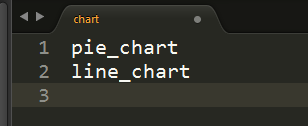

淺談 regex 及其應用
###########################

:date: 2015-10-4
:modified_date: 2015-11-22
:categories: Python;程式設計
:cover: images/1.png

先別管 regex 了，你有用 Ctrl + F 搜尋過文章嗎？

一篇網頁文章中，搜尋「小雞」這個關鍵字，如果文章有出現這樣的字眼，就會移到出現「小雞」的位置；如果沒有，它就會說找不到。

一個簡單好用的功能。

但人生很複雜，文章內容也有千千萬萬。

當你搜尋「小雞」這個詞時，多半心裡想的是毛茸茸很可愛的「小雞」，所以當你發現找出來的結果是「小雞雞」時，心情就不會太好。但你也知道不能怪可憐的搜尋器，因為你心裡明白它是無辜的。

又比如，「複雜的人生」有時會迫使你搜尋連自己也不十分確定內容的字串。

反正你就是覺得小雞很可愛，具體是「小母雞」、「小公雞」、還是「小白雞」無關緊要，只要開頭為「小」，結尾是「雞」就行了，該怎麼搜呢？有點麻煩對吧？

(咦！這樣「小雞雞」也符合定義耶？)

又或者，你想搜尋小雞的相關資料，像是小雞的體重。搜「小雞」自然找不著，因為結果太多了，但搜「體重」也不對，萬一出來的是蟑螂的體重怎麼辦？多噁心？

雖然你知道想搜尋的句子大致是「小雞 XX 公克重」這類的句子。但問題在於這個 XX 偏偏就不知道，若是知道何必搜尋？

到了最後，發現自己不過只是想看一下可愛的小雞而己，竟然還能搞得這麼麻煩，人生實在有許多無奈。

不管啦！老子就是想要知道小雞的體重啦！

幸好，英勇的 regex 這時就現身了，regex 好棒棒！

regex 是正規表示式(Regular Expression)的簡稱，我們只要使用正確的格式撰寫 regex，就可以直接透過對應的工具幫我們找到答案，現在的程式語言幾乎都有支援，有些甚至就直接就內建在語言裡頭了，好比說 Python 的 re 模組就是一個例子。

與普通的搜尋相比，regex 的好處太多了，能夠輕鬆的表示多種、甚至無限種可能的字串，連不確定、不知道的字串也可以搜尋，好比說剛剛提到的「小雞」、「小白雞」、「小小雞」，甚至是不知道答案的「小雞 XX 公克重」都有辦法找到。

有了 regex ，我們想要知道小雞的體重便容易許多了。

regex 語法簡介
======================

regex 用法規則不少，小弟我把它大致區分為四種類別，分別是「選擇」、「次數」、「錨點」和「截取」類。

選擇
----------------------

首先是「選擇」類，regex 可以在不知道準確字串的情況下對內文進行搜尋，不知道實際是小「白」雞、還是小「小」雞也沒關係，都可以搜尋得到，在此例中，我們可以這麼做：

::
    
    小白雞|小小雞 

「\|」代表「或」的意思，表示由「\|」區隔出來的字串都可以接受，在這個例子中，無論是「小白雞」還是「小小雞」都可抓得到。

我們也可以加上小括號可以限制「或」的範圍，達成同樣的效果：

::

    小(白|小)雞  

這並不限制只能有兩種狀況，假設除了「小白雞」和「小小雞」，「小母雞」也是可以接受的，那只要再加上一個「|」即可：

::

    小白雞|小小雞|小母雞

或是

::
    
    小(白|小|母)雞

其中 (白\|小\|母) 可以用中括號的語法簡化：

::

    小[白小母]雞

省去寫一大堆「|」的麻煩。

不過，由於複雜的世界，可接受的情況越來越多，什麼小懶雞、小肥雞都出來了，這個中括號裡的內容可能也會越來越長。

幸好中括號的用法還提供了另一個功能，那就是反向選擇的功能，假設今天我們已經豁出去，覺得什麼都可以，只要不是「小雞雞」就行！我們可以這樣寫：

::

    小[^雞]雞

在中括號內的開頭加上「^」代表反向選擇，只要不是括號內的字都可以接受。

選擇的用法大概就這樣，非常單純。不過在實際的情況下，還是有些便利的技巧，比如說:

::

    [a-zA-Z0-9]

a-z 代表 a 到 z，A-Z 代表 A 到 Z 而 0-9 代表 0 到 9，這個 regex 代表「所有英文字母和數字」都可以接受。

而有些太長用的字，甚至可以直接利用特殊的符號代表。下面列一個簡單的列表：

============== ==============================================
  regex 語法     意義
  .              任意字元
  \\d            數字(digit)，如 0 到 9
  \\D            非數字
  \\w            文字(word)
  \\W            非文字
  \\s            廣義的空白符號(whitespace)，如空白、tab 等
  \\S            非空白
============== ==============================================

.. note:: 通常 \\w 代表的是 [A-Za-z0-9\_]，但在 Python3 中，\\w 也可以是中文字。

次數
-----------

再來則是關於「次數」類型的規則。

有時不只出現搜尋的文字不確定，就連出現的次數也不能肯定。regex 也提供了一些特殊符號來處理這種次數未定的情況。

好比說假設我們一開始就知道是小「白」雞，但卻發現「白」有機會不只出現一次，有可能是「小白雞」、「小白白雞」、「小白白白雞」、「小白白白白雞」……。

這時就可以用「次數」類型的規則處理這個問題，在這個例子中，我們可以用：

::

    小白*雞

「\*」修飾前面的「白」字，表示「白」可以出現任意次數(包含 0 次)，所以這個 regex 可以同時代表「小雞」、「小白雞」、「小白白雞」、「小白白白雞」……。

如果不想包含 0 次，也可以用「+」代替：

::

    小白+雞

「\+」一樣代表任意次數，但不包含 0 次。所以只能是「小白雞」、「小白白雞」、「小白白白雞」、「小白白白白雞」……。

我們也可以直接指定可以出現的次數範圍：

::

    小白{1,3}雞

{} 大括號代表可以出現的次數範圍，這個例子即代表「白」可以出現 1 次到 3 次，所以只會有「小白雞」、「小白白雞」、「小白白白雞」三種情況。

類似的規則可以見下表：

============== ===========================
  regex 語法     意義
  \*             任意次數(包含 0 次)
  \+             任意次數(不包含 0 次)
  ?              0 次或 1 次
  {n}            n 次
  {n, m}         n 次到 m 次
  {n,}           n 次以上
============== ===========================

錨點
-------------

再來是定位相關的「錨點」類型。

感謝我們身在一個複雜的世界，有時我們不但對搜尋的字串很龜毛，甚至對搜尋的字串出現的位置也有意見。這種類型的語法比較少，比較有機會用到的就那幾個。

其中「^」代表開頭，「$」代表結尾。

::

    ^小白雞

代表「小白雞」一定要搜尋內文的開頭。

(……話說這個例子還要用搜尋，也是一種本事？)

反過來說：

::

    小白雞$

代表「小白雞」一定要在內文的結尾。

另外還有比較常用的是「\\b」和「\\B」，前者代表「邊界」，後者代表「非邊界」。這個定義比較模糊，有時碰到像是中文的時候會出事，比較沒異議的應用場景比較像是應用在拼音文字單字的邊界，如：

::

    chick\b

在這個例子中，「chicken」就不符合要求，因為「k」並非單字的邊界。但反過來如果是：

::

    chick\B

那麼「chicken」就可以接受，但「chick」就不能過。但如果換成中文呢？比如說：

::

    小雞\b

據我測試的結果，有些可有些不行，像是 Python 2 就抓不到，但 Python 3 就可以。因此結論就是最好不要太依靠這個規則。

截取
-------------

最後則是「截取」類的規則。

小括號除了可以改變規則影響的範圍，像是下例 regex 對應的字串並非是「小雞雞」，而是「小雞小雞」:

::

    (小雞){2}

括號裡的內容本身也能直接當成結果輸出，說來有些抽象，舉個例子先：

::

    小雞 (\d+) 公克重

我們可以用這個 regex 搜尋文章中是否有對應的字串外，也可以直接截取括號裡的內容。如果符合的字串為「小雞 30 公克重」，我們可以直接取得「30」這個數字。

事實上，小括號也不限於只能用一次：

::

    小雞 (\d+) 公克重， (\d+) 公分長。

這樣我們就能同時取得體重和身高了。

接下來，再度因應複雜的社會，越來越機車的情況一個接著一個出現，有時我們會碰到需要考慮「前後文」的字串。

::

    
小雞

假設有一種情況，需要知道「小雞」屬於什麼標籤的內文，該怎麼辦呢？不能單純用角括號「<」和「>」來判斷，因為裡頭其實也可以包含其他的標籤，好比：

::

    
這是一隻<strong>3000</strong>公斤重的小雞

幸好，用小括號截取出來的字串，也可以當成規則的一部分。我們可以用小括號配合 \\1 解決。

::

    <(\w+)>.*小雞.*</\1>

\\1 代表第一個小括號截取出來的內容，在這個例子中就代表「p」。以此類推，如果有第二個括號，那麼就是 \\2，第三、四個則是 \\3 和 \\4。

原則上，regex 比較常用的規則大約都不會超出這些，看起來好像很簡單，但事實上有不少人，可能一聽到 regex，心裡就會抽蓄，不能自已。

不過這也不能怪他們，舉個例子，下面是我 Google 到驗證 Email 格式的 regex：

::

    ((([\t ]*\r\n)?[\t ]+)?[-!#-'*+/-9=?A-Z^-~]+(\.[-!#-'*+/-9=?A-Z^-~]+)*(([\t ]*\r\n)?[\t ]+)?|(([\t ]*\r\n)?[\t ]+)?"(((([\t ]*\r\n)?[\t ]+)?([]!#-[^-~]|(\\[\t -~])))+(([\t ]*\r\n)?[\t ]+)?|(([\t ]*\r\n)?[\t ]+)?)"(([\t ]*\r\n)?[\t ]+)?)@((([\t ]*\r\n)?[\t ]+)?[-!#-'*+/-9=?A-Z^-~]+(\.[-!#-'*+/-9=?A-Z^-~]+)*(([\t ]*\r\n)?[\t ]+)?|(([\t ]*\r\n)?[\t ]+)?\[((([\t ]*\r\n)?[\t ]+)?[!-Z^-~])*(([\t ]*\r\n)?[\t ]+)?](([\t ]*\r\n)?[\t ]+)?)

(傳送門： http://stackoverflow.com/questions/13992403/regex-validation-of-email-addresses-according-to-rfc5321-rfc5322)

看到這個噁心的語法，誰都會想叫媽媽。

但其實雖然 regex 看起來不容易，但實際去寫的時候，卻常會發現並沒有想像中困難。因為 regex 在大部分的情況下都是前後文無關的，後面不會影響前面，所以寫起來感覺像是一層一層疊起來的感覺，實際上考慮的東西並不會如何複雜。

寫的時候雖然很輕鬆，但把最後結果拿給別人看的時候，就會是「一整坨」regex，別人自然會覺得它很噁心，好像很難的樣子。

對此，我只能說－－反正寫出來能用就好，痛苦是之後看的人！

呵呵。

(開玩笑的，別當真。)

我們也可以透過一些工具，像是 `Rubular <http://rubular.com/>`_ 這些線上工具，用視覺化的形式即時驗證自己寫的東西是否正確，讓我們更輕鬆地撰寫 regex。

咦！ Rubular 是 Ruby 的？這怎麼可以！趕緊推薦另一個工具 `RegExr <http://www.regexr.com/>`_ ，這個工具還附帶一些用法的教學、隨附語法簡表、常用 regex 範例、甚至還開放原始碼，這真是太棒了！比前者好用一萬倍啊！

(而且不是 Ruby)

Python 的 re 模組
======================

在 Python 中，要使用 regex 並不難，已經內建在標準庫裡頭了，只要引入「re」模組即可。其中最常用的函式，大概就是 re.search 函式了。

.. code-block:: python

    import re

    # 要搜尋的內文
    text = "…… 小雞 30 公克重 ……"

    # 第一個參數代表 pattern，後者代表內文
    match_object = re.search(r"小雞 (\d+) 公克重", text) 
    
    # 如果要抓到，就會回傳一個 Match Object，若無則回傳 None
    if match_object:  

        # group 函式會回傳截取的內容，0 代表自己， 1 代表第一個截
        # 取的內容，依此類推
        print(match_object.group(0))  # '小雞 30 公克重'
        print(match_object.group(1))  # 30

要同時找多個符合的結果，則可以使用 re.findall 函式：

.. code-block:: python

    import re

    text = "小雞 白雞 黃雞 綠雞"

    re.findall(r".雞", text)  # ['小雞', '白雞', '黃雞', '綠雞']
    
若需要多次同一 regex 搜尋，可以使用 re.compile 函式預先處理 regex 以增加效能。

.. code-block:: python

    import re

    text = "小雞 白雞 黃雞 綠雞"

    regex = re.compile(r".雞")
    regex.findall(text)  # ['小雞', '白雞', '黃雞', '綠雞']

    text = "黑雞 青雞 灰雞 橙雞"
    regex.findall(text)  # ['黑雞', '青雞', '灰雞', '橙雞']

由於 regex 相當有用，所以無論是透過第三方函式庫，如 C++ 的 Qt、boost 等或是語言內建，像是 Perl、Javascript、C++11 等，現代的程式語言幾乎都能找到辦法使用 regex，舉幾個例子：

Qt:

.. code-block:: c++

    #include <QCoreApplication>
    #include <QRegularExpression>
    #include <QDebug>

    int main(int argc, char *argv[])
    {
        QString text = QString("…… 小雞 30 公克重 ……");

        QRegularExpression re("小雞 (\d+) 公克重");
        QRegularExpressionMatch match = re.match(text);
        if(match.hasMatch()){
            qDebug() << match.captured(0); // 小雞 30 公克重
            qDebug() << match.captured(1); // 30
        }
    }

Boost C++:

.. code-block:: c++

    #include <iostream>
    #include <string>

    #include <boost/regex.hpp>

    int main(int argc, char *argv[])
    {
        std::string text("…… 小雞 30 公克重 ……");
        boost::regex pattern("小雞 (\d+) 公克重");
        boost::smatch matches;
        if (boost::regex_search(text, matches, pattern))
        {
            std::cout << matches[0] << std::endl; // 小雞 30 公克重
            std::cout << matches[1] << std::endl; // 30
            
        }
        getchar();
    }

Javascript:

.. code-block:: javascript

    var text = "…… 小雞 30 公克重 ……";

    var re = /小雞 (\d+) 公克重/;

    matches = re.exec(text);

    console.log(matches[0]); // 小雞 30 公克重
    console.log(matches[1]); // 30

常見應用
======================

說了這麼多 regex 的用法，我們到底可以拿 regex 做什麼用呢？

抓取特定格式的字串
---------------------

抓取特定格式的字串，大概就是最常見的應用情景，通常會順帶截取字串裡的關鍵資訊。

.. code-block:: python

    import re

    text = "…… 小雞 300 公斤重 ……"
    match_object = re.search(r"小雞 (\d+) 公斤重", text)

    if match_object and int(match_object.group(1)) > 100:
        print("好肥的小雞……開始減肥！")

在這個例子中，小雞的體重就成功的被我抓出來，之後的減肥計劃就可以順利展開了。

.. note::

    有些網站會為了讓比較弱的爬蟲自爆，又或是為了節省頻寬。會在不影響網站顯示的情況下，故意讓部分的標籤的 end tag 去掉。如果單純以普通的 HTML parser 來處理這類型的網站時，爬蟲就會死給你看。

    為了不要讓這些網站的奸計得逞，為了我們看漫畫的權益，很多情況下，除了用專門處理的工具像是 BeautifulSoup  外，也可以直接使用 regex 來解決。

    ::

        

    (而且效能似乎較好)

驗證格式
--------------------------

我們也可以用 regex 來驗證某段文字的格式，這也是相當常用的做法。除了剛才見到的 Email 格式，也能用來驗證時間的格式、IP 的格式、URL 的格式等。許多時候，我們其實可以不用自己實際去寫這些對應的 regex，善用 Google 搜尋，可以節省自己許多力氣(其實 `RegExr <http://www.regexr.com/>`_  就有提供很多例子可以使用了)。

.. code-block:: python

    """
    驗證是不是兩大類寫的文章
    """
    text = "..."
    if re.search("雞|chicken|喵"):
        print("可能是？")
    else:
        print("也許不是？")

.. note:: 

    雖然 regex 可以做的事很多，但很多時候，善用第三方才是最佳選擇。比方說驗證時間請愛用 python-dateutil

取代特定格式的內容
--------------------------

有時，我們會想替換字串裡的某些內容，像是字串中的「小雞」是換成「小肥雞」，最直覺的做法就是使用 replace 函式：

.. code-block:: python

    "... 小雞 ...".replace("小雞", "小肥雞")

但是我們也可能會碰到比較複雜的情況，比如說我們想修改一個腳本：

::

    甲說："烤雞好吃"

    乙說："才怪，炸雞才好吃"

我們想把腳本中的 "" 改我們比較習慣的 「」，這時單純用字串的 replace 函式，就比較不好處理了，我們可以改用 re.sub 函式解決這個問題。

.. code-block:: python

    text = """
    甲說："烤雞好吃"

    乙說："才怪，炸雞才好吃"
    """

    re.sub(r'："([^"]+)"', r"：「\1」", text) # '\n甲說：「烤雞好吃」\n\n乙說：「才怪，炸雞才好吃」\n'

re.sub 函式用法相對比較複雜，第一個參數代表要修改的 regex，第二個參數是要改成的字串，第三個參數則是來源字串。其中還有一些比較進階用法，這裡就不多提了。有興趣的可以直接參考官方的文件 (`傳送門 <https://docs.python.org/2/library/re.html#re.sub>`_)

拆解特定格式的 token
--------------------------

Python 字串有一個好用的 split 函式，可以指定的參數將字串拆成多個子字串，比如說：

.. code-block:: python

    "小雞 白雞 母雞".split(" ")  # ['小雞', '白雞', '母雞']

    "綠雞:藍雞:黑雞".split(":")  # ['綠雞', '藍雞', '黑雞']

另外，如果不輸入任何參數，可以直接將一系列的空白字元(包含tab、換行等) 去掉。

.. code-block:: python

    "灰雞      紅雞 \t \n    紫雞".split()  # ['灰雞', '紅雞', '紫雞']

不過這個函式還是有一些侷限性，如果同時碰到多種不同類型的分隔符號時，就無能為力了。

.. code-block:: python

    "黃雞 橙雞:青雞;金雞".split() # ?

這時就可以使用 re.split 函式來幫助我們。

.. code-block:: python

    re.split(" |:|;", "黃雞 橙雞:青雞;金雞")  # ['黃雞', '橙雞', '青雞', '金雞']

不過個人覺得這算是比較少用的功能。

編輯器上的應用
--------------------------

說個題外話，regex 也不只能在程式中用到，事實上，我們在「寫程式」本身，也可以用到 regex 實用的功能。現在很多編輯器，包含 Vim、Sublime Text 都可以使用，雖然語法可能會有些許的變化，但概念都是一樣的。

好比說之前碰過一個例子，專案裡有關圖表的變數命名方式與同事沒有協調好，結果同時出現 piechart 和 pie_chart 兩種命名，結果經過一些「親密交流」後，終於決定用 pie_chart 來命名……碰到這種問題時，也可以用 regex 解決。

.. image:: images/1.png

輸下 Ctrl + h，然後確認 Regular Expression 模式有開啟(最左邊的圖示)。

.. image:: images/2.png

按下 Replace All。

搞定！

常見問題與注意事項
======================

前面說了這麼 regex 好用的地方，但 regex 其實也有很多陷阱需要注意。

注意「/」和「\\」
--------------------------

regex 不同的實作品，語法規則並不統一，不同實作，不同語言，甚或是同一語言不同版本都有所差別，雖然大多數常用的規則基本相同，但還是有一些地方要注意。

好比說 Perl 的 regex ，「/」是用來判斷 pattern 的開始與結束，擁有特定的意涵，因此 pattern 中的 / 前面要加上 \\ 跳脫，受到 Perl 的影響，幾乎所有 regex 函式庫都對「/」有特殊的判定。

.. code-block:: perl

    /<Name>([^<]+)<\/Name>/

但不是每個語言都將「/」當成分隔符號，好比說 Python 即是如此。這種情況如果還要跳脫「/」其實沒什麼道理，所以 re 其實也能同時支援不跳脫「/」的情況。

.. code-block:: python

    re.match(r"<Name>([^<]+)<\/Name>", "<Name>飛天雞</Name>") # 抓得到~

    re.match(r"<Name>([^<]+)</Name>", "<Name>飛天雞</Name>")  # 也抓得到~

「\\」也有異曲同工之妙，在 regex 中 \\d 有特殊意涵，但有些語言本身本來就會對 \\ 特殊處理(如 C/C++)，可能要改成 \\\\d 才能運作。

尤其是 Python 在這裡也比較麻煩，因為它的「\\」有時會特殊處理，有時不會，搞得像女人一樣難懂。

簡單來說，Python 的邏輯是－－若『\\』後面接特定字元，如「n」、「t」、「\\」或數字時，就會當成特殊字元，其餘則不理會，因此在 Python 中，下例代表一樣的意義：

.. code-block:: python

    "\d" == "\\d"  # True

但這個例子便有差別：

.. code-block:: python

    "\n" == "\\n"  # False 

尤其是後者，因為除了語言層面，「\\n」對 regex 本身也有意義，因此：

.. code-block:: python

    re.search("\n", "\n")  # 找得到(語言自己判斷為特殊字元)

    re.search("\\n", "\n")  # 也找得到(regex 函式庫判斷特殊字元)

所以這個地方很容易讓人產生困惑，因此我會建議一致使用 raw string 來寫 regex。Python 的 raw string 不會處理任何一個 \\，所以不會造成混淆。

.. code-block:: python

    re.search(r"\n", "\n")  # 代表全交由 regex 函式庫判斷

.. note:: raw string 其實也並非全然都不處理，可以試試「r"雞\\"」，看會發生什麼？

注意 * 是貪婪的
--------------------------

::

    <strong>小雞</strong>

如果我想要抓取環繞「小雞」前的標籤，該怎麼做呢？

.. code-block:: python

    text = "<strong>小雞</strong>"

    re.search("<.+>", text)  # 是不是這樣寫呢？

事實上，這種寫法實際抓出來的會是「<strong>雞</strong>」，而非「<strong>」，理由是 regex 搜尋的時候，會盡可能的抓越多越好，這個例子中「.+」同時符合「strong>小雞</strong」和「strong」，但由於 regex 是「貪婪」的，所以它會選擇多的那一個。

當然，我們也可以讓它不「貪婪」，那就是在「+」後加上「?」：

.. code-block:: python

    text = "<strong>小雞</strong>"

    re.search("<.+?>", text)  # <strong>

這個方法雖然可行，但演算法實作的原因，效能會比較差一些，其實在很多時候，我們可以改用另一種寫法來達成同樣的目的，不需要學習新的語法。

.. code-block:: python

    text = "<strong>小雞</strong>"

    re.search("<[^>]+>", text)  # <strong>
  
搞定！

注意換行
--------------------------

要注意 regex 是一行一行找的，所以對於換行的處理，有幾個比較奇怪的地方，舉個例子：

.. code-block:: python

    text = """
    雞腿
    雞心
    雞肝
    """
    re.search("雞.*", text)  # '雞腿'

雖然前面有說過「.」代表任意字元，但其實不包含換行，當碰到第一個換行時，就會停止抓取，所以最後只抓到「雞腿」就停止了。如果要讓「.」也能代表換行字元，就要加上「DOTALL」這個 flag 才行。

.. code-block:: python

    text = """
    雞腿
    雞心
    雞肝
    """
    re.search("雞.*", text, re.DOTALL)  # '雞腿\n雞心\n雞肝\n'

「^」和「$」的情況比較像反過來，前面說過兩者分別代表文章的「開頭」和「結尾」，但有時我們可能會希望這個「開頭」或「結尾」代表的是「行」的開頭和結尾，這時可以加上「MULTILINE」這個 flag。

.. code-block:: python

    text = """
    雞腿
    雞心
    雞肝
    """

    re.findall("^雞.*", text)  # []
    re.findall("^雞.*", text, re.MULTILINE)  # ['雞腿', '雞心', '雞肝']

結語
=====================

本來還想寫一下 regex 實作相關的介紹，不過我覺得再加內容大概就沒人想看了吧？

總之，這篇介紹了 regex 的簡單用法和我對 regex 應用的心得，沒有太過深入討論 regex 太多詳細的規則語法，畢竟雖然規則很多，但多數都不太常用，我覺得需要時再上網查即可。在這個網路的時代，很多時候都不需要死背硬記，畢竟人的腦袋就這麼小小一顆，何必老是欺負它呢？

以上。

