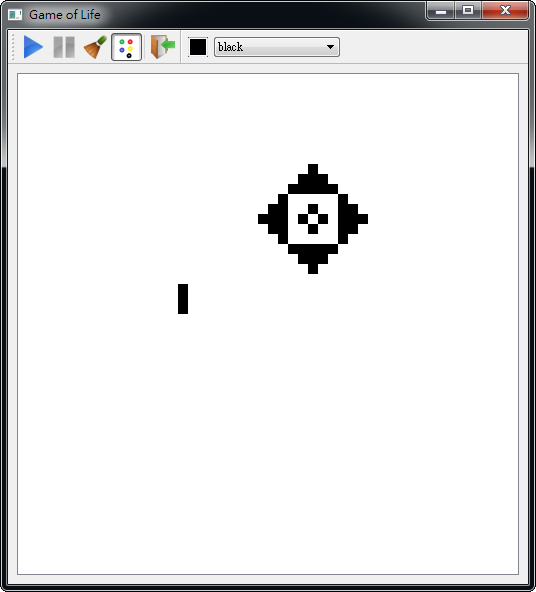
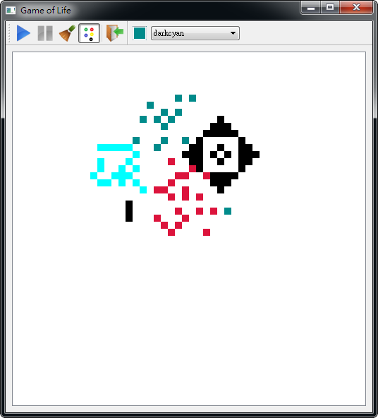

生命遊戲
##################

:date: 2013-02-23
:categories: 專案作品

     
============= ===========================================================
 名稱          生命遊戲
 使用語言      Qt
 使用平台      Windows
 版本資訊      0.5.4
 作者          大類
 下載連結      `載點 <files/gameoflife.exe>`_
============= ===========================================================

**簡介**

生命遊戲(Game of Life) 是一個很有意思的玩意兒，它特別的地方在於這個遊戲不需要玩家，
遊戲就會根據「規則」自動運行下去。

那「規則」是什麼？

::

    假設現在有一個世界，裡面有很多細胞，那麼對於現存活的細胞來說：

    * 當周圍只有零個或一個細胞時，就會孤獨而死
    * 若超過三個細胞時，就會資源匱乏而死
    * 但其餘情況的話，就會活得很快樂

    另一方面，附近有三個活細胞時，就會在中間產生一個新的細胞(人家要三個才能生......)

我們可以用左鍵點擊遊戲畫面，該處就會出現一個小點，一個小點代表一個細胞，
接下來可以在附近多點弄多一點細胞，之後就可以開始觀察遊戲世界的變化。

這個遊戲還有一個進階玩法，就是開始有顏色模式(選單左邊第三個按扭)，
然後就可以用多種不同顏色的細胞，而這個玩法的特點在於，如果如果附近那些顏色的細胞比較多，
生出該顏色的細胞機率就會比較大。

(選擇多種不同的顏色)

.. image:: images/3.png
    :alt: gameoflife-color2.png

(然後靜靜觀察)

.. note::

    這個遊戲的玩法非常簡單，就是用滑鼠對著遊戲畫面亂點，然後一直看著發呆即可。
    完全沒有上手難度，你可以一直看、一直看、一直看.....看到到天荒地老，是一個殺時間的好遊戲！
