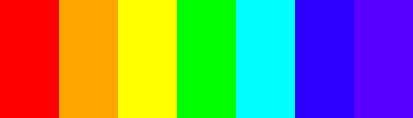

筆記 - 資料視覺化之理論
##################################

:date: 2016-4-4
:categories: 程式設計
:cover: images/1.png

在工作上有時會碰到「如何將大量的資料用簡單易懂的方式呈現」的問題，一直覺得是一個不大不小的困擾。正好聽聞了今年台灣資料科學愛好者年會舉辦的「資料視覺化之理論、賞析與實作」的課程，講師是康仕仲博士。本著閒著也是閒著，不聽白不聽的精神，參加這次一天的課程，不貴，還算是不錯的活動。

這篇主要的內容便是上課的心得和一些筆記。

資料視覺化的意義
==================

資料視覺化基本概念就是－－當資料很多，內容很複雜時，透過各種圖像或是互動的方式，幫助人們理解資料。將冷冰冰的數字轉化為圖像，不但專家能夠看得開心，而且也能讓普通人也能有理解資料的機會。

人類天生擁有許多天然的特性，有擅長與不擅長的事物。看到一百元紙鈔沒什麼感覺，但若你神經地把它全換成一元硬幣，就能真切地感受到它沉甸甸的重量……和自己的神經病。

雖然一百元紙鈔和一百個一元硬幣明明有一樣的意義，但換成一百個一元硬幣後，我們就能更輕易的理解……原來那張紙真的代表了「一百個」一元耶！

資料視覺化就是利用人類的各種天生的特性，將資料轉化為更方便我們理解的形式。

有什麼好處？

對專家而言，首先可以節省他們判斷資料的時間，再者，因為透過不同面向的閱讀，也可能藉此找出自己的思考盲點，發現問題，找到隱藏的關聯性等；對普通人如我來說，圖像化可以增加我閱讀的意願，有利於資訊的傳播，而且也能減少我閱讀的障礙，因為那些專家將資料轉化為圖像時，便已融入了豐富的資訊，讓我可以用比較接近專家的角度看問題。別的不提，至少我也知道「紅色粗體的大字」代表重要嘛！

.. image:: images/1.png

有些人會覺得資料視覺化不過是美工的工作，不需要多深的專業。

但顯然並非如此，由上述可知，資料視覺化的目的並不僅僅是為了「好看」，更關鍵是為了「好懂」！前者相對容易，但後者則必須花上不少心思。要使別人好懂，自己也要先了解才行，如果連自己都弄不明白，那你做的圖表還稱得上是「好懂」嗎？

……可惜這個「有些人」通常位置都不低，擁有決策的權力，所以美工可能要辛苦一點了。

.. note:: 當然不是講師說的，這是「心得」嘛！

當然了，實務上要求資料視覺化的製作者要完全了解資料本身，顯然也是不切實際的，但至少要能做到使用者滿意才行。許多領域都信奉著共同的道理，「使用者」才是工具存在最根本的目的。

人類的擅長和不擅長
====================

前面說過，人類有其擅長和不擅長，不擅長的先不提，擅長的則可以好好利用。一份非常複雜的資料，如果用人類最擅長的方式閱讀，是不是就相對容易理解？

假設我和女友要比較身高差異，用長條圖就會比圓餅圖清楚。因為人類對長度比對角度敏感，用長條圖便可很輕易的看兩者的比例差異。反過來說，若我和女友比較的是體重差異時，用圓餅圖的效果就會比較差，這並不是說長條圖比圓餅圖好，不同的使用目的自有其最適合的表示法，圓餅圖在比較整體比例時就比長條圖有用。

.. note:: 不要笑，我知道我沒有女友。

要成為好的設計師，就必須理解這些人類的擅長和不擅長，把這些元素集合起來，就可以成為自己手中的武器。其重點主要有三，分別是：顏色、形狀和動作。其中最關鍵的就是顏色，恐怕可以佔有一半的重要性。

**顏色**

顏色最能抓住讀者的注意，速度甚至快到「讀者都沒開始理解其中的意義時，就已經進腦袋裡了」。也因為顏色非常「強烈」，所以常用來表示資料最重要的維度。 

好的設計師不隨便使用顏色，因為顏色太過醒目，讀者很容易分心。圖表上如果有太多顏色，讀者會無法分辨何者為重要，何者為不重要。而且咱們的腦袋時常會偷偷越過我們的理性，自行判讀顏色的意義，假若其中的意義和資料本身不相符合，就會使人困惑。

彩虹色便是錯用顏色的經典例子，許多人會用彩虹色來製圖表，認為這是物理上波長連續的一系列顏色，所以代表一系列的數值非常符合自然。

聽起來好像有道理，但可惜人類喜歡砍樹，不喜歡自然，人類的視覺系統並不認為彩虹是連續的一整體，而會自動為顏色分群，我們會潛意識為這些顏色賦予意義，而這個意義不見得與資料相符合。

(我們會很自然地把左邊紅燈分成一群，右邊的靛紫分成一群)

所以顏色非常「危險」，若不謹慎使用，可能會讓讀者錯誤理解資料。但反過來說，如果我們善用顏色，就可以有一加一大於二的效果。好比說我們可以使用在非常緊急，需要快速判斷的地方，像是當災難發生時，直接用紅色的警示燈，就會比用大大的新細明體寫：「哎呀，要爆炸了，快逃呦！」的效果還要好。

顏色大致可以分為四種使用方式：「標註」、「度量」、「仿效」和「裝飾」。「標註」即是我們可以把顏色當成一個「名詞工具」，最經典的例子即是股票，透過顏色來代表：「漲」、「跌」兩種概念；「度量」則代表我們可以用顏色表達「量」的資訊，好比說溫度計，越冷越藍，越紅越熱；「仿效」則是利用顏色來仿照真實的顏色，如用藍色代表海水、用綠色代表草原等；最後是「裝飾」，可以利用顏色讓圖更加好看，更加有吸引力，但最好小心用，因為很容易傷害圖的易懂性。

別忘了，美觀只是資料視覺化的要素之一，如果好看可是看不懂，那就是本末倒置。

**形狀**

這裡說的形狀非常籠統，形狀、角度、距離、方向等都包含在內，這些要素都能抓住讀者的注意，不過人類對不同的要素敏感度不一。比如說人類對「長度」的判斷敏感，因此當有資料要比較時，長度是不錯的選擇。相對而言，人對角度雖然也算敏感，不過沒有像對「長度」的感受那麼細緻。所以要比較差異時，長條圖會比圓餅圖還要好，但圓餅圖還是有自己的優勢，在看整體比例時，圓餅圖效果還是很不錯的。 

相比起來，人對面積就不是這麼敏感，不容易判斷資料差異的倍數。如果有一大一小的圖形，我們會傾向低估大圖形的面積，以為大的沒這麼大。再強調一次，依照不同的使用需求，每一種方式都有意義，讓讀者的判斷力下降說不定也可以是一種策略……我絕對不是指公司財報什麼的……。

.. image:: images/3.png

(我們很難輕鬆地判斷兩個圖案面積的比例)

這裡粗略的列一下不同要素人類判斷的精準度。

::

    位置 > 長度 > 斜度 > 角度 > 面積 > 體積 > 色彩飽和度

    (精準到不精準)

換言之，以後要做公司財報時，用色彩飽和度來表示利潤下降的比率就是一個不錯的選擇……當然前提是不要被人轟下台才行。

**動作**

人對會動的事物也會有反應，這也是初學者特別喜歡使用的方式，希望藉此讓圖表看起來豐富多采……來掩飾貧乏的內容。但事實上，這種方式可能不但沒有加分，還會反過來扣分。因為我們的腦已經演化出一種精密的方式可以自動地篩選動態的資訊，以幫助我們在很短的時間內做出正確的判斷，所以如果錯誤的使用動畫，反而可能會干擾資訊解讀。

這裡有幾個因素會影響人的判斷。首先是「變盲(Change Blindness)」，變盲代表觀察者無法察覺的動態改變。簡單來說就是觀察的東西變了，但是觀察者卻沒發現的現象。為何會如此呢？通常是因為為了維持多目標的注意力，或是畫面閃爍有關。另一個因素是「動盲(Motion-Induced Blindness)」，動盲即是當在動態的背景下，注視特定的部分，會造成在不特定的時間內，忽略一些明顯的特徵。

.. image:: images/4.gif
    :width: 300

(轉自 `維基 <https://www.wikiwand.com/en/Motion-induced_blindness>`_ ，這是一個動盲的實驗，如果專注地看圖中央閃爍的綠點一小段時間，就會發現旁邊的黃點會莫名的消失)

這兩個因素都與人的注意力有關，當大腦在處理動態資訊時，會遵循「贏者通吃」的法則，時常會只注意到其中的某一個變化，而忽略其他的。這給我們的啟示即是盡量不要讓讀者同時注意多個目標，不然很容易被讀者直接忽略。

**小結**

人類是非常容易分心的動物，過多的雜訊會影響我們的判斷力。所以我們設計時要反過來，簡化雜訊，強化目標。不要錯用顏色，也不要用過多的顏色。如果有東西會動，不要多個東西一起動。對於目標物，我們要用最適宜的形狀或是顏色呈現。如果有需要的話，倒是可以同時將多種不同的要素集合在同一個目標物上，可以有更加強調的效果。

好比說大字體的「我想要女友」雖然已經很顯眼了，但如果是紅色大字體而且再加上燃燒動畫的「我想要女友」自然更加引人矚目。

善用人類天生的特性，是好設計師的基本功。

設計的原則和方法
==================

複雜的資料不容易理解和表達，許多人就會嘗試先簡化資料。

舉個例子，在計算貧富差距時……別誤會，我絕對沒有在討論政治……總之，計算方式即是將所有人的所得按收入排序，依高至低分為五組分別平均起來，然後最高除以最低得出一個數，這個數如果太高即代表貧富差距太大。因為只有一個數，所以很容易以視覺化呈現，這即為一種簡化。

簡化資料代表有處理過，根據其處理的方式，許多事情便被隱藏起來了，這裡頭到底有多少意涵，讀者是很難經由簡化的數值看出來的。所以才會造成同樣的資料，因為處理方式不同，判斷結果也不同的情況。不過這樣政治人物們也才有材料可以吵，顯得他們好像不是無所事事的樣子。

簡化資料會出現上述的問題，因此好的設計並不是簡化資料，而是盡可能的善用人的視覺理解力來降低閱讀門檻。當然，若是太過複雜的資料，降低門檻有時不容易做到，這時仍是需要一些簡化。所以這變成一種權衡，在設計師的能力範圍內，盡可能在讀者能理解的情形下呈現完整的資料。能力越強的設計師，呈現的資料就越完整，而且還能讓目標使用者看得清清楚楚。

接下來，注意我剛剛提的「目標使用者」，資料視覺化的關鍵原則就是以「使用者為中心」，因為這是給使用者使用的。因此了解使用者的目的是很重要的。有時使用者的目的是為了快速理解資訊，快速判斷；有的是為了方便尋找關鍵或是發現問題；有的單純就是為了拿來說故事。

了解使用目的後，我們就可以藉由草圖、原型來設計我們的圖表或是系統。關鍵是過程中最好要能與使用者不斷地溝通，滿足他們最真實的需求。

進入實際的設計流程後，還有一些技巧可以參考：

**資料的運用**

在設計之初，我們要盡可能的理解資料，然後選用適合的圖表表達資料的關聯性。每一種圖表都有其適合與不適合，無論是長條圖、圓餅圖、折線圖還是直方圖，這需要經驗和對各種圖表的熟悉掌握程度。這比較像是基本功，但用得好可以讓使用者更能輕易地理解資料。很多時候最簡單的方式就是直接下去試，直覺和經驗可以告訴我們其中的好與壞。參考一下別人的設計，也可以給你靈感，好的設計師就是要懂得如何偷別人的點子。

**空間的運用**

但不用忘記所有的圖表都是在一個空間表達資料，在一個大的空間呈現和在一個小的空間呈現是不同的概念。在電腦呈現的方式不應該與手機相同，因為我們閱讀的方式並不一樣。所以在設計之時，也要考慮在資料顯示的情境為何，在捷運車上顯示的地圖資料，就不適宜用密密麻麻的文字表達。但同樣的資料若是用乾淨簡潔的大字顯示在論文中，只會讓教授覺得你在佔空間拼頁數。

除此之外，適當的扭曲資料裡的空間有時也是一種表達資料的手段，一個經典的例子就是「捷運地圖」，台北捷運的路線顯然不都是直線，轉彎也不都是直角和四十五度角，但透過這種扭曲空間的方式，反而能方便我們理解。當然你也可以解釋說，因為捷運的實際的路線不是我們在乎的，所以被簡化了。

.. image:: images/5.jpg
    :width: 400

**互動的運用**

最後則是互動的運用，設計師可以提供一些工具來讓讀者探索資料，讓使用者更能了解資料的本質。互動也可以提升趣味性，增加使用者的閱讀意願。沒人規定資料一定只能是死板板的，無聊的。像是著名的 3A 級遊戲「刺客教條」，除了遊玩本身，你也可以說它將歷史資料透過人實際操作互動的方式呈現在讀者(玩家)眼前，這也確實比一本大部頭的歷史研究資料更有互動性，不但較容易理解，而且更來得吸引人。

總結
============

資料視覺化是盡可能的在不簡化資料的情況下，利用各種手段把閱讀門檻降低到目標使用者的程度。好的設計可以幫助人理解資料、增加閱讀意願、方便傳播等。這裡有一個共通的特性即是通常如果做得很好，讀者其實是沒感覺的。好比說交通狀態良好時，你不會記得什麼，但是一旦常發生塞車，你就會覺得某些政府長官很該死……。

所以說－－做到沒人注意到，就是好的設計師……當然，也有可能是職業生涯不成功的設計師就是了。

反正我不是設計師。

以上。
