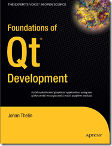

##################################################
被 Qt 快樂地玩弄 - 好書推薦
##################################################

:date: 2013-02-17
:categories: 程式設計

我想向大家推薦一本 Qt 的教學書，書名為 Foundations of Qt Development，
作者是 Johan Thelin。我不太喜歡英文，所以可能的話，我會儘量買中文的教學書，
而我幾乎買了我所有能買到的 Qt 中文教本，繁體、簡體都有，但是我遺憾的發現，
我最喜歡的還是這本 Foundations of Qt Development 。

以我閱讀的經驗，我覺得 Qt 教學書主要可以分為兩種類型，
一種就像是百科全書型，另一種則是範例集型。

**百科全書型**

使用這種方式的教學書，最主要的特點是會各個常用的類別一字排開，
每一個類別都會條列出各種成員函式，然後分別說明它們的用法，最後再給個範例。

雖然說這種方式的好處是，如果你突然忘了某個類別的功能時，可以很迅速的查找出這個類別的用法。

但這種方式卻有一個很大的問題－－非常無聊！而且就算看完了整本書，
而且書上的範例也都看得懂，但自己真的要寫 Qt 程式的時候，還是會不知道如何下手。

原因很簡單，因為看作者的範例時，我們注意的是「程式的運行方式」，
卻可能看不出「為什麼要用這種運行方式？」，如果我們不了解這其中的設計哲學，
在實際寫 Qt 程式的時候，自然會覺得不知從何下手。

**範例集型**

這種教學書則剛好相反，整本書就像是範例集，從開始到結束都是在講解各種不同的範例，
如果碰到一個觀念，就會停下來解釋一下，然後再繼續講解範例。

如果這時讀者真的能遵照範例一個個讀下去，相信收獲是很大的。但是這有一個前提，
那就是除非這本書你每一個範例都感興趣，都會去仔細讀它，不然只要有其中有一個範例沒興趣，
跳過不讀，你可能就會不小心錯過一些重要觀念。

另外還有一個問題，那就是如果有什麼內容忘記了，你也很難從這本書找到所需要的資料。

**融合型**

我覺得這兩種方式各有好壞，不過當然最好的方式就是兩種方式融會貫通，
而這本 Foundations of Qt Development ，雖然不敢說它完美，但至少我覺得融得還算不錯，
它確實包含了不少概念上的東西，也提供了不少範例給讀者練習。這本書啟發了我不少東西，
所以我非常推薦給各位閱讀。
