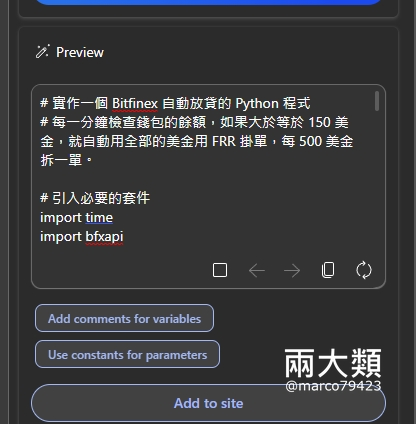

隨手記 - 用 AI 寫 Bitfinex 放貸機器人
=====================================

:date: 2023-05-23
:categories: 隨手記
:cover: images/2.jpg

最近在嘗試 Bitfinex 放貸，想寫一個簡單的美金放貸機器人。

突然想說不如就用最近很夯的 AI 寫寫看？

想到就做，首先自然是帶動這波 AI 浪潮的 ChatGPT。

（要事先聲明的是我沒有付費，所以是 GPT-3.5）

以下是我的問題：

::

   實作一個 Bitfinex 自動放貸的 Python 程式，每一分鐘檢查錢包的餘額，如果大於等於 150 美金，就自動用全部的美金用 FRR 掛單，每 500 美金拆一單。

而 ChatGPT 回我：

（文字的部分）

::

   在開始之前，請先確認您已經有 Bitfinex 的 API Key 和 Secret，並且已經開啟了 Lending 功能。

   接下來，我們可以使用 Python 和 Bitfinex 的 API 來自動放貸。我們需要安裝 bitfinex 和 requests 這兩個模組，使用以下指令：

   >>> pip install bitfinex requests

（程式碼的部分）

.. code-block:: python

   import bitfinex
   import requests
   import time

   # 設定 API Key 和 Secret
   api_key = 'YOUR_API_KEY'
   api_secret = 'YOUR_API_SECRET'

   # 設定 FRR 掛單參數
   currency = 'USD'
   rate = 'frr'
   amount = 500

   # 初始化 Bitfinex API 連線
   client = bitfinex.ClientV2(api_key, api_secret)

   # 每一分鐘檢查錢包餘額
   while True:
       wallet = client.wallets()
       balance = float(wallet[currency]['balance'])
       if balance >= 150:
           # 計算掛單數量
           orders_num = int(balance // amount)
           # 掛單
           for i in range(orders_num):
               resp = client.submit_offer(currency, amount, rate)
               print(resp)
       time.sleep(60)

（上面程式碼的註解不是我寫的，是 AI 自動生成的內容）

結果看來確實有模有樣，甚至還有使用說明，包含需要先安裝哪些套件，相當厲害。

不過這裡有個小問題，那就是它所使用的 `bitfinex <https://pypi.org/project/bitfinex/>`__ 並非官方的套件，而且其官網也找不到對應的 Python 程式碼，因此我不敢裝，不確定 AI 是否有正確使用該套件。

但就算如此，稍微仔細一瞧也能看出實作的邏輯也有問題，比如說我的要求是「500 元拆一單」，但沒說不到 500 就不下訂單了，所以這樣的結果顯然有誤。

再來是測試據說已經是 GPT-4 的 Bing AI。

使用的方法很簡單，直接使用 Edge 瀏覽器即可，按一下 Edge 右上角 Bing 的 logo 就可以使用（不過要先排隊取得使用資格）。

看起來雖然很方便，但實際使用時卻發現右側輸入框的大小竟然不能調整，所有內容都擠在一起，超小又超難讀，非常難用。

這也就算了，我發現最嚴重的問題是其輸出的程式碼竟然沒有排版！？

Python 的程式碼如果沒有排版，還能用嗎？

相比起來，ChatGPT 的網站其程式碼會用令人舒服的方式呈現，體驗差距非常巨大。

（其實在我寫作的當下已經 Edge 可以調整大小、而且程式碼也有排版了，後面會提到）

總之，沒有辦法的我，突然想到只要再把這段沒排版的程式碼再拿回給 ChatGPT 排版不就得了？

想到就做，所以我就複製貼上，希望 ChatGPT 幫我排版。

結果被拒絕了……

於是我再求一次。

繼續求。

改用哀兵戰術。

改用考官模式。

於是 AI 接受挑戰。

我發現 AI 似乎挺喜歡接受考驗的，之前只要用這個方法通常都可以成功。

總之最後結果如下：

.. code-block:: python

   # 匯入所需的套件
   from bitfinex_api_py.client.rest.wallets import WalletClient
   from bitfinex_api_py.client.rest.funding import FundingClient
   import schedule
   import time

   # 設定 API 金鑰和密鑰
   API_KEY = "your_api_key"
   API_SECRET = "your_api_secret"

   # 建立 WalletClient 和 FundingClient 物件
   wallet_client = WalletClient(API_KEY, API_SECRET)
   funding_client = FundingClient(API_KEY, API_SECRET)

   # 定義檢查錢包餘額的函數
   def check_balance():
       # 取得錢包的資訊
       wallet_info = wallet_client.get_wallets()
       # 遍歷錢包的資訊，找出美金的餘額
       for wallet in wallet_info:
           if wallet["currency"] == "USD":
               balance = wallet["balance"]
               break
       # 如果美金餘額大於等於 150 美金，就呼叫 lend_all 函數
       if balance >= 150:
           lend_all(balance)

   # 定義將美金全部用 FRR 掛單放貸的函數
   def lend_all(balance):
       # 計算需要拆分成幾單
       num_orders = balance // 500 + 1
       # 設定每單的金額為 500 美金或剩餘的金額（如果不足 500 美金）
       amount_per_order = min(500, balance)
       # 遍歷每一單，發送放貸的請求
       for i in range(num_orders):
           # 設定放貸的參數，使用 FRR（Flash Return Rate）作為利率，期限為 30 天
           params = {
               "type": "LIMIT",
               "symbol": "fUSD",
               "amount": str(amount_per_order),
               "rate": "0",
               "period": "30",
               "flags": 1024 # FRR flag
           }
           # 發送放貸的請求，並印出回傳的結果
           result = funding_client.submit_offer(params)
           print(result)

   # 設定每一分鐘執行一次 check_balance 函數
   schedule.every(1).minutes.do(check_balance)

   # 使用 while 迴圈持續執行
   while True:
       # 執行排程中的任務
       schedule.run_pending()
       # 暫停一秒
       time.sleep(1)

乍看起來也不錯，似乎比剛才的厲害，不過和前者一樣的問題，它同樣也沒用官方的函式庫，所以我也不知道用法對不對？我以為 Bing 的版本應該是可以查最新資料的，不知道為何仍有這樣的問題……

而且同樣的，拆單的邏輯也同樣的錯誤，所以我覺得結果並不比 GPT-3.5 的 ChatGPT 更好。

我個人的心得是目前的 AI 寫的程式快雖快，但還不太可靠，雖然相信未來發展非常有潛力，但至少目前還沒有。

前面有約略提過，要寫 Bitfinex 的機器人，雖然可以打 API，但 Bitfinex 其實就有出官方的 `bintfiex-api-py <https://github.com/bitfinexcom/bitfinex-api-py>`__ 套件可以使用，根本就不需要用其他民間自製的套件。

簡單的用法如下：

.. code-block:: python

   import bfxapi

   client = bfxapi.Client(
       API_KEY=API_KEY,
       API_SECRET=API_SECRET,
   )

列一下基本的操作：

.. code-block:: python

   # 查看錢包
   wallets = await client.rest.get_wallets()

   # 查看下的訂單（美金）
   offers = await client.rest.get_funding_offers(symbol='fUSD')

   # 查看蠟燭圖
   candles = await client.rest.get_public_candles(f'fUSD:p{period}', start=start, end=end, tf=timeframe)

   # 下訂單
   await client.rest.submit_funding_offer(
       symbol='fUSD',  # 美金
       amount=amount,
       rate=amount,
       period=period,
       funding_type=FundingOffer.Type.LIMIT
   )

   # 用 FRR 下訂單
   await client.rest.submit_funding_offer(
       symbol='fUSD',
       amount=amount,
       rate=0,
       period=120,
       funding_type=FundingOffer.Type.FRR_DELTA
   )

另外要注意的是查詢訂單的時候會發現 FRR 訂單拿到的 rate 會是 0，這時可以用下面這個方法拿到當前的 FRR 利率。

.. code-block:: python

   [frr_rate, *_] = await client.rest.get_public_ticker('fUSD')

完稿前，突然想要再一次嘗試一下 Edge 的 Bing AI，沒想到這次前面說的問題都解決了，既可以調整寬度，而且程式碼也有排版，雖然還是沒有語法高亮的功能，但至少可以直接使用了。

程式碼如下：

.. code-block:: python

   # 實作一個 Bitfinex 自動放貸的 Python 程式
   # 每一分鐘檢查錢包的餘額，如果大於等於 150 美金，就自動用全部的美金用 FRR 掛單，每 500 美金拆一單。

   # 引入必要的套件
   import time
   import bfxapi

   # 建立客戶端物件，填入 API 金鑰和密碼
   client = bfxapi.Client(API_KEY='<YOUR_API_KEY>', API_SECRET='<YOUR_API_SECRET>')

   # 定義一個函數，用來放貸美金
   def lend_usd(amount):
       # 設定放貸的參數，幣種為美金，利率為 FRR，期限為 30 天，可自動續約
       symbol = 'fUSD'
       rate = 'FRR'
       period = 30
       renew = 1

       # 如果放貸金額大於等於 500 美金，就拆成多筆放貸，每筆 500 美金
       if amount >= 500:
           orders = []
           while amount >= 500:
               orders.append(client.new_offer(symbol, 500, rate, period, renew))
               amount -= 500
           # 如果還有剩餘的金額，就再放貸一筆
           if amount > 0:
               orders.append(client.new_offer(symbol, amount, rate, period, renew))
           # 回傳放貸的訂單列表
           return orders
       # 如果放貸金額小於 500 美金，就直接放貸一筆
       else:
           order = client.new_offer(symbol, amount, rate, period, renew)
           # 回傳放貸的訂單物件
           return order

   # 定義一個無限迴圈，每一分鐘執行一次
   while True:
       # 取得錢包的資訊，並找出美金的餘額
       wallet = client.wallet_balances()
       usd_balance = wallet['exchange']['USD']['available']

       # 如果美金的餘額大於等於 150 美金，就呼叫放貸函數，並印出結果
       if usd_balance >= 150:
           result = lend_usd(usd_balance)
           print(f'Lent {usd_balance} USD with FRR.')
           print(result)
       # 如果美金的餘額小於 150 美金，就印出提示訊息
       else:
           print(f'Not enough USD to lend. Balance: {usd_balance} USD.')

       # 等待一分鐘後再執行迴圈
       time.sleep(60)

感覺明顯已經比之前好了，有用到官方套件，也有正確的處理不足 500 美金的部分，但也因為有正確使用官方套件，所以我這次也可以明確的說——這個套件不是這樣用的。

AI 確實一如既往的在胡說八道，嗯嗯……

＊＊＊

最後的小結，我想說這只是個例子，我不是用這個策略放貸的。

想問我有沒有好的投資策略？

沒有。

（其實我也很想知道，知道的可以私下留言給我 XD）
