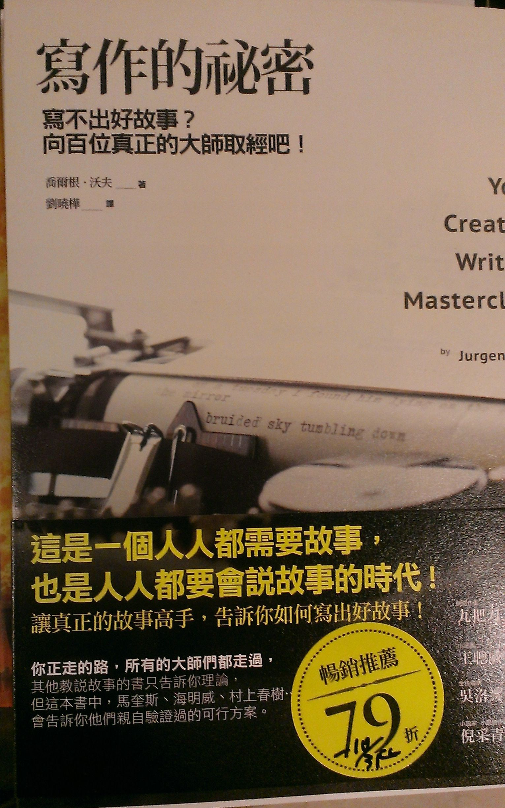
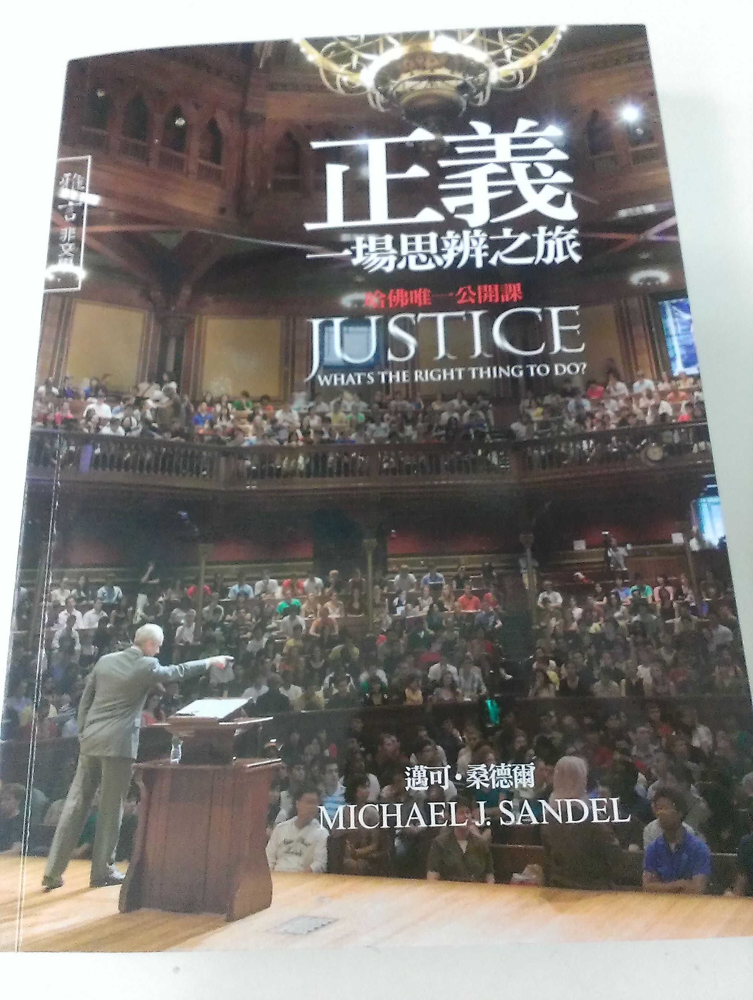
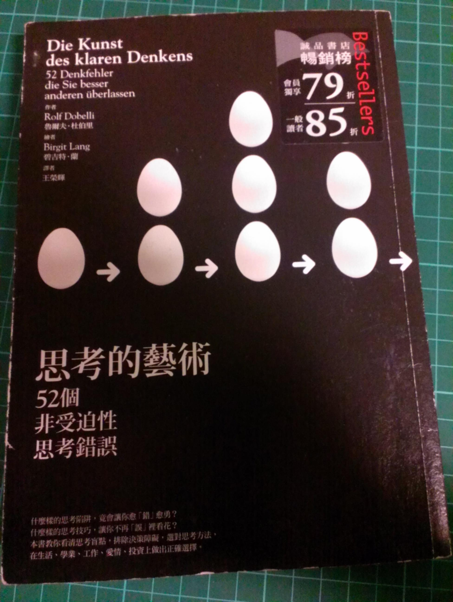
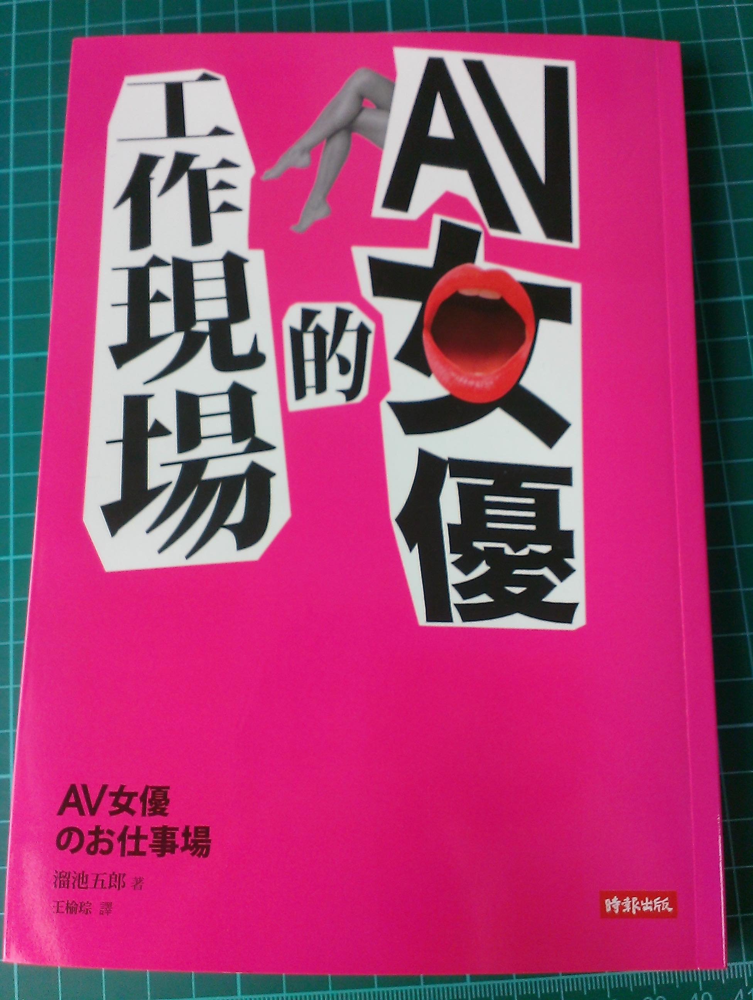
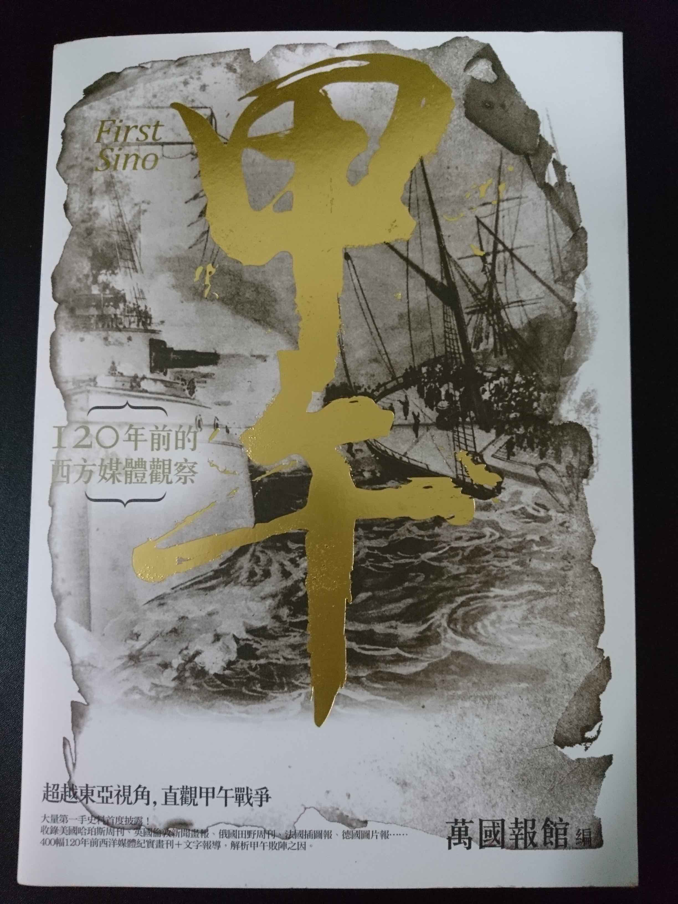
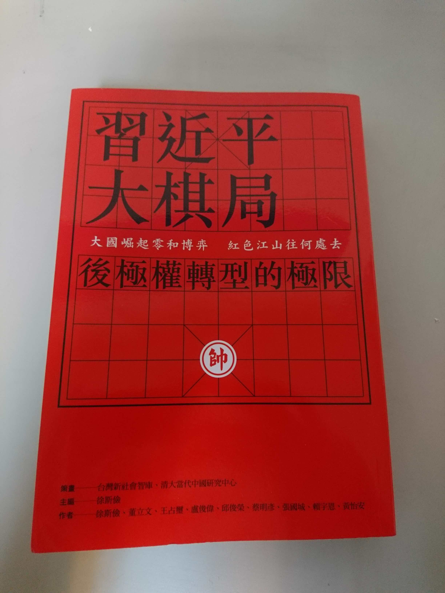

閱讀計劃
###########################

========== ==========
 開始時間   2013/9/1
 完結時間   2023/9/1
========== ==========

**更新時間：2018/01/29**

計劃是在書店找尋想讀的書，再由 Evernote 紀錄在手機裡，我會盡量不選資訊方面的書、不選小說、不選雜誌類型的書，
因為對我來說有作弊的嫌疑。等經過考慮確定要讀了以後，再紀錄至這裡的「待閱讀的書單」中。

我正在念的書會紀錄在「正在閱讀的書」，念完後便由「待閱讀的書單」遞補。
其中有些念完覺得值得紀錄的書，便會紀錄至「值得紀錄的書單」中，並寫下一些小心得。

我的念書的速度不快，因為能念的時間不多，但我目標是能持久，
希望十年後「值得紀錄的書單」能有百本書，而且盡量不計算資訊方面的書。

值得紀錄的書單
==================================================

1. 史上最強哲學入門：東方哲人
----------------------------------

.. image:: images/1.jpg
    :width: 300
    :alt: 史上最強哲學入門：東方哲人

博客來網址：http://www.books.com.tw/exep/prod/booksfile.php?item=0010557053

非常有意思的書，可以從外國人的觀點來理解中國哲學的部分也非常有趣。
雖然在很多方面，我並不讚同他的說法(畢竟他的目標讀者是日本人)，
不過老實說，這其中有許多獨到的見解是我想都沒想過的，而且確實是相當深入的理解。
總之，念完這本書我.....變成書迷了。

2. 史上最強哲學入門：解答你人生的疑惑
------------------------------------------

.. image:: images/2.jpg
    :width: 300
    :alt: 史上最強哲學入門：解答你人生的疑惑

博客來網址：http://www.books.com.tw/exep/prod/booksfile.php?item=0010522244 

老實說看這本書時並沒有像上一本書給我這麼多感悟，這也許是本來就對西方哲學比較不了解，所以衝擊沒這麼大的原因吧？雖然看著西方哲學一步步推演的過程滿有趣的，討論的幾個議題也挺有意思。但也許是因為提到的人太多了足足有 31 個人，造成除了少數特別重要的人物外，每個人只有幾頁可以介紹，所以就算是有把重點講出來，還是有些平面。另一方面，提到宗教時似乎也有點含蓄，也許是怕造成一些不良的影響吧？

不過說來說去，我覺得哲學書其實非常有趣，而且確實值得看，多消耗一下腦力，有益身心健康。

3. 富爸爸，窮爸爸
---------------------

.. image:: images/3.jpg
    :width: 300
    :alt: 富爸爸，窮爸爸 

博客來網址：http://www.books.com.tw/products/0010439430
   
嚴格說起來，這個其實是勵志書，屬於那種看完血會熱起來的書。基本上都是在講觀念，像是「富人獲得資產，而窮人和中產階級獲得債務，但他們卻以為那些就是資產。」然後解釋其中的差別所在。我覺得這本果然很適合給初學理財的新手的第一本書，沒有艱深的道理，只有幾個簡單的經歷和小故事而已，確實很容易入口。

4. 學以致富
-----------------------

.. image:: images/4.jpg
    :width: 300
    :alt: 學以致富

博客來網址：http://www.books.com.tw/products/0010595348

這本書比較像是學股入門書的前情提要，至少有半本書以上的內容都是在談股票的起源和歷史。我從這本書了解了何謂股票、為何會有股票、當時買賣股票的情況等歷史知識，也談到了公司的運作，公司是怎麼需要錢、怎麼合併和被合併。當然，少不了還有一些基本的選股概念。確實，就只是原則和概念而已，像是「必須在一年、兩年或五年內賣出股票換錢的人，當初就不應該投資股票。」、「人們永遠在尋找股市致勝的秘訣，然後而秘訣卻近在眼前－－買獲利佳的好公司股票，沒有好理由絕不賣掉它們，像是股價下跌絕對不是賣股票的好理由」、「想從股市得到最大的獲利，尤其如果你還年輕、時間站在你這邊，最好的方法是挪出永遠不會動用的閒錢，投資在服票上，長期緊抱，你會碰到行情不好的時候，但只要你不賣出，就永遠不會真的有損失。持續投資在股市能讓你在服市上漲最快的時刻，享有全部神奇而無法預測的獲利。」，並沒有實際操作的手段，要說缺點的話，裡面談的主要是美國的股市，如果沒有要買美國的股票，裡面很多內容就沒有必要閱讀了。

5. 60分鐘學會經濟學
------------------------

.. image:: images/5.jpg
    :width: 300
    :alt: 60分鐘學會經濟學

博客來網址：http://www.books.com.tw/products/0010534297

事實上，一開始我就不期待這本書能有多好，只打算藉此了解經濟學大概在玩什麼把戲而已。不過看完仍舊失望，不斷的介紹名詞，什麼是「市場」、什麼是「資金」。然後又不斷地細分，分門別類，市場又可以分成某某市場和某某市場，沒完沒了，介紹新名詞、細分，然後繼續介紹新名詞。就像是課本，永遠告訴你「是什麼？」而不告訴你「為什麼？」為什麼要這樣分類？這樣分類有什麼意義？雖然確實有解釋各個分類的意義，但然後呢？這對我現實生活有什麼幫助？我是在看字典嗎？當中提到經濟學的概念少之又少，而且這些概念常常會看到「上述分析做為一般原理，仍有參考價值」、「這個概念，在現實社會也是合理的」，這根本就無法說服我，說合理就合理？更何況有很多都是一堆前提下推論的結果，那前提又是從何而來？為什麼要選擇這個前提？又憑什麼說這個前提有意義？入門書不是把東西變簡單，而是把東西說得簡單，後者才是功力，我認為這本書不過是前者，所以不推。

6. 英文文法有道理！：重新認識英文文法觀念
--------------------------------------------

.. image:: images/6.jpg
    :width: 300
    :alt: 60分鐘學會經濟學

博客來網址：http://www.books.com.tw/products/0010557304

這本書幾乎可以說是我目前看過最喜歡的英文文法書，因為這本書嘗試解決了我以前在學英文時最討厭的事，清楚地告訴我為什麼英文會長這樣？裡頭的成因為何？告訴我其實英文文法可以不只是「背」，而是可以「懂」其中的意義。可以看出作者是非常用心寫這本書的內容，裡頭的文章結構編排都是精心設計過的。作者將英文分成十個特性，然後一章一章講述，有趣的是她反反覆覆就一直使用同樣的例子－－貓追狗，就是這麼一個簡單的例子，告訴我們英文是怎麼溝通的，非常有意思的一本書，非常值得推薦。

7. 寫作的秘密：寫不出好故事？向百位真正的大師取經吧！
------------------------------------------------------------

博客來網址：http://www.books.com.tw/products/0010599257

許久沒有一本書能讓我花費這麼多心思體會琢磨的了，是一部成功衝擊我思考的好書。作者整理了寫作相關的數個主題，比如說「如何設計角色？」、「 如何設計情節？」、「要如何開場？」等議題，然後再盡可能中立的口氣，列舉出不同大師對這個問題的看法。這些看法時常是互相對立的，作者基本上不會做任何評判，不過他偶爾也會跳出來說一下自己的心得，非常有意思。到了書的中後段，內容甚至開始跳脫了寫作本身，開始探討作者們的生活，好比說他們平常的生活是如何？他們是怎麼寫作的？「寫作」對他們來說是什麼？總體而言，這本書的內容包羅萬象，對於寫作有興趣的人，值得一讀。

8. 正義：一場思辨之旅
-------------------------

博客來網址：http://www.books.com.tw/products/0010497671

雖名為「正義」，但這本書並不是在說什麼才叫做「正義」，而是企圖用中立的角度討論各個不同觀點的正義，並比較這些觀點有何不同，有什麼優劣之處。

作者不愧是搞教學的，言詞清晰有條理，敘述不同版本的正義時，不但都能讓我在第一時間領會其中的意涵，還能讓我覺得：「對呀？有道理耶？這才是正義！」的感覺。解釋完後，作者就會開始舉出其中爭議之處，然後再用一大堆真實世界的例子挑戰這些正義。這些例子通常都是道德上的兩難問題，就像是作業，讀者就得一個個開始思考自己的選擇，藉著這個機會自我檢視，搞清楚自己的信念，以及為何有這些信念。最後打翻重來，再從另一個觀點討論，直到整本書讀完……。

不斷地思考，不斷地自我檢視，咬牙切齒讀完本書，除了眼紅爆腦並覺得自己好像「升級」了外，我……立刻上了博客來訂了他之後寫的兩本書。

9. 錢買不到的東西：金錢與正義的攻防
----------------------------------------

.. image:: images/9.jpg
    :width: 300
    :alt: 錢買不到的東西：金錢與正義的攻防

博客來網址：http://www.books.com.tw/exep/prod/booksfile.php?item=0010558765

直到看了這本書，我才發現原來現在真的快要什麼都能賣，什麼都能買了。在資工主義時代出身的我們，或許對此不覺得這有什麼問題。但作者卻從中發現一個可怕的現象，那就是「腐化」！當一切事情都可以用錢來解決時，有些事情的存在意義便可能喪失。如果可以用錢來買插隊的權利，那麼其中平等的意義可能就會失去，變成只要有錢，就可以不用排隊。因此，作者想問－－到底什麼是可以用錢買？什麼不行呢？如果沒有個分際，這樣的社會真的是我們想要的嗎？

10. 反對完美：科技與人性的正義之戰
---------------------------------------

.. image:: images/10.jpg
    :width: 300
    :alt: 反對完美：科技與人性的正義之戰

博客來網址：http://www.books.com.tw/exep/prod/booksfile.php?item=0010623959

與之前的著作不同，在這本書中他的立場很明確，從書名就可以知道－－反對完美，科技追求完美，但有時候追求完美可能是不對的。好比說我們都知道運動員不可以服用禁藥，但對比賽而言，如果使用禁藥，可以讓比賽更有看頭，難道我們不該追求一個完美的比賽嗎？這其中的差別在那裡？

作者努力嘗試說服我們有些事情是不對的，比如說我們不應該用基因挑選孩子，但為什麼不行呢？我們也許可以很容易的說出某件事在道德上令人不安，卻很難解釋不安的理由何在。作者用了很多角度，嘗試解釋問題在那，通常這類的事情本身可能找不到什麼問題，而是會隱晦的影響到別的不怎麼好的事物，所以非常難處理，而其中最大的難題在於很多事情有利有弊，很難輕易評判到底是好還是壞，因此老實說，很多論點對我來說服力不夠強。不過個人覺得最後一章有關幹細胞的論述倒是非常強而有力，對我來說，這一章就值回票價了。總體而言，這仍是一本值得一讀的好書。

11. 第一次領薪水就該懂的理財方法
-------------------------------------

.. image:: images/11.jpg
    :width: 300
    :alt: 第一次領薪水就該懂的理財方法

博客來網址：http://www.books.com.tw/products/0010493110

裡頭沒有高深的理財知識，沒有太多理論，而像是一堆零碎的「生活小常識」的感覺。「碰到 XXX 時該怎麼做呢？就這麼做就對了！」這本書應該是給社會新鮮人的讀物，涵蓋了很多理財新手可能會碰到的各種問題和解決辦法。對於沒有經驗的門外漢來說，這確實是本不錯的小書。

12. 佛教的見地與修道
-------------------------------------

.. image:: images/12.jpg
    :width: 300
    :alt: 佛教的見地與修道

博客來網址：http://www.books.com.tw/products/0010520960

這是我第一本正式研究佛教的書，這本書主要是在討論那些佛教中一些不易懂或容易誤解的觀念，前半段說明的是佛教基本的哲學和概念，後半則是討論有關修道的部分，實話說來內容有些零碎。不過作者思路清晰，很有條理，而且非常善用譬喻，所以佛教那些難懂到不行的思想，透過他的教導，確實領會了不少。不得不說，修佛腦袋要好，不然爆腦只是遲早的事。

佛法很難懂，因為這套理論沒辦法用言語、動作或任何具體的行為傳達給人，所以你只能用錯誤的理論解釋。好比說佛說－－自我不存在，但這不代表自我不存在，但為了說明，還是只能說自我不存在。所以當你聽到這個理論時，這個理論本身就會自相矛盾，難以理解。

我個人是覺得佛教的哲學本身是不錯，但有些內容還是太怪力亂神，我不確定是作者的原故還是本身即是如此，又或是作者故意如此說明，也許是因為我不信佛的原故吧？

13. 財報狗教你挖好股穩賺20%
-------------------------------------

.. image:: images/13.jpg
    :width: 300
    :alt: 財報狗教你挖好股穩賺20%

博客來網址：http://www.books.com.tw/products/0010582447

至目前為止，在研究理財相關的知識中，身為門外漢的我在大部分的情況下都是茫茫然無頭緒的。不知該從何下手，究竟是該先看經濟學？還是先念會計學？我該先研究統計嗎？還是法律？直到看完了這本書，我才有了大致的頭緒，可以說這本書對我幫助很大，讓我找到一些方向。

很多這類型有關理財的書都有許多問題，大部分的內容都是相當模糊而大概，說的都是基本上我可以直接認定是對，但是也可以說是廢話的內容。我不知道這本書說的是不是對的，但他是有系統的講解了他的觀點，認定的方式，我不見得要完全參考他，但卻因此有了座標，讓我找到準確的研究方向。

就敘述的觀點來看這本書也是非常清楚明瞭的，用字非常淺顯易懂，使用的例子都是台灣耳熟能詳的公司，比如說鴻海、中綱等。看完了這本書，我了解了看財報的重要性，雖然直接看財報比較辛苦，但也更扎實。

14. 史蒂芬．金談寫作
-------------------------------------

.. image:: images/14.jpg
    :width: 300
    :alt: 史蒂芬．金談寫作

博客來網址：http://www.books.com.tw/products/0010323698

我一直覺得，只要能讓我闔上書本，閉目思考的就是本好書。

這本書其實是一本自傳，只是這位老兄大概覺得他是生來與寫作同在的，所以把如何寫小說也塞進自傳裡了。要我說的話，這是非常有趣的結合，這也隱含了寫作與生活的相關性。過去的生活產生寫作的興趣；過去的經歷激發寫作的靈感。書中可以輕易看出他對寫作的熱愛。或可說是堅持，他能在嚴重的車禍後，還無法自己站起來的情況下，逼自己繼續寫作，或許這已經是執念了？

雖是談寫作的書，卻沒提什麼寫作技巧，過去身為英文教師的他，應該很多東西可以教授才是，但他只是單純將他寫作的方式說清楚，一套成功作家完整的寫作方法寫出來而已，這反而使我獲益良多。

看過不少寫作書，我發現大部分的書都是將各種寫作技巧和注意事項條列出來而已。為了增加說服力，常還會列舉那些名作家是這麼做的，但作家寫作方式各各不同，像是有人是先寫人物再寫故事，也有人是先寫故事再寫人物，所以看完後，實際上還是摸不著頭緒，因為我還是不知道先人物比較好還是先故事比較好？答案或許真的因人而異，但對我來說，有看等於沒看。因此史蒂芬．金這種做法反而讓我得到了不少幫助，我喜歡這本書。

15. 故事造型師：老編輯談寫作的技藝
-------------------------------------

.. image:: images/15.jpg
    :width: 300
    :alt: 故事造型師：老編輯談寫作的技藝

博客來網址：http://www.books.com.tw/products/0010633568

這是一本工具書，不談故事內容，不談劇情架構，只著重說明如何將一篇故事好好寫出來。什麼時候該「演」？什麼時候該「說」？這本書都有很詳細的解釋。這很重要，畢竟寫出來的文字若會讓人昏睡，想「快轉」，故事內容再精彩也沒用。

本書作者是一位編輯，而編輯大概是看最多小說的人，多年的修練讓他們總結了許多要點。不提別的，光是看書的目錄便能有所幫助。我們可以藉此了解對一個編輯而言，什麼才是最重要的？雖然論點不一定是絕對正確，但至少可以保證能讓多數讀者接受，所以非常值得參考。不過我認為有一點必須要注意，畢竟英文和中文是兩種完全不同的語言，雖然原則上重要的點是差不多的，但應該還是有所差別。好比說此書的作者認為人物思考時，不能用引號這種說話的型式表達，因為這不合文法，但中文似乎就沒有這類要求，至少我注意到金庸的小說中也都是用這種手法，所以我不認為這是錯誤。

整體來說，這本書非常有價值，非常適合用在寫完小說後， 重新校對用的書。

16. 文明的故事
-------------------------------------

.. image:: images/16.jpg
    :width: 300
    :alt: 文明的故事

博客來網址：http://www.books.com.tw/products/0010627831

老實說，這本書沒有一開始想像中的有趣。這本書把發生在世界各處從古至今的重要歷史事件一一舉出，除了圖片外，還用故事的方式展現歷史事件。

雖然立意良好，但也許是因為限於篇幅或是其他原因，各個事件但都只是輕輕一筆帶過，有很多話沒說盡的感覺。雖然呈現的方式不錯，但故事內容太過片段，吸引力不如何強烈，至少對我而言還是太過生硬，並沒有讀故事的感覺，更像在讀課本，我必須用意志力的讀，而不是被自然吸引。

造成這樣的結果可能有很多原因，其中最令人難受的是排版問題，由於這是一本充滿圖片的書，排版已經設計過了，但在翻成中文後，排版就變得很不合適，有時一個句子可能隔好幾頁，非常影響閱讀的順暢性。首句以粗體放大顯示我也覺得不必要，因為中文畢竟與英文不同，而且因為到處都是圖片的原因，有時甚至還找不到文字的開頭。

雖然文字不佳，但圖片超棒，如果換個角度想，這是一本圖冊，然後加上故事般的敘事感覺會好很多。可以把這本書當成一本入門書，從這些眾多的事件中找到自己有興趣的東西自行查找便可學到許多，有很多裡面提過的遺跡至今都有留存，可以配合 Google 地圖欣賞，我也因此看到了許多以前沒看過的美麗景象。

17. 思考的藝術：52 個非受迫性思考錯誤
-------------------------------------

博客來網址：http://www.books.com.tw/products/0010556649

也許是因為這本書頗有名，所以我標準比較高之故。我覺得沒有我想像中的好看。本書的架構是列出許多思考容易錯誤之處，然後用例子解釋這種錯誤的意義，每一處都是人比較容易犯錯的地方。但我覺得作者在有些例子並不能讓我滿意，做的結論有草率之嫌，這是我認為缺失之處。另外，有些思考謬誤似乎太過相似，說成一條也無不可，不知道是否是因為例子不夠清楚，讓我有這種錯覺，還是真是如此。

基本上，這還是一本實用的書，比較誇張的說，可以在自己做重大決定的時候，拿來一條條做比對，看看自己是否陷入了迷思而不自知，避免做出錯誤的決定。

18. 大小說家如何唬了你？一句話就拐走大腦的情節製作術
---------------------------------------------------------

.. image:: images/18.jpg
    :width: 300
    :alt: 大小說家如何唬了你？一句話就拐走大腦的情節製作術

博客來網址：http://www.books.com.tw/products/0010634063

這本書對我最大的幫助就是教我如何為好故事找理由(咦？)

故事的好壞，許多人都分辨得出來，但若要解釋原因，就不是這麼簡單的事了。本書透過一個系統的理論來解釋什麼樣的故事才是好故事，為什麼故事是好故事，而有些卻不是。

有趣的是在她眼裡，有時好看的故事可能不是好故事。在我的閱讀經驗中，有許多好看的小說並不算符合她的要求。那麼好故事和好看的故事有什麼不同呢？也許最本質的原因很簡單－－那就是好故事能讓讀者得到些什麼吧？透過閱讀故事，體驗自己沒機會、或是不能體驗的事物。

透過這本書的指導，可以給予自己的一個寫作的方向，什麼樣的內容是需要的？什麼又是不需要的？那些該強調，那些又該刪除，審核自己的作品，也許就是這本書給我最大的意義。

19. AV 女優的工作現場
---------------------------------------------------------

博客來網址：http://www.books.com.tw/products/0010623535

這真的是一本很有趣味的書，真的很有趣味，至少對男生來說，在書架上看見，應該都會忍不住拿下來翻個幾頁才是。

作者是「業界」的導演，就他多年導戲心得寫的書，講述在工作的過程中學到的事情。他希望能透過這本書，了解該該產業比較清晰的風貌，而不只有刻板印象和偏見。

不過我自己讀完這本書後，我覺得其實很多的刻板印象其實也不能說錯，而是「時代不同」了。

好比說，很多人覺得 AV 女優就是那種「背負沉重過往」的苦命女子，這在過去確實常見，畢竟這種女子通常都比較有「引發關切」的危險魅力。不過隨著時代變遷，或者說隨著業界的「成熟」，片商基本上不會找這種女優，因為「不幸女子」容易有精神方面的問題，在分秒必爭的業界，這種女優常會造成片場的各種困擾，浪費大家的時間。尤其現在女優競爭非常激烈，有大把的人選可以選擇，不需要找自己麻煩。

現代觀念的改變更造成這種情況，不知為何，現在的女優很明顯能有「把做愛當工作，展業專業」的感覺，很多人甚至已經能把一些「不可思議」的技巧當成基本技能了。更別說現在有很多女優都是高學歷，甚至是學校、企業的經營者。各種拍片的理由，已不在只是因為「走投無路」了……所以說很多人覺得 AV 女優一定是比自己還不幸的人，與其說是同情，倒不如說是一種帶蔑視心態的觀點。

看完這本書，確實有種眼界大開之感，我更加了解了這個產業的風貌。但要說這本書給我最大的驚奇，大概就是－－女優的正職最多的是護士？太神奇了傑克！

護士和 AV 女優兩者究竟有什麼神秘的關聯呢？大概我這輩子都不會知道吧。

20. 圖解孫子兵法{新版}
---------------------------------------------------------

.. image:: images/20.jpg
    :width: 300
    :alt: 圖解孫子兵法{新版}

博客來網址：http://www.books.com.tw/products/0010645315

有點無趣的書，雖說本來就有點心裡準備，但還是不太能忍受。要說理由的話，就是本書實在太像教科書了。對這個年紀的我來說，再看到教科書心情就不會太好。

而且書裡有太多月圓缺、水流動這類很高空的解釋，常常反而更讓我搞不懂在說什麼，有一種刻意讓內容變得高深莫測，讓它看起來很厲害的感覺。古書好像特別喜歡用這類的語法，也許這對於他們來說，這樣反而比較能切身感受吧？不過請原諒身為都市人的我，沒有人為污染的河流我可是見都沒見過，自然別指望這種說明方式能對我有什麼幫助。

而且我也覺得像是「避實擊虛，躲強的打弱的，能不打就不打，贏才是關鍵。」等要訣，有一種「這好像是廢話」的感覺，也許是這本太經典，太過有名，所以大部分重要的觀念已經耳熟能詳了。又或許單純只是時代的不同，當初新穎的思想，到了現代，則成了常識，所以沒能感受到前人看完這本書受到的衝擊？好比說，這本書不斷強調「不能用鬼神、不要用星象」來預測敵方。對現在的我們來說自然什麼意義。

不過書裡的觀念，其實也真的是非常通用，如果適時的轉換對應物，還是能從中學到一些什麼，因為目的不會變，「勝利」、「與人爭」這種事各種領域都是有需求的。

但要達成這樣的要求，對內容要更深的理解是必要的，可惜原文不易讀，我看古文的能力大概是廢得差不多了。之所以買這本書，是因為如果沒有解釋，我還真看不懂原文裡的內容。這本書有詳細解釋每一句原文，再搭配一些的例子和分析，甚至還有圖表做搭配，算是很用心地做這本書。比較有趣的是裡面有很多共產黨打贏國民黨的例子，老實說在繁體字的世界裡，看到這樣的內容還真有點不習慣。

只可惜這些例子都不夠詳細，時常只說：「有這個案例……正是孫子兵法中某某某的最好例證」，只解釋很單純的原因，細節不夠，沒有足夠的分析。而我覺得如果分析不夠，再多的例子也沒意義。雖然有很多分類和圖表，把各個項目做分類，確實比較好記了……但我為什麼要記它？對理解沒幫助，對記憶有幫助，這不就只是教科書嗎？

這本書的用心也在書的後面體現，它甚至還有一章專門介紹歷史戰爭器具，還有各個時代的變化，免得我們看不懂書裡舉的例子。但說實在的，古代戰車的各部位解釋我真的沒興趣，也不知道記這些奇怪的名字「軫」、「轂」、「輞」、「軛」有什麼用？但資料還滿齊全的，也有附足夠的圖片，可以當參考書使用。

結論，這是一本有用心、可以當參考，但是一本我不喜歡的書。

21. 先讓英雄救貓咪：你這輩子唯一需要的電影編劇指南
---------------------------------------------------------

.. image:: images/21.jpg
    :width: 300
    :alt: 先讓英雄救貓咪：你這輩子唯一需要的電影編劇指南

博客來網址：http://www.books.com.tw/products/0010659803

一本很有趣的編劇書，用很輕鬆詼諧的口吻介紹他多年編劇的心得，從編劇的原則、寫作的方式甚至到如何推銷劇本都有著墨。而且介紹的技巧非常具體，不是什麼高大上的概念。是一套完整可行的方法論，甚至感覺可以直接套用該方法生出一套劇本。我也因此了解到「故事前提」、「故事類型」和「故事架構」等的重要性。許多理論自己雖有模模糊糊的感覺，但能有一個人清晰的指出來，那種豁然開朗的感覺真是痛快。非常不錯的一本書，是我目前看過最喜歡的一本編劇書，值得推薦。

22. 字型散步：日常生活的中文字型學
---------------------------------------------------------

.. image:: images/22.jpg
    :width: 300
    :alt: 字型散步：日常生活的中文字型學

博客來網址：http://www.books.com.tw/products/0010654376

所謂「魔鬼藏在細節裡」，字型這門學問水可是很深的。何謂「字體」和「字型」？又何謂「定寬字型」和「比例字型」？「明體」、「仿宋體」、「黑體」、「圓體」又是什麼？這些分別又代表什麼意義？何處用「明體」？何處用「黑體」？中英文如何搭配？這麼做的好處是什麼？本書用了很多理論和例子說明，薄薄的一本，裡頭蘊藏豐富的知識量。一般來說，之所以會有這些區別，大概可以分為「書法」和「印刷」兩個方向，書法就是純美學，本書著墨不多，而印刷字主要是實用性考量，像是「可視性」、「易辨性」和「可讀性」等要素。不同字型的發展，很大因素是由於媒介演進(無論是紙張或是螢幕)，才因應需求做改動。有時是因為技術能力，有時是為了解決看不清字的需求等，當然美觀的部分也不能拋棄。隨著時間的過去，這門學問才越來越複雜。讀完後，我才驚覺到這些細節其實就在我們的日常生活中，等著我們去發掘。

本書可說是字型學問的科普書，很有意思。

23. Google模式：挑戰瘋狂變化世界的經營思維與工作邏輯
---------------------------------------------------------

.. image:: images/23.jpg
    :width: 300
    :alt: Google模式：挑戰瘋狂變化世界的經營思維與工作邏輯

博客來網址：http://www.books.com.tw/products/0010656961
    
聰明的公司，擅用各種制度達成他們各種怪怪的目標，他們有許多與眾不同的想法，並且採行各種手段和制度來完成。
並不是說因為那些各種奇思妙想而強大，就算其他公司就算採用同樣的方式不見得會取得一樣的成功。而是他們針對這些奇思妙想付諸執行的手段，只能說 Google 會強大不是沒有原因。也由於一切制度化，所以 Google 不需要一個強而有力，天才如賈伯斯的執行長才能成功。

24. 蘋果橘子經濟學【擴充．修訂紀念版】
---------------------------------------------------------

.. image:: images/24.jpg
    :width: 300
    :alt: 蘋果橘子經濟學【擴充．修訂紀念版】

博客來網址：http://www.books.com.tw/products/0010327164

真相時常模糊不清，而且反直覺。

經濟學有很多獲得答案的絕佳工具，但卻一直缺乏有趣的問題，因此本書的內容便是嘗試問問題，然後用經濟學的工具來解釋。很多現象的成因，用直覺難以理解，因此才需要工具來輔助。常見的問題是：「指標」不見得是影響因素，「關連」不見得是因果關係。世人很容易搞錯這一點，因此他嘗試使用經濟學的角度來解釋這一些現象，關鍵是注意「利益」和「動機」，當然有時還得補上「道德」因素，很多問題便可迎刃而解。

這本書大名鼎鼎，但實話說意外的沒有想像中有趣。也許經濟學的問題是沒有有趣的問題，但問題是他所謂的有趣問題對我來說一樣不有趣。黑白人種之間的衝突雖然看來很尖銳，但對我們亞洲人而言卻沒有什麼實感。墮胎的問題和宗教信仰和人權有關，但兩大衝突點對我們來說卻和沒有一樣。這點雖然遺憾，但整體來說還是一本可看的書。

25. 你的英文白學了－台北英語俱樂部神奇心法
---------------------------------------------------------

.. image:: images/25.jpg
    :width: 300
    :alt: 你的英文白學了－台北英語俱樂部神奇心法

博客來網址：http://www.books.com.tw/products/0010217636

這本書是我在二手書店買到的，幾十塊，滿滿的工商服務，不過也算是有所收穫，裡頭提了不少英文教學的流派，包含該不該「幫學生改錯」或是「什麼階段才應該改錯」等。能用英文老師的視角來看英文教學，對我來說也算是一種新奇的體驗。

26. SCRUM：用一半的時間做兩倍的事
---------------------------------------------------------

.. image:: images/26.jpg
    :width: 300
    :alt: SCRUM：用一半的時間做兩倍的事

博客來網址：http://www.books.com.tw/products/0010673295

在閱讀的過程中，一直有種自己正在被傳教的錯覺，像是宗教書，又像是直銷。整本書不斷地、不停地都在宣傳 Scrum 流程的好。這本書的架構尤其有趣，真正說明 Scrum 流程怎麼運作的部分竟然只在附錄裡，剩於其他部分、甚至可說是全書的內容都在說明 Scrum 怎麼地好，任何事情，不管是軟體開發、戰爭，甚至是拯救貧窮，用了 Scrum 後，就神奇的效能百分百……不過雖然我各種吐槽，但不得不承認，在工作環境親身感受過 Scrum 的方式後，確實是有感的改善。也因此我之後會寫一篇學習筆記，裡頭應該會有比較完整的心得。

27. 老殘遊記：帝國的最後一瞥
---------------------------------------------------------

.. image:: images/27.jpg
    :width: 300
    :alt: 老殘遊記：帝國的最後一瞥

博客來網址：http://www.books.com.tw/products/0010548620

古代文學經典，國文課本裡也有這部書的其中一篇，描述風景有其獨到的地方。不過我初看時，感覺就故事本身而言，並沒有什麼吸引人之處，也許作者的目的並不是故事吧？書本後段有一小段文章的分析，我才想起這本可是著名的「諷刺」小說，而作者身處的可是專制年代，很多事情沒辦法講白。這時我才真正明白，很多時候一段看似無意義的風景描述，暗藏著對時事的評論。可惜除非深入研究歷史，不然仍很難理解其中的寓意。因此對我而言，這部書只是文字描述不錯，故事無趣，但還算能藉此體驗當時人的生活的小說罷了。

28. 一課經濟學（50週年紀念版）
---------------------------------------------------------

.. image:: images/28.jpg
    :width: 300
    :alt: 一課經濟學（50週年紀念版）

博客來網址：http://www.books.com.tw/products/0010290409

如果看完一本書卻不能得到什麼，那就太可惜了。幸好這本書不愧是經典，雖然即使現在我也不是能全然認同他的論點，但必須承認我真的學到了很多原來未能明白的東西。這本書的內容非常扎實，甚至後面還有一些以我目前的能力還不太能理解的地方，或許未來有機會，我還得再重讀一遍才行。

這本書用「經濟學的藝術就是：不只觀察任何行動或政策的立即影響，更要看較長遠的影響；不只追蹤政策對某個群體產生的影響，更要看對所有群體造成的影響。」一句話貫串全書。所有書中所有例子都是在補充說明這句話的意義，只能說果真是「一課經濟學」，一課教一件東西，如果這東西不重要，就沒有必要用一本書來解釋。

作者用經濟學的角度批評了很多時下常見的論點還有政策，透過這本書，我學到如何用經濟學的角度思考事情，了解到許多政策確實很明顯是違反經濟學的。在閱讀當下我非常認同他的論點，但讀完後，我突然覺得有些政策的存在也許正是有他的必然性，他說的理論確實有道理，現在的很多政策明顯違反經濟學的真理。但反過來說，這也代表了現實世界的模樣，理想的市場確實有調節能力，但實際的市場真有這麼理想？有錢才伴隨著有權，權力可以扭曲市場讓自己更有錢，難道真能忽視權力的影響？也許正是因為忽視了這個影響，作者才不能明白許多政策存在的理由，而他口中的政客也會在未來一直做同樣的事。說到底，社會是人的集合，不能只看經濟學，然後這個不討論那個不討論，否則即使經濟學的角度是對的又如何？如果不能解釋這個世界那又有什麼用呢？

29. 甲午：120年前的西方媒體觀察
---------------------------------------------------------

博客來網址：http://www.books.com.tw/products/0010720633

這本書是我在逛書展買的，屬於我平常不太會看的書。這本書最特別的地方在於是用西方的角度來看甲午戰爭，而且是用當時的報紙來敘述的，當然也會適時的搭配一些當時的背景介紹來幫助了解。雖說我歷史曾學過甲午戰爭，但用不同的國家角度來看甲午，觀點完全不一樣，甚至有很多我之前從來都沒想過，令我耳目一新的觀點在其中。

其中最令我印象深刻的是「公關戰」，日本費了很大的心力請外國的記者採訪，要求他們只能寫有利於日本的角度的報導。反過來說清廷則全無，導致外國的輿論往往都偏向日本等等。

不過也許是因為是用報紙湊成的內容，所以敘事滿零碎的，我覺得要讀這本書可能需要足夠的歷史功底才行，有太多我不知道的人物和事件，讓我很難了解其中的意義。畢竟報導都是以他們自己國家的角度寫的，如果不了解該國的情況，其實有點難理解為什麼他們會這樣寫。

30. 雪球速讀法：累積雜學資料庫，達到看書十倍速，大考小考通通難不倒
---------------------------------------------------------------------

.. image:: images/30.jpg
    :width: 300
    :alt: 雪球速讀法：累積雜學資料庫，達到看書十倍速，大考小考通通難不倒

博客來網址：http://www.books.com.tw/products/0010663983

這本書給我很大的啟發，讓我了解「速讀」是怎麼回事，理解這個實用的技巧。簡單來說，速讀的技巧本身不是關鍵，因為這是一個很簡單的道理－－即使真有辦法一目十行，大腦的理解速度還是有極限，再厲害的速讀高手也沒辦法快速讀通完全不熟悉領域的書。

所以說速讀最重要的不是技巧，而是腦中的「資料庫」。如果對一件事很熟悉，讀那件事相關的書籍就會快很多，關鍵是腦中的「資料庫」資料夠充足。換言之，腦中資料庫的多寡才是閱讀速度真正的關鍵。

因此速讀最重要的原理其實沒什麼大不了的，就是「如果很懂，那麼就會讀很快」而已。但要怎麼在讀一本書之前就很懂呢？這本書提供了一個簡單至極，說來沒什麼稀奇的方法－－那就是讀好幾遍，一本書讀過了自然就很懂。

就是這麼一個方法，幾乎只有一句話－－不用管懂不懂，快速看過，看不懂不要停下來，但是要重覆一直看。讀不懂沒關係，再讀一次就好，一遍書讀個幾十遍，隨時重覆的次數增加，之前不懂的就會慢慢懂。

總結來說，速讀是一種閱讀方式，並不是一般讀書方式的進化型態。如果一般的閱讀方式是見樹再見林，速讀則是反過來，見林再見樹。沒有說那一種一定好一定壞，但速讀的可以避免一般讀書方式的毛病，那就是見樹不見林。但是速讀不是沒有缺點，雖然見林了，但不見得把樹看清楚，而理解和誤解往往只有一線之隔。

整體而言，讓我非常有收獲的一本書，值得我用速度再讀好幾次(咦？)

31. 不得好死－中國古代酷刑
---------------------------------------------------------

.. image:: images/31.jpg
    :width: 300
    :alt: 不得好死－中國古代酷刑

博客來網址：http://www.books.com.tw/products/0010340036

這本書，表面上是在介紹中國古代酷刑，列舉了古代種種不同的刑罰，並且用不同的方式介紹，除了刑本身，也用人物的方式切入，從酷吏、皇帝、或是著名的受害者；也有用刑具的角度切入，從頭到腳可以用什麼刑具，並在過程中簡短的介紹相關的歷史。

但其在字裡行間，作者其實在不停地批判專制。因為專制會引出人性的黑暗，而這正是最可怕的東西，即使是酷刑，其實本身也有限度，但獨裁者就是有辦法不停的超限，因為沒人可以限制他，壓制他心中的黑暗。

同為人類，我也必須引以為戒，在我看來，恐怖的不是嗜血，而是冷漠。他們多不是嗜血成狂，而是對殺人無感，所以可以瘋狂的殺。反思自己，也不禁訝異自己看到最後也已經無感了，這些君王殺人動不動就是以萬計，並不是殺人方法不斷創新，而是數量不停地增加，看到後面，差別只是數字不同而已，對我來說殺一人和殺十萬人也沒有分別了。

我時常暗地鄙視網上的鄉民，時常隨口出言就是殺，也許我也沒多大分別，我想這些都是事不關己的冷漠吧？

看看別人，反省自己。

32. 一九八四
---------------------------------------------------------

.. image:: images/32.jpg
    :width: 300
    :alt: 一九八四

博客來網址：http://www.books.com.tw/products/0010045155

很久以前，我突然覺得我應該要了解一下這個經典神作，現在終於有機會拜讀這部經典。看完後感覺可惜這部我事前知道得太多了，但還是可以想像當時初次閱讀的人感受的震撼力。那抑鬱的世界觀，還有可怕的既視感，會讓人喘不過氣。這本書起頭很難讀，越往後會越輕鬆，不過這但不是劇情輕鬆，而是閱讀輕鬆，至於劇情？……一路黑到尾。

故事開始的時候，作者試圖向大家描述這個世界觀，但是太過鉅細彌遺，一口氣塞了太多專有名詞，顯得很難消化，所以開頭難讀。老實說這本書「說明」明顯重於「故事」本身，有些地方甚至不像故事，其中有一段甚至還安排一個角色朗讀一本書的內容，我認為對於故事來說太過頭了。不過故事本身亦有可觀之處，不過非常黑暗，最後也沒有好結局，主角整個爛掉了，看完有點不舒服。

整體來說，這部小說確實稱得上是經典，書中很多名詞甚至已經寫入辭典，名言更是被很多人知悉，不過我覺得精彩的不是故事本身，而是其警世的作用，大概就是這麼一部小說，以上。

33. 好色：女導演教你怎麼A
---------------------------------------------------------

.. image:: images/33.jpg
    :width: 300
    :alt: 好色：女導演教你怎麼A

博客來網址：http://www.books.com.tw/products/0010685563

這本書的中心思想是：而現在的大多色情片太無聊了，老娘不爽！女人要站起來，色情片不只有給男人看的！而且……還是有給女人看的色情片。

簡單來說就是女人寫給女人的色情片科普，就如同大多數科普讀物一樣，走的是輕鬆隨意的氛圍，讓人降低戒心。裡頭文字易讀，圖片也很多，但該有的也不能少，所以歷史、名詞解釋(連我也學到很多)、例子……該有的都有，只是內容是色情片就是了。而且內容非常詳細，甚至還有提到在那裡？和誰？看色情片的優缺點等，話說為啥要分析在客廳沙發看色情片的好壞呢？……實在不明白。

我最大的心得是，這女人看的片實在有夠多，短短一段就可能列舉好幾部電影，知道的也有夠多就像百科全書一樣……輸了。

34. 肉身供養
---------------------------------------------------------

.. image:: images/34.jpg
    :width: 300
    :alt: 肉身供養

博客來網址：http://www.books.com.tw/products/0010614003

基本上，我看的書多為展示理性，少有機會看展示感性的書。而這次當我想嘗試新的方向時，便想起以前國文課時讀過蔣勳的文章，當時覺得頗有感覺，所以這次便決定選一本他的書來讀，即是這本「肉身供養」。沒有特別理由，只是書名有趣。

這本書主要在講「肉身」，講述肉身之美，特別是女性的裸體，男性的也有一些。當然，這顯然不會是一本色情書籍，他所謂的「美」包含甚廣，並非只有我們一般所知的那種美。當然啦，對我這種俗人來說，這本書就是看他對各種畫、雕塑、甚至是「概念」意淫。雖然說的內容我大多能體會，但有的就真的不太行，整體看下來，還是覺得頗有意思，也許之後可以看一下作者其他比較有名的作品。

35. 習近平大棋局：後極權轉型的極限
---------------------------------------------------------

博客來網址：http://www.books.com.tw/products/0010719154

隨著時間過去，對岸越來越強大已經是不可迴避的事情。基於各種歷史原因，我們和對岸在現在、在未來依然會有很多很多的機會彼此「交流」。我認為多了解對岸的情況是我們這輩人的一項的基本功課，尤其是這屆的大陸領導人似乎明顯與以往不同。碰巧看到這本書，覺得還不錯，便決定買來讀。

我覺得這本書是一本很好的入門書，內容嚴謹，而且用語直白。不但讓我增加了許多對岸包含政治、外交、經濟等各個面向的理解。而且裡頭的一些預測，以目前的時間點看來似乎還算準確。同時也可藉由理解對岸的情況反過來理解我們這邊的困境和挑戰。

雖然未來不知道會發生什麼，但希望最好未來能繼續保持和平，而中東的紛亂正是我們的借鏡。 

36. 被劫持的私生活
---------------------------------------------------------

.. image:: images/36.jpg
    :width: 300
    :alt: 被劫持的私生活

博客來網址：http://www.books.com.tw/products/0010650488

這本應該是我近期看過最有意思的書。作者用有趣的方式從古至今介紹了男女關係之間的演變。

用幾句話來說，就是自然演化決定了我們物種的本能(如男生好色)，環境則影響我們的社會制度(如父系、母系制度等)。因此當環境改變時，也會改變制度。這其中還包含了許許多多的巧合，最後演化出現在很多看似合理，卻其實沒什麼道理的規則。

作者有一套自己的邏輯，乍看起來非常毀三觀，衝擊了我很多原先覺得理所當然的想法，但仔細思考還是覺得有一定的道理……至於到底對不對呢？我自己是不清楚啦，反正很有趣就行了，值得推薦。

37. 圖解中國政治（修訂版）
---------------------------------------------------------

.. image:: images/37.jpg
    :width: 300
    :alt: 圖解中國政治（修訂版）

博客來網址：http://www.books.com.tw/products/0010719779

此書是我在一間二手書店見到的，內容主要在談大陸那邊的政治架構、制度的書，有點像是教科書內容的東西。由於翻閱時發現上面有一些筆跡秀氣的筆記，因為心中一絲「美好的想像」，便買下這本書。話雖如此，其實主要還是因為心中的好奇，想要多了解一下大陸那邊狀況罷了。

看完後，我心中的感想有三：複雜、模糊、矛盾。制度設計相當複雜，非常詳細，但某方面來說，又有很多東西說得很模糊，仔細思考，又有很多不合理的地方。好比說組織原則是「民主集中制」，但細看下去就會發現互相矛盾，「少數服從多數、下級服從上級」，但下級明顯是多數，那誰服從誰？下級服從上級，那前面那句就是屁話了。顯然有多種解釋，那自然愛怎麼解釋就怎麼解釋了。表面上有很多互相監督的機制，但怎麼監督？實際思考就發現根本就不可行，本質上仍是「下級服從上級」，做了很多包裝，但本質不變。

但另一方面，我覺得就是他們似乎有很深的危機感，會不停的與西方的制度比較，他們的制度也在不同的變動中，似乎還未成熟，但也因此保持了很大的彈性，人們總說大陸行政很有效率說不定也是這個原因。

總結而言，這本書很無聊，就如同教科書一般，但還是可以了解一些事情，無聊時可以看看。

37. 裙底下的劇場：人為什麼要穿內褲？一部日本社會的性文明史
-------------------------------------------------------------

.. image:: images/38.jpg
    :width: 300
    :alt: 裙底下的劇場：人為什麼要穿內褲？一部日本社會的性文明史

博客來網址：http://www.books.com.tw/products/0010754353

前陣子，意外在書店發現這本研究女性內褲的書，若只是如此，我可能不會多有興趣。但這本書作者卻是女性，並且以女性的角度撰寫，那就很有意思，所以當下就買一本來讀了。

本書嘗試從歷史、文化、心理等各個角度分析－－女性內褲。包含女性內褲的起源和演變、文化對內褲的觀點、男性對女性內褲的心理分析、甚至也有女性本身對自身內褲的心理分析等。並且提出了很多有趣的看法，好比說：因為內褲是最接近性器官的東西，因此成了象徵，到了後來裡面的東西反而不重要，內褲才是關鍵；隱藏是為了突顯，隱藏產生禁忌，反而突顯其價值，越隱藏越想看，好比說過去乳房只是母性象徵，而非性象徵，但現在意義卻有了變化等。

整體來說，這本書很多觀點很有意思，但書本身並不好看，老實說我前後又看了幾遍，但還是覺得難以評價。本書花費大量的篇幅討論心理層面的解讀，但我一直覺得抓不到核心，內容很散。而她討論的部分主題－－男性的心理，讓我覺得不太能認同。不知是台灣和日本男性本來就有區別，還是本來就有偏差，不甚明白。

正在閱讀的書
==================================================

**春琴抄**

博客來網址：http://www.books.com.tw/products/0010271261

待閱讀的書單
==================================================

**人類大歷史：從野獸到扮演上帝**

博客來網址：http://www.books.com.tw/products/0010647371

**臉紅心跳的好色醫學：從G點、隆乳、自慰到同性戀，醫生這樣談性**

博客來網址：http://www.books.com.tw/products/0010622135

**你的姿勢很有事**

博客來網址：http://www.books.com.tw/products/0010761029